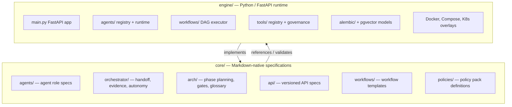
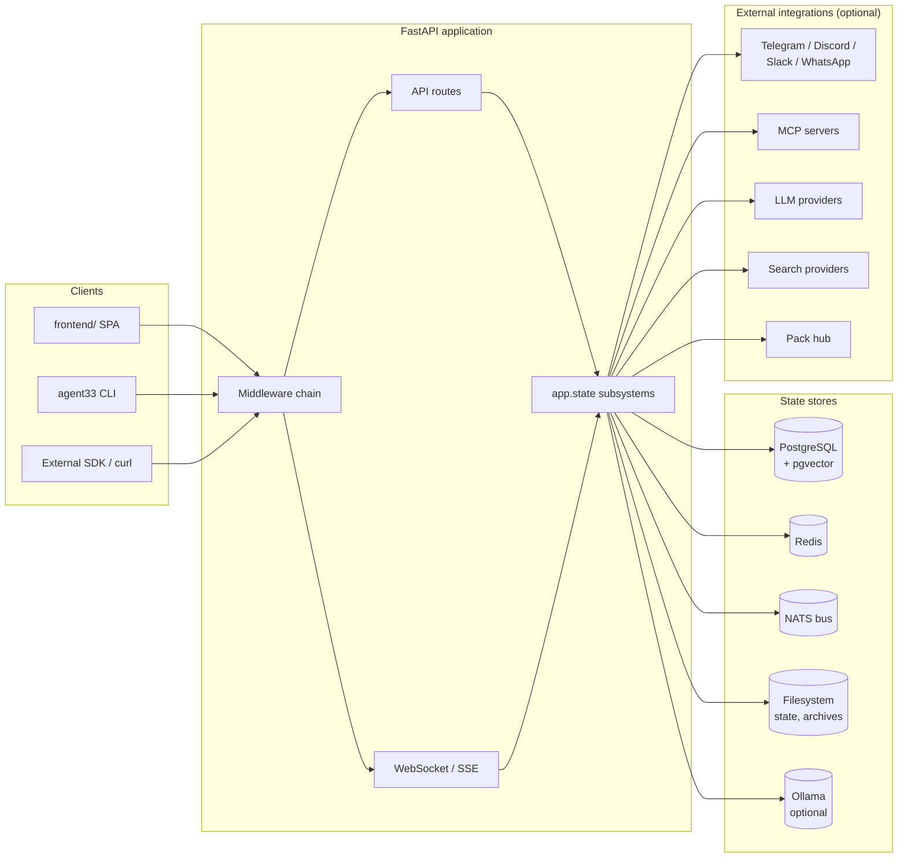
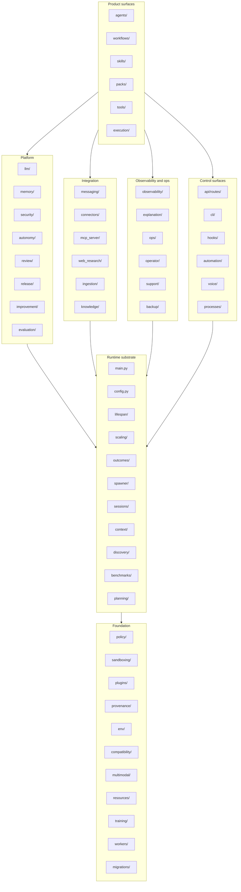
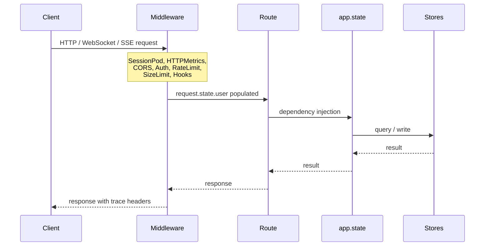
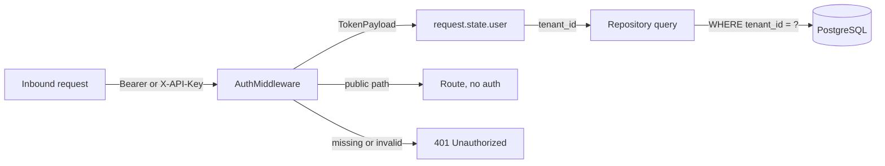
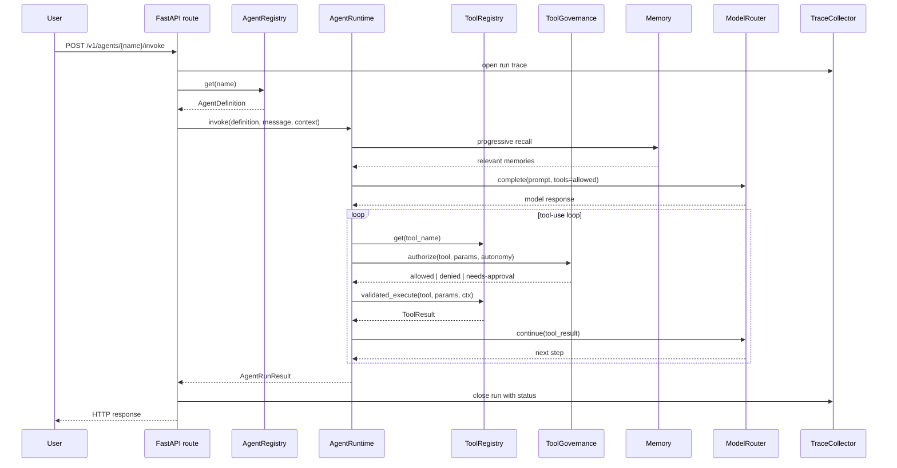

# Architecture

This document is the canonical top-level architectural overview of AGENT-33. It describes what the project is, how the codebase is organised, the runtime that operators actually deploy, the data stores those operators run, how multi-tenancy and security flow through the engine, the supported deployment topologies, and where to find more detail. It is meant to be readable end-to-end in one sitting and to send you to the right sub-document when you need to go deeper.

> Detail docs:
> - System overview: [docs/architecture/overview.md](docs/architecture/overview.md)
> - Component catalog: [docs/architecture/components.md](docs/architecture/components.md)
> - Canonical data flows: [docs/architecture/data-flow.md](docs/architecture/data-flow.md)
> - Agent model: [docs/architecture/agents.md](docs/architecture/agents.md)
> - Workflow engine: [docs/architecture/workflows.md](docs/architecture/workflows.md)
> - Packs and skills: [docs/architecture/packs-and-skills.md](docs/architecture/packs-and-skills.md)
> - Multi-tenancy: [docs/architecture/multi-tenancy.md](docs/architecture/multi-tenancy.md)
> - Security model: [docs/architecture/security-model.md](docs/architecture/security-model.md)
> - Deployment topologies: [docs/architecture/deployment-topologies.md](docs/architecture/deployment-topologies.md)
> - API surface (architectural view): [docs/architecture/api-surface.md](docs/architecture/api-surface.md)
> - Messaging: [docs/architecture/messaging.md](docs/architecture/messaging.md)
> - Observability: [docs/architecture/observability.md](docs/architecture/observability.md)
> - Storage: [docs/architecture/storage.md](docs/architecture/storage.md)
> - MCP integration: [docs/architecture/mcp-integration.md](docs/architecture/mcp-integration.md)

## What AGENT-33 is

AGENT-33 is an open-source multi-agent orchestration framework. It is licensed under Apache 2.0 and developed at [github.com/mattmre/AGENT33-PUBLIC](https://github.com/mattmre/AGENT33-PUBLIC). It accepts agent invocations and workflow runs over HTTP, WebSocket, and Server-Sent Events; routes them through a DAG executor against a registry of LLM-backed agents; and persists the resulting traces, evidence, lineage, and review state to durable stores. The runtime is async Python on top of FastAPI, runs end-to-end against a local Ollama model out of the box, and is multi-tenant by default — every persisted row carries a `tenant_id` resolved by auth middleware from the inbound credential.

The framework was built around four design choices that show up in every subsystem:

1. **Declarative-first.** Agents are JSON, workflows are YAML or JSON, skills are Markdown with YAML frontmatter, and packs are YAML manifests over a directory of files. Anything you can declare you can ship without code changes.
2. **Governed execution.** Code execution, tool calls, autonomy budgets, review sign-offs, release lifecycles, and pack trust all flow through dedicated subsystems with explicit state machines. There is no implicit "agent does whatever the model says" path.
3. **Local-first with remote optional.** The default stack runs against Ollama on a developer laptop. Every external integration — cloud providers, hosted vector databases, signing authorities, message buses — is opt-in behind feature flags and graceful fallbacks.
4. **Multi-tenant from the ground up.** Tenant resolution is middleware, not a route concern. All durable models carry tenant id. Cross-tenant data is a bug, not a misconfiguration.

## Two-layer model

AGENT-33 separates *specification* from *runtime*. The two layers ship together and version together but serve different purposes.

The `core/` tree is plain Markdown — no executable code. It defines the rules the engine implements. Sub-directories include `core/agents/` (agent role specs), `core/orchestrator/` (handoff, evidence capture, autonomy budget specs), `core/arch/` (phase planning, regression gates, glossary), `core/api/` (versioned API specs), `core/workflows/` (workflow templates the frontend imports as raw YAML), and `core/policies/` (policy pack definitions). These documents are auto-loaded by the orchestrator agent at runtime and consulted by reviewers when assessing changes.

The `engine/` tree is the actual software. It is a Hatchling-built Python package (`engine/pyproject.toml`) with strict mypy, Ruff linting, and pytest in async mode. Strict means *strict*: the type checker has no untyped escape hatches, the linter blocks new violations rather than warning about them, and the test suite is the gate.

The `frontend/` tree is a React/TypeScript single-page application that consumes the same HTTP/WebSocket API surface. It is not architecturally required — every operation is reachable via the API and CLI — but it is the day-to-day interface for operators.

## High-level runtime topology

The deployed runtime is a small set of stateful services around the FastAPI application. The application is stateless itself; state lives in PostgreSQL (with pgvector), Redis, NATS, and the local filesystem.

Each box on `STATE` is an `app.state.*` attribute populated by the FastAPI lifespan in `engine/src/agent33/main.py`. Subsystems are constructed in dependency order so each one can read from the ones already initialised. The shutdown path reverses that order: workflows are cancelled, services drain, message buses disconnect, and the database connection pool closes last.

The same application is run in three deployment shapes — *lite* (SQLite + in-process bus + in-process cache, single process), *standard* (PostgreSQL + Redis + NATS, single or small Kubernetes deployment), and *enterprise* (the standard stack plus dedicated observability, persistent volumes, ingress, and HPA). See [deployment topologies](docs/architecture/deployment-topologies.md) for the details.

## Subsystem map

The engine package contains roughly 60 first-class subsystem directories under `engine/src/agent33/`. They cluster into seven groups by responsibility.

Each directory has an `__init__.py` that names the public symbols and a small number of load-bearing modules. The component catalog ([docs/architecture/components.md](docs/architecture/components.md)) describes every one of these directories and links the modules you need to read first.

## Lifespan startup order

The FastAPI lifespan in `engine/src/agent33/main.py` initialises subsystems in a deliberate order so each one can depend on the previous ones. The high-level sequence below is what the engine actually does at startup; the detail breakdown (every step, every fallback) lives in [docs/architecture/overview.md](docs/architecture/overview.md).

1. **Runtime state paths** are resolved relative to the working directory.
2. **Secret warnings** — `settings.check_production_secrets()` warns on insecure defaults and exits the process in production if the JWT secret is the development default.
3. **PostgreSQL** — `LongTermMemory` opens an async SQLAlchemy engine and runs `CREATE EXTENSION IF NOT EXISTS vector`.
4. **State stores** — shared orchestration state, explanation store, autonomy/evaluation/release/review services, trace collector, workflow archive.
5. **Redis** — async client; on connection failure the lifespan falls back to `InProcessCache`.
6. **NATS** — async client; on connection failure the lifespan falls back to `InProcessMessageBus`.
7. **Scaling guards** — instance registry and scheduler ownership guard prevent multiple replicas from running the same cron jobs.
8. **Registries** — agents, capability packs, tools, packs, skills, hooks, commands.
9. **Observability** — metrics collector, alert manager, lineage store, replay store, cost tracker.
10. **Code execution** — `CodeExecutor` is constructed with CLI, Jupyter, and optional GPU Docker adapters.
11. **LLM and memory** — model router, embedding provider with cache, BM25 index, hybrid searcher, RAG pipeline, progressive recall.
12. **Tool governance and approval** — approval service, approval token manager, tool governance loads `~/.agent33/approved-tools.json`.
13. **Capability packs, skill injection, hybrid skill matcher** — wired into `AgentRuntime`.
14. **Operator session, catalog, lineage, spawn, archive** — file-backed session storage with crash recovery.
15. **External integrations** — knowledge ingestion cron, web research, voice sidecar probe, messaging adapters, MCP service bridge.
16. **Transports** — WebSocket and SSE managers, agent-to-workflow bridge with pack sharing service.

Subsystems that fail to initialise log a warning and fall back to an in-process alternative where one exists. The application starts in *lite* mode if PostgreSQL, Redis, and NATS are all unavailable.

## Request lifecycle

Most operator and SDK interaction with AGENT-33 goes through the same five-stage HTTP request lifecycle.

Authentication is enforced by `security/middleware.py` (`AuthMiddleware`). Public paths (`/health`, `/healthz`, `/readyz`, `/metrics`, `/v1/auth/token`, `/v1/dashboard/`, `/docs`, `/redoc`, `/openapi.json`, `/v1/outcomes/health`, `/v1/ingestion/heartbeat`) bypass auth. Every other path requires either an `Authorization: Bearer <jwt>` header or an `X-API-Key: <key>` header. The middleware attaches a `TokenPayload` to `request.state.user`; routes consume it via FastAPI `Depends`.

Scope enforcement is per-route. The scope catalogue is in `security/permissions.py` and covers `admin`, `agents:read`, `agents:write`, `agents:invoke`, `workflows:read`, `workflows:write`, `workflows:execute`, `tools:execute`, `operator:read`, and `operator:write`. Routes that don't list a scope still require authentication; they're left at the `Authenticated` level when the resource has handler-level ownership logic that can't be expressed as a simple scope.

## Persistence model

State lives in five durable locations, each chosen for the access pattern it has to support.

| Store | Purpose | Notes |
|-------|---------|-------|
| **PostgreSQL** (with pgvector) | Long-term memory, embeddings, workflow runs, governance state, lineage records | Async via SQLAlchemy; Alembic migrations in `engine/alembic/versions/` |
| **Redis** | Cache, locks, per-tenant rate limiters, ephemeral coordination | Async client; falls back to `InProcessCache` in lite mode |
| **NATS** | Event bus for messaging adapters, inter-service signalling, sub-agent dispatch | JetStream-capable; falls back to `InProcessMessageBus` in lite mode |
| **Ollama** (optional) | Local LLM inference and embeddings | Default base URL `http://host.docker.internal:11434`; any provider via `ModelRouter` |
| **SQLite files** | Orchestration state, ingestion journal, P69b tool approvals, outcomes, explanations | One file per subsystem under the runtime state directory |
| **Filesystem** | Workflow run archive, pack rollback archive, operator sessions, backup artifacts, exports | Paths resolved through `RuntimeStatePaths` |

The schema is documented in detail in [docs/architecture/storage.md](docs/architecture/storage.md). The migrations under `engine/alembic/versions/` are the authoritative source — the initial migration creates `workflow_checkpoints`, `sessions`, and `memory_documents` (with a 1536-dimension `vector` column and an IVF-Flat cosine index), and the seven follow-up migrations add review state, evaluation state, autonomy state, release state, improvement state, and skill registry state.

## Multi-tenancy and security

Every persisted model has a `tenant_id` column. The auth middleware resolves the tenant from the inbound credential (JWT or API key) and attaches it to the request state. Repository methods either filter by `tenant_id` directly or call a tenant-scoped helper that does. There is no global view of all tenants from a route handler — operator and admin scopes still see one tenant at a time unless they explicitly use admin endpoints.

Security boundaries are described in detail in [docs/architecture/security-model.md](docs/architecture/security-model.md). The headline items:

- **AES-256-GCM** encryption for secrets at rest (`security/encryption.py`), Fernet-backed vault for high-level secret storage (`security/vault.py`).
- **JWT** for human-issued tokens, signed with `JWT_SECRET`, configurable algorithm.
- **API keys** stored encrypted, mapped to tenant id, validated against the vault.
- **Tool governance** with per-subject rate limiting, autonomy budget enforcement, and HMAC-signed one-time approval tokens for sensitive operations.
- **Prompt-injection screening** on user inputs before they reach the LLM.
- **Command and host allowlists** for the shell, browser, and HTTP tools.
- **Pack trust manager** with Sigstore cosign signature verification and per-pack revocation lists.

The security model documented here is the *runtime* model. The companion documents under `docs/operators/` cover the operational model (rotation, backups, incident response, SLOs).

## Extension points

AGENT-33 has six declarative extension points. Adding one of these is normally a configuration or file-drop change, not a code change.

1. **Agents** — drop a `.json` file into the directory pointed to by `agent_definitions_dir`. The auto-discovery scan picks it up on the next restart. See [agents](docs/architecture/agents.md).
2. **Workflows** — drop a `.yaml` or `.json` file into the workflow definitions directory or POST it to `/v1/workflows`. See [workflows](docs/architecture/workflows.md).
3. **Skills** — write a SKILL.md or SKILL.yaml file and place it in the skill definitions directory. The skill registry scans on startup and on demand. See [packs and skills](docs/architecture/packs-and-skills.md).
4. **Packs** — install a pack from disk, from the local marketplace, or from the remote pack hub. The pack registry verifies the SHA-256 digest with `hmac.compare_digest` and applies the trust policy. See [packs and skills](docs/architecture/packs-and-skills.md).
5. **Tools** — implement the `Tool` interface and either register at startup or expose via a `agent33.tools` setuptools entry point. The tool registry discovers entry points at lifespan time and validates JSON Schemas on call. See [components](docs/architecture/components.md).
6. **MCP servers** — point `agent33.tools.registry.discover_mcp_stdio_server` or `discover_mcp_sse_server` at an MCP server and its tools are imported. See [MCP integration](docs/architecture/mcp-integration.md).

There are also code-level extension points for operators who want to ship their own connectors, messaging adapters, model providers, sandbox adapters, and observability sinks. These are documented in [components](docs/architecture/components.md).

## How a request becomes a result

The shortest interesting path through the system is "operator invokes agent." It exercises auth, the agent registry, the tool registry, governance, the LLM router, observability, and the workflow bridge.

That same shape — registry lookup, runtime orchestration, governance check, evidence capture — is what happens for workflows, sub-agent spawns, and MCP tool calls. The path varies in the transport (WebSocket for streams, NATS for sub-agent dispatch, SSE for progress) and in the executor (`WorkflowExecutor` instead of `AgentRuntime` for DAG runs), but the cross-cutting concerns are the same.

The full canonical flows for agent invocation, workflow execution, pack install, tool approval, memory ingestion, and MCP tool call are diagrammed in [docs/architecture/data-flow.md](docs/architecture/data-flow.md).

## What runs where

A typical *standard* deployment has the following processes:

| Process | Image | Replicas | Notes |
|---------|-------|----------|-------|
| `agent33-api` | The engine image | 1 (HPA: 1–1 by default for safety) | FastAPI app; stateless |
| `postgres` | `pgvector/pgvector:pg16` | 1 (StatefulSet) | Persistent volume |
| `redis` | `redis:7-alpine` | 1 | Optional persistence |
| `nats` | `nats:2-alpine` | 1 | JetStream enabled, monitor on `8222` |
| `ollama` | `ollama/ollama:latest` | optional, often 0 | Defaults to host's existing Ollama via `host.docker.internal` |
| `searxng` | `searxng/searxng:latest` | optional | Local search index |
| `frontend` | Frontend image | 1 | Static Vite build served by Nginx |

The Kubernetes overlays under `deploy/k8s/` are kustomize-based: `base/` contains the cluster-agnostic manifests, `overlays/production/` adds replica counts, ingress hostnames, and TLS configuration. The HPA in `base/api-hpa.yaml` ships with `minReplicas: 1, maxReplicas: 1` as a single-instance guardrail; raising it requires reading [horizontal-scaling-architecture.md](docs/operators/horizontal-scaling-architecture.md) because the engine has cron jobs and stateful background tasks that need ownership coordination.

For local development, `engine/docker-compose.yml` boots the same stack including profiles for `local-ollama`, `dev` (devbox), `agent-os`, `integrations` (n8n), and `gpu` (AirLLM 70B local inference).

## Operability concerns

Telemetry is structured. The engine emits structlog JSON to stdout by default; Prometheus metrics are exposed at `/metrics`; the `MetricsCollector` keeps a rolling window of counters and timings for the dashboard; the `AlertManager` evaluates rule-based alerts against that window; the `ExecutionLineage` records the parent-child graph of agent and workflow runs; the `ExecutionReplay` allows deterministic replay of recorded runs. The `TraceCollector` captures structured traces (Session → Run → Task → Step → Action) with a 10-entry failure taxonomy (`F-ENV`, `F-INP`, `F-EXE`, `F-TMO`, `F-RES`, `F-SEC`, `F-DEP`, `F-VAL`, `F-REV`, `F-UNK`). Details in [observability](docs/architecture/observability.md).

Backups are first-class. The `backup` subsystem produces signed envelopes containing memory, sessions, traces, and registry state. Restore is gated by a two-flag confirmation: `confirm=true` is always required, and `allow_overwrite=true` is additionally required if the restore plan reports overwrite conflicts. See `docs/operators/production-deployment-runbook.md` for the operational procedure.

Cron jobs (the knowledge ingestion sweep, the trace retention sweep, the pack hub refresh, the BM25 warm-up) are coordinated by a Redis-backed ownership guard so that only one replica runs them at a time. The guard is in `scaling/scheduler_ownership.py`.

## Reading order

If you are new to the codebase, read in this order:

1. This document.
2. [docs/architecture/overview.md](docs/architecture/overview.md) — the system block diagram, lifespan order in full detail, runtime modes.
3. [docs/architecture/components.md](docs/architecture/components.md) — every subsystem directory and what it does.
4. [docs/architecture/data-flow.md](docs/architecture/data-flow.md) — sequence diagrams for the six canonical flows.
5. [docs/architecture/agents.md](docs/architecture/agents.md) and [docs/architecture/workflows.md](docs/architecture/workflows.md) — the product surfaces operators use the most.
6. [docs/architecture/packs-and-skills.md](docs/architecture/packs-and-skills.md), [docs/architecture/security-model.md](docs/architecture/security-model.md), and [docs/architecture/storage.md](docs/architecture/storage.md) — pick whichever area is most relevant to what you're building.

Operator runbooks (deployment, scaling, incident response, secret rotation, SLOs) live under `docs/operators/`; user-facing tutorials live under `docs/`; this file and the `docs/architecture/` directory are the architectural reference.
