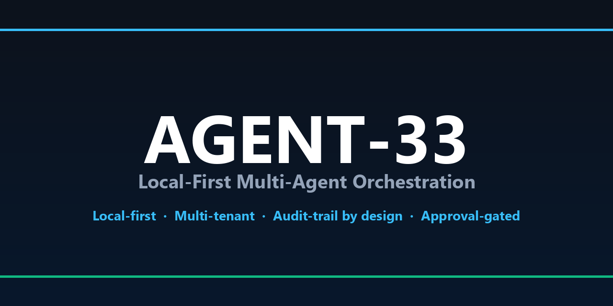
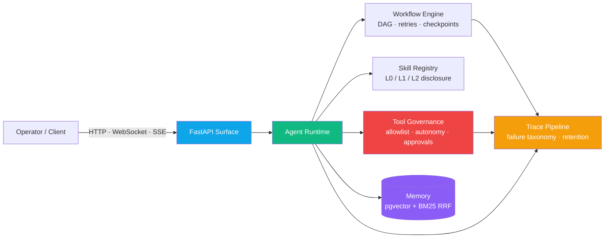

<div align="center">



# AGENT-33

### Local-First Multi-Agent Orchestration Platform

<sub>Governance &middot; Evidence &middot; Workflows &middot; Multi-tenant Isolation &middot; Observability</sub>

[](LICENSE)
[](CHANGELOG.md)
[](https://github.com/mattmre/AGENT33-PUBLIC/actions/workflows/ci.yml)
[](https://github.com/mattmre/AGENT33-PUBLIC/actions/workflows/security-scan.yml)
[](https://www.python.org/)
[](https://www.docker.com/)
[](https://fastapi.tiangolo.com/)
[](https://ollama.com/)
[](https://github.com/pgvector/pgvector)
[](https://github.com/mattmre/AGENT33-PUBLIC/discussions)
[](https://github.com/mattmre/AGENT33-PUBLIC/issues)
[](https://github.com/mattmre/AGENT33-PUBLIC/pulls)
[](https://github.com/mattmre/AGENT33-PUBLIC/network/members)
[](https://github.com/mattmre/AGENT33-PUBLIC/stargazers)
[](https://github.com/mattmre/AGENT33-PUBLIC/graphs/contributors)
[](CONTRIBUTING.md)

#### Local-First &middot; Approval-gated automation &middot; Audit trail by design &middot; Multi-tenant

[**Quick Start**](#quick-start) &nbsp;&middot;&nbsp; [**Architecture**](docs/architecture/overview.md) &nbsp;&middot;&nbsp; [**API Reference**](docs/api-reference.md) &nbsp;&middot;&nbsp; [**Onboarding**](docs/ONBOARDING.md)

[Use Cases](docs/use-cases.md) &nbsp;&middot;&nbsp; [Walkthroughs](docs/walkthroughs.md) &nbsp;&middot;&nbsp; [Self-Improvement](docs/self-improvement/README.md) &nbsp;&middot;&nbsp; [Operator Runbooks](docs/operators/)

</div>

---

## At a Glance

<table>
  <tr>
    <td align="center" width="16%">
      <b><sub>AGENTS</sub></b><br>
      <b style="font-size:1.5em">6</b><br>
      <sub>Reference agent definitions</sub>
    </td>
    <td align="center" width="16%">
      <b><sub>WORKFLOWS</sub></b><br>
      <b style="font-size:1.5em">DAG</b><br>
      <sub>Composable, with retries</sub>
    </td>
    <td align="center" width="16%">
      <b><sub>TOOLS</sub></b><br>
      <b style="font-size:1.5em">7</b><br>
      <sub>Schema-validated builtins</sub>
    </td>
    <td align="center" width="16%">
      <b><sub>SUBSYSTEMS</sub></b><br>
      <b style="font-size:1.5em">20+</b><br>
      <sub>Lifespan-wired services</sub>
    </td>
    <td align="center" width="16%">
      <b><sub>LLM PROVIDERS</sub></b><br>
      <b style="font-size:1.5em">20+</b><br>
      <sub>Auto-registered from env</sub>
    </td>
    <td align="center" width="16%">
      <b><sub>TENANCY</sub></b><br>
      <b style="font-size:1.5em">Native</b><br>
      <sub>Multi-tenant by design</sub>
    </td>
  </tr>
</table>

---

## Why AGENT-33

AGENT-33 is a local-first AI agent orchestration platform for teams that want **real workflows, explicit governance, and a usable control plane** instead of a pile of disconnected scripts. It combines an API runtime, workflow engine, memory stack, review/release controls, and a first-party frontend so you can run guarded automation from one system.

- **Local-first runtime** &mdash; FastAPI backend, Docker Compose bootstrap, Ollama-friendly model routing
- **Contained Agent OS** &mdash; optional Linux operator workspace with first-party tools, state, and stack connectivity
- **Guardrailed automation** &mdash; scopes, approvals, autonomy budgets, and review/release workflows
- **Agent + workflow orchestration** &mdash; invoke agents directly or compose repeatable DAG workflows
- **Operational visibility** &mdash; health, dashboard surfaces, traces, evaluations, and rollout telemetry
- **Extensible platform** &mdash; packs, tools, memory, webhook intake, and improvement loops



For the full lifespan startup order, runtime modes (lite, standard, enterprise), and middleware chain, see [`docs/architecture/overview.md`](docs/architecture/overview.md).

---

## Repository Layout

- `engine/` &mdash; FastAPI runtime, orchestration services, API routes, tests, Docker Compose stack
- `frontend/` &mdash; AGENT-33 control plane UI served at `http://localhost:3000`
- `core/` &mdash; orchestration specs, policy packs, protocol references, workflow materials
- `docs/` &mdash; canonical operator, setup, onboarding, and release-readiness documentation

---

## Quick Start

### 30-Second Try

Spin up the stack and confirm it's alive in under a minute:

```bash
cd engine && docker compose up -d
curl http://localhost:8000/health
```

Then continue below for the full operator setup (JWT minting, agent invocation, control plane).

### Full Operator Setup

#### Prerequisites

- Docker Desktop or Docker Engine with Compose
- Python 3.11+
- `curl`
- Ollama reachable from the stack (`http://host.docker.internal:11434` by default), or use the bundled/local override paths documented in the setup guides

### 1. Start the stack

```bash
cd engine
cp .env.example .env
docker compose up -d
curl http://localhost:8000/health
```

If you reuse an Ollama container from another Compose project:

```bash
docker compose -f docker-compose.yml -f docker-compose.shared-ollama.yml up -d
```

### 2. Open the control plane

- Frontend: `http://localhost:3000`
- API docs: `http://localhost:8000/docs`

Default local credentials from `.env.example`:

- username: `admin`
- password: `admin`

### 3. Mint a local JWT for API access

```bash
docker compose exec -T api python -c "import os,time,jwt; now=int(time.time()); payload={'sub':'local-admin','scopes':['admin','agents:read','agents:write','agents:invoke','workflows:read','workflows:write','workflows:execute','tools:execute'],'iat':now,'exp':now+3600}; print(jwt.encode(payload, os.getenv('JWT_SECRET','change-me-in-production'), algorithm=os.getenv('JWT_ALGORITHM','HS256')))"
```

Set the token in your shell:

```bash
export TOKEN="<paste-token-here>"
```

PowerShell:

```powershell
$env:TOKEN = "<paste-token-here>"
```

### 4. Verify the first agent flow

List agents:

```bash
curl http://localhost:8000/v1/agents/ \
  -H "Authorization: Bearer $TOKEN"
```

Invoke the orchestrator:

```bash
curl -X POST http://localhost:8000/v1/agents/orchestrator/invoke \
  -H "Authorization: Bearer $TOKEN" \
  -H "Content-Type: application/json" \
  -d '{
    "inputs": {
      "task": "Create a short rollout plan for adding cache metrics"
    },
    "model": "llama3.2",
    "temperature": 0.2
  }'
```

## First 5-Minute Operator Path

1. Start the stack and confirm `/health`
2. Sign in to `http://localhost:3000`
3. Mint a local JWT or use the UI token flow
4. List agents with `GET /v1/agents/`
5. Invoke an agent or execute a minimal workflow
6. Explore the dashboard, traces, reviews, evaluations, and autonomy surfaces from the UI

For a fuller beginner path, use:

- [Getting Started](docs/getting-started.md)
- [Operator Onboarding](docs/ONBOARDING.md)
- [Walkthroughs](docs/walkthroughs.md)

## Security and Production Warning

**Bootstrap auth is for local development only. Do not expose AGENT-33 publicly with default credentials or default secrets.**

Before any shared, VPS, or production deployment:

- set `AUTH_BOOTSTRAP_ENABLED=false`
- rotate `API_SECRET_KEY`
- rotate `JWT_SECRET`
- rotate `ENCRYPTION_KEY`
- review [SECURITY.md](SECURITY.md)
- work through the [Release Checklist](docs/RELEASE_CHECKLIST.md)

## Documentation Map

### Start here

- [Getting Started](docs/getting-started.md)
- [Operator Onboarding](docs/ONBOARDING.md)
- [Setup Guide](docs/setup-guide.md)
- [Walkthroughs](docs/walkthroughs.md)
- [Use Cases](docs/use-cases.md)
- [Agent OS Runtime](docs/operators/agent-os-runtime.md)
- [API Surface](docs/api-surface.md)
- [Release Checklist](docs/RELEASE_CHECKLIST.md)
- [Documentation Index](docs/README.md)

### Deep references

- [Functionality and Workflows](docs/functionality-and-workflows.md)
- [Production Deployment Runbook](docs/operators/production-deployment-runbook.md)
- [Operator Verification Runbook](docs/operators/operator-verification-runbook.md)
- [Horizontal Scaling Architecture](docs/operators/horizontal-scaling-architecture.md)
- [Incident Response Playbooks](docs/operators/incident-response-playbooks.md)

## Who this is for

- **Operators** who need a guarded local or self-hosted AI control plane
- **Platform teams** building approval-aware automation and workflow execution
- **Engineering teams** running review, release, evaluation, and autonomy gates in one runtime
- **Researchers and builders** experimenting with packs, memory, training, and improvement loops

## Roadmap

AGENT-33 is under active development. Near-term public direction:

- **Ecosystem growth** &mdash; broader pack catalog, community-contributed skills and tools, signed pack distribution
- **MCP integrations** &mdash; richer hosted MCP server surface and tighter MCP client interop with the agent runtime
- **Public benchmarking** &mdash; continued evaluation against [SkillsBench](https://github.com/benchflow-ai/skillsbench) with CTRF reporting and weekly full-tier runs
- **Provider depth** &mdash; first-class support for additional local-inference backends (llama.cpp, LM Studio, AirLLM) and embedding providers
- **Operator UX** &mdash; visual workflow builder polish, sub-agent execution trees, knowledge ingestion cron expansion

See [CHANGELOG.md](CHANGELOG.md) for release history.

## Contributors

<a href="https://github.com/mattmre/AGENT33-PUBLIC/graphs/contributors">
  
</a>

Every commit, issue, review, and Discussion thread makes the project better. Thank you.

## Star History

<a href="https://star-history.com/#mattmre/AGENT33-PUBLIC&Date">
  <picture>
    <source media="(prefers-color-scheme: dark)" srcset="https://api.star-history.com/svg?repos=mattmre/AGENT33-PUBLIC&type=Date&theme=dark" />
    <source media="(prefers-color-scheme: light)" srcset="https://api.star-history.com/svg?repos=mattmre/AGENT33-PUBLIC&type=Date" />
    
  </picture>
</a>

## License

Apache License 2.0. See [LICENSE](LICENSE).

---

<div align="center">

**[Documentation](docs/)** &nbsp;&middot;&nbsp; **[API Reference](docs/api-reference.md)** &nbsp;&middot;&nbsp; **[Architecture](ARCHITECTURE.md)** &nbsp;&middot;&nbsp; **[Changelog](CHANGELOG.md)** &nbsp;&middot;&nbsp; **[Presentation Suite](presentation/index.html)** &nbsp;&middot;&nbsp; **[Discussions](https://github.com/mattmre/AGENT33-PUBLIC/discussions)**

<sub>AGENT-33 v2.1.0 &middot; Apache License 2.0 &middot; <em>Local-first multi-agent orchestration with built-in governance</em></sub>

</div>
