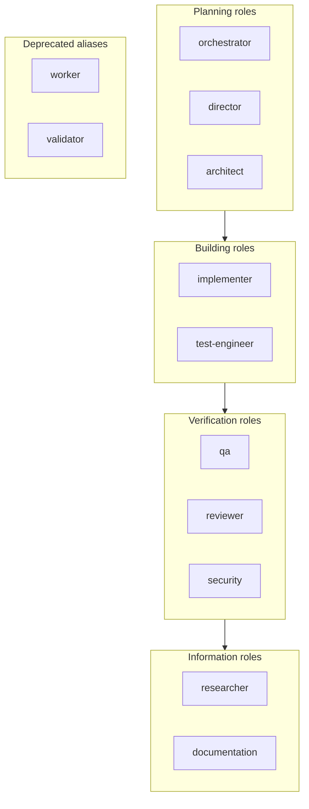
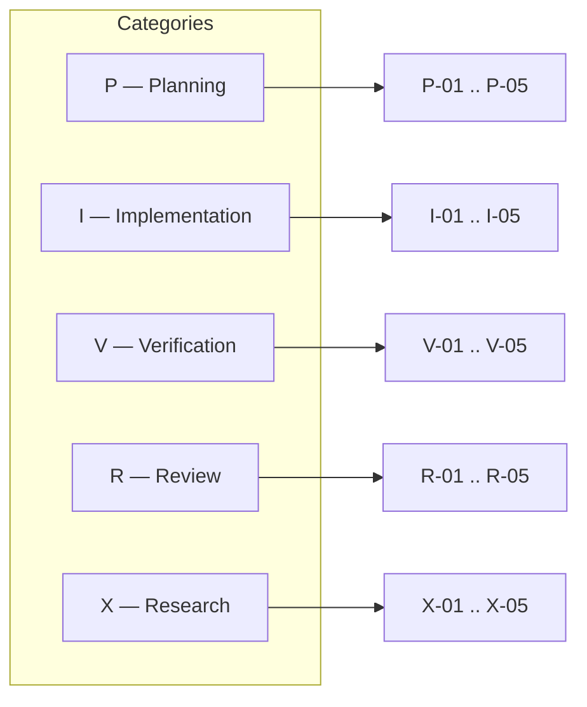
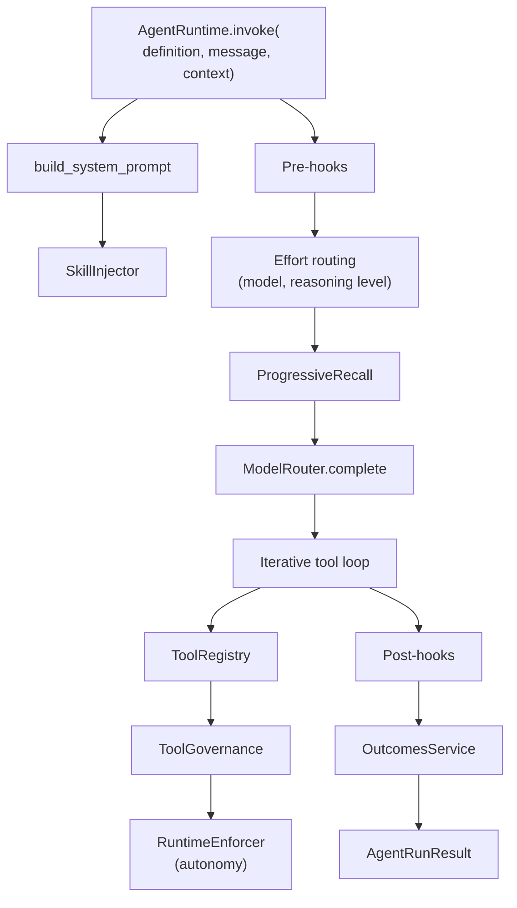

# Agent Model

This document describes how AGENT-33 models agents: the definition format, the registry that holds them, the runtime that invokes them, and the capability taxonomy that classifies what they can do. It is the place to read when you need to add a new agent role, understand why an existing agent behaves the way it does, or wire your own runtime into the framework.

For the higher-level architecture see [ARCHITECTURE.md](../../ARCHITECTURE.md). For the component catalog see [components.md](components.md). For the data flows that exercise the agent runtime see [data-flow.md](data-flow.md).

## Agent definition

An agent is a JSON file conforming to the `AgentDefinition` Pydantic model in `engine/src/agent33/agents/definition.py`. The file format is intentionally declarative — drop a new file into the directory pointed to by `agent_definitions_dir` and the registry will pick it up at the next startup.

The minimum viable definition is:

```json
{
  "$schema": "./schemas/agent.schema.json",
  "name": "researcher",
  "version": "1.0.0",
  "role": "researcher",
  "description": "Read-only research and synthesis agent.",
  "agent_id": "AGT-005",
  "status": "active",
  "capabilities": ["web-search", "code-analysis"],
  "spec_capabilities": ["X-01", "X-02", "X-03"]
}
```

The full model includes governance, ownership, inputs, outputs, dependencies, prompt template paths, model constraints, and metadata. The shipped definitions in `engine/agent-definitions/` are good worked examples:

| File | Role | Spec capabilities | Notes |
|------|------|-------------------|-------|
| `orchestrator.json` | `orchestrator` | P-01, P-02, P-03, P-05, V-05 | Top-level dispatcher |
| `director.json` | `director` | P-01, P-02, P-03, P-04, P-05 | Plan-and-decompose |
| `worker.json` | `worker` (legacy alias) | I-01, I-02, I-03, I-04, I-05 | General-purpose execution |
| `qa.json` | `qa` | V-01, V-02, V-03 | Quality assurance |
| `researcher.json` | `researcher` | X-01, X-02, X-03 | Read-only synthesis |
| `browser-agent.json` | (varies) | (varies) | Browser-driven tool use |

## Role taxonomy

The role enum in `agents/definition.py` lists every accepted role:



The roles are:

- `orchestrator` — top-level dispatcher.
- `director` — strategic planner.
- `implementer` — writes and modifies code.
- `qa` — verifies behavior.
- `reviewer` — checks completeness and conventions.
- `researcher` — read-only synthesis.
- `documentation` — produces and maintains docs.
- `security` — security-focused review and hardening.
- `architect` — system-level design.
- `test-engineer` — test infrastructure.
- `worker` (deprecated alias) — kept for backward-compatible JSON loading.
- `validator` (deprecated alias) — kept for backward-compatible JSON loading.

When you add a new agent, pick the closest existing role. If none fit, propose a new role through the change-control process before adding it to the enum.

## Capability taxonomy

AGENT-33 has a 25-entry capability taxonomy organised across five categories. The categories are the top-level letter; the entries are `<category>-<number>` within each:



Each `SpecCapability` value carries a `.category` property that recovers the top-level enum. The 25 entries are intentionally small so they can be reasoned about end-to-end; the framework treats them as opaque labels and uses them for search, routing, and reporting. See `agents/capabilities.py` for the metadata associated with each entry.

There is also a legacy capability vocabulary (`AgentCapability` enum) that uses kebab-case names: `file-read`, `file-write`, `code-execution`, `web-search`, `api-calls`, `orchestration`, `validation`, `code-analysis`, `research`, `refinement`. These are kept for backward compatibility — newer definitions should prefer the `spec_capabilities` field over the legacy `capabilities` field.

## Autonomy levels

Each definition can declare an autonomy level that constrains what the runtime will do without human approval:

| Level | What the agent may do |
|-------|----------------------|
| `read-only` | Read data, query stores, run inert tools. No writes, no shell, no commits. |
| `supervised` | Act, but every destructive operation needs approval (file write, shell, browser, commit, deploy). |
| `full` | Act within its governance constraints. No additional approval beyond the configured budget. |

The autonomy level interacts with the **autonomy budget** subsystem (`autonomy/`) which adds a stateful overlay: an active budget defines what files can be read, what files can be written (with line limits), what commands can be run, what network destinations can be reached, and what triggers a stop condition. The `RuntimeEnforcer` in `autonomy/enforcement.py` evaluates each access at runtime and either allows, warns, or blocks.

## Lifecycle status

Every definition has a `status`:

- `active` — the default. Discoverable, invocable.
- `experimental` — discoverable but flagged. Useful for definitions still being calibrated.
- `deprecated` — discoverable but flagged. Future runs may be rejected; new work should target a replacement.

The status flows through the registry and the API. `GET /v1/agents/by-id/{agent_id}` returns the status; the dashboard shows it; routing decisions can filter on it.

## Registry

The registry in `agents/registry.py` is an in-memory map keyed by agent name with secondary indexes:

```python
class AgentRegistry:
    def discover(self, path: str | Path) -> int: ...
    def register(self, definition: AgentDefinition) -> None: ...
    def get(self, name: str) -> AgentDefinition | None: ...
    def list_all(self) -> list[AgentDefinition]: ...
    def remove(self, name: str) -> bool: ...
    def get_by_agent_id(self, agent_id: str) -> AgentDefinition | None: ...
    def find_by_role(self, role: AgentRole) -> list[AgentDefinition]: ...
    def find_by_spec_capability(self, cap: SpecCapability) -> list[AgentDefinition]: ...
    def find_by_capability_category(self, category: CapabilityCategory) -> list[AgentDefinition]: ...
    def find_by_status(self, status: AgentStatus) -> list[AgentDefinition]: ...
    def search(self, *, role=None, spec_capability=None, category=None, status=None): ...
```

The registry is constructed in the FastAPI lifespan, populated by `discover(agent_definitions_dir)`, and stored on `app.state.agent_registry`. Routes access it via `Depends(get_registry)`; the agent invoke route additionally reads `skill_injector` and `progressive_recall` from `app.state` and passes them to the runtime.

Discovery is idempotent. If you drop in a new JSON file and restart, it's loaded. If you drop in a malformed file, it's logged and skipped (the registry doesn't crash startup over one bad definition).

## Runtime

The runtime in `agents/runtime.py` is the orchestrator that takes a definition and a message and produces a result. It is constructed once per process at lifespan time with a long list of optional dependencies, and it invokes itself many times per process for each agent call.



### System prompt construction

`_build_system_prompt` assembles the prompt from ten sections:

1. **Identity** — the agent's name, role, description.
2. **Capabilities** — its declared spec capabilities and legacy capabilities.
3. **Governance** — its scope, command policy, network policy, approval requirements.
4. **Autonomy** — its autonomy level and the active budget summary.
5. **Ownership** — the owning team and escalation target.
6. **Dependencies** — declared dependencies on other agents.
7. **I/O contract** — the declared inputs and outputs.
8. **Constraints** — model, token, retry, timeout, parallel-allowed.
9. **RAG memory** — the recalled context from `ProgressiveRecall`.
10. **Safety and output format** — global safety language and the requested output shape.

Skill injection runs as part of step 1: the injector picks skills allowed for this agent (and not disallowed), arranges them by progressive disclosure level (L0/L1 inlined; L2 references), and inserts them into the prompt.

### Pre-hooks and effort routing

After the system prompt is built but *before* the LLM call, pre-hooks run. Hooks can mutate the inputs, the prompt, the model selection, or the tool list. **Effort routing parameters are resolved after pre-hooks** — the routing engine needs to see the post-hook prompt to pick the right model and reasoning level. This ordering is preserved by the regression case in the iterative invocation path.

### Iterative tool loop

The loop is in `agents/tool_loop.py`. Each iteration:

1. Call the LLM with the current message history and allowed-tool descriptions.
2. If the response is a final answer, exit.
3. If the response is one or more tool calls:
   - For each call, resolve the tool by name, authorize via `ToolGovernance`, execute via `validated_execute` (which checks the JSON Schema first), and capture the result.
   - Append the tool result to the message history.
4. Increment the iteration count. If `max_iterations` is reached, exit with the last assistant message.

The loop is bounded both by `max_iterations` (configured per agent definition or per call) and by the autonomy budget (which can stop the loop early via `SC-01..SC-10` conditions).

### Streaming variant

`AgentRuntime.invoke_stream` is the streaming counterpart. It calls `stream_complete` instead of `complete`, emits SSE events as token chunks arrive and tool calls happen, and produces a final `completed` event with the assembled message. The streaming loop preserves the `max_iterations` termination contract: the final event still carries the last successful response content.

### Post-hooks and outcomes

After the loop terminates, post-hooks run with the final result, and the result is recorded to the outcomes service. Outcomes capture is best-effort — the SQLite store can fail silently if disk is unavailable, and the agent run still succeeds.

## How to add an agent

The full procedure for adding an agent:

1. Pick a role from the role enum, or propose a new one through change control.
2. Pick a unique `name` (must match the file stem).
3. Pick a unique `agent_id` of the form `AGT-XXX`.
4. Pick the spec capabilities from the 25-entry taxonomy. Aim for 2–5 capabilities; a definition with all 25 is a smell.
5. Write the system prompt as a Markdown file under the prompt directory the definition references (or inline it in the definition if it's short).
6. Add the file to `engine/agent-definitions/`, restart, and verify with `GET /v1/agents/{name}`.

No code change is required. The registry's `discover` call picks up the file at startup.

If you need a *new* role enum value, that's a one-line change in `agents/definition.py` plus regenerated schema. Roles are intentionally limited.

## How to add a runtime extension

Most operators won't need to write a new runtime — `AgentRuntime` is general enough for almost every case. The extension points operators do use are:

- **Hooks.** Drop a script into the hook directory; the hook registry picks it up at startup. Hooks can mutate prompts, inputs, model selection, and the result. See [components.md](components.md) for the hook subsystem.
- **Skills.** Add SKILL.md files. The skill injector picks them up automatically.
- **Tools.** Implement the `Tool` interface and either register at startup or expose via an `agent33.tools` entry point.
- **LLM providers.** Implement the `LLMProvider` protocol in `llm/providers/`; auto-registration from environment variables is in `llm/runtime_config.py`.
- **Memory providers.** Replace `LongTermMemory` with a subclass if you need a different durable store; the rest of the memory stack (embedding cache, BM25, hybrid searcher, RAG pipeline) is decoupled from the underlying store.

If you need to add a fundamentally different runtime — say, a runtime that uses a planner instead of a tool-use loop — you can implement a sibling class to `AgentRuntime` and dispatch on the agent definition's `archetype` (assistant, coder, router, group-chat-host). See `agents/archetypes/` for the base classes.

## Operational concerns

- **Hot reload.** The registry doesn't reload definitions at runtime. Restart the process to pick up changes. (Alternatively, the `POST /v1/agents/` endpoint allows admin-scoped runtime registration without a restart.)
- **Per-tenant overrides.** The framework doesn't have first-class per-tenant agent overrides yet. Tenants share the same definition set. If you need tenant-specific behavior, encode it in the prompt template or in a hook.
- **Versioning.** The `version` field is informational. The registry doesn't run multiple versions of the same agent simultaneously — the most recent file wins. If you need versioning, encode the version into the name (`researcher-v2`).
- **Cost.** Per-call cost is tracked by the `CostTracker` in observability. Aggregate cost is exposed via the dashboard.
- **Latency.** The trace collector records `started_at`, `completed_at`, and per-step durations. The dashboard rolls these up into P50/P95/P99 panels.
