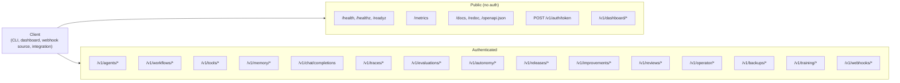

# API Surface

This document describes the shape of AGENT-33's HTTP API: how the surface is organised, what each route family is for, how authentication and authorization compose with route dependencies, and how streaming and webhook surfaces differ from request/response routes. It is not an endpoint reference — for that, the OpenAPI document at `/openapi.json` is the source of truth.

For the auth model see [security-model.md](security-model.md). For tenant scoping see [multi-tenancy.md](multi-tenancy.md). For the messaging surfaces see [messaging.md](messaging.md).

## Versioning and base path

Every route lives under `/v1/`. The version is part of the path because the framework's API is a public contract; breaking changes require a new version path. Within `/v1/`, sub-paths are grouped by domain (`agents`, `workflows`, `tools`, `traces`, `evaluations`, etc.).

Routes are mounted by `engine/src/agent33/api/routes/__init__.py`, which assembles per-domain routers into the top-level FastAPI app. Each router is a self-contained module with its own dependencies and tags. The OpenAPI document picks up the tags automatically.

## Service map



## Authentication and scope

Every request to `/v1/*` (except the public list) passes through `AuthMiddleware`, which extracts a credential from `Authorization: Bearer <jwt>` or `X-API-Key`. The decoded `TokenPayload` is attached to `request.state.user`.

Routes declare their scope requirement via `Depends(require_scope("..."))`. The dependency runs after middleware and rejects with `403` if the scope is absent.

The scope catalog is described in [security-model.md](security-model.md#authorization-scopes). The mapping from route family to scope is the surface contract:

| Family | Read scope | Write scope | Execute scope |
|--------|-----------|-------------|---------------|
| `/v1/agents` | `agents:read` | `agents:write` | `agents:invoke` |
| `/v1/workflows` | `workflows:read` | `workflows:write` | `workflows:execute` |
| `/v1/tools` | `tools:execute` | `tools:execute` | `tools:execute` |
| `/v1/memory` | `agents:read` | `agents:write` | — |
| `/v1/reviews` | `workflows:read` | `workflows:write` | — |
| `/v1/traces` | `workflows:read` | — | `tools:execute` |
| `/v1/evaluations` | `workflows:read` | — | `tools:execute` |
| `/v1/autonomy` | `workflows:read` | — | `tools:execute` |
| `/v1/releases` | `workflows:read` | — | `tools:execute` |
| `/v1/operator` | `operator:read` | `operator:write` | — |
| `/v1/backups` | `operator:read` | `operator:write` | — |
| `/v1/auth/api-keys` | — | `admin` | — |
| `/v1/webhooks/deliveries` | `admin` | `admin` | `admin` |

The `admin` scope is a supercede — it satisfies any other scope.

## Public paths

A short list bypasses auth. These are documented exhaustively in [multi-tenancy.md](multi-tenancy.md#public-paths). The list:

- Liveness/readiness probes (`/health`, `/healthz`, `/readyz`, `/health/channels`).
- Metrics scrape (`/metrics`).
- OpenAPI documentation (`/docs`, `/redoc`, `/openapi.json`).
- Credential exchange (`/v1/auth/token`).
- Operator dashboard reads (`/v1/dashboard/*`).
- Outcomes service health (`/v1/outcomes/health`).
- Ingestion heartbeat (`/v1/ingestion/heartbeat`).

These paths either return non-tenant data, exist to bootstrap a credential, or are aggregated read endpoints intended for a local operator.

## Request/response routes

The vast majority of routes are conventional JSON request/response. Patterns:

- **Resource collection** — `GET /v1/<domain>/` returns a paginated list. `POST /v1/<domain>/` creates a new resource.
- **Resource by id** — `GET /v1/<domain>/{id}` returns one. `PATCH` updates. `DELETE` removes.
- **Lifecycle transition** — `POST /v1/<domain>/{id}/<verb>` triggers a state machine transition (e.g., `/v1/releases/{id}/freeze`, `/v1/reviews/{id}/approve`).
- **Action** — `POST /v1/<domain>/{id}/<noun>` performs an action that may or may not transition the resource (e.g., `/v1/autonomy/budgets/{id}/enforcer`).
- **Subresource** — `/v1/<domain>/{id}/<sub>` operates on a child entity (e.g., `/v1/traces/{trace_id}/actions`).

Response shapes are Pydantic-modelled and serialised to JSON. Errors follow the FastAPI convention: `{"detail": "..."}` with appropriate HTTP status.

## Streaming routes

Some agent and workflow operations support streaming. The pattern is Server-Sent Events (`text/event-stream`):

- **Agent invocation** — `POST /v1/agents/{name}/invoke?stream=true` returns an SSE stream of events: `tool_call`, `tool_result`, `assistant_message`, `usage`, `completed`. The runtime emits events as the iterative loop progresses.
- **Workflow execution** — `POST /v1/workflows/{name}/execute?stream=true` returns SSE events for step transitions and final result.

SSE consumers must:

- Handle reconnection with the `Last-Event-ID` header (the framework writes monotonically increasing ids).
- Be prepared for `done` and `error` terminator events.
- Treat unknown event types as forward-compatible (skip rather than reject).

Streaming routes still pass through auth, scope, and rate limiting. The token-bucket consumes one token per *initiation*, not per event.

## Webhook routes

`/v1/webhooks/*` accepts inbound webhooks from external sources (Telegram, Discord, Slack, WhatsApp, GitHub, custom integrations). Patterns:

- **Provider verification** — `GET /v1/webhooks/whatsapp` responds to the WhatsApp verification challenge.
- **Inbound payload** — `POST /v1/webhooks/<provider>` receives the provider's event payload, validates the signature (HMAC or per-provider auth), and dispatches to the messaging adapter via the NATS bus.
- **Delivery management** — `/v1/webhooks/deliveries/*` is the operator-facing surface for tracking outbound webhook deliveries (retries, dead letters, statistics). Requires `admin` scope.

Inbound webhook auth is signature-based, not credential-based. Each provider sends a signed payload that the route verifies before processing. See [messaging.md](messaging.md) for the messaging side.

## Dashboard routes

`/v1/dashboard/*` is intentionally public (in the framework default). The dashboard returns:

- **Aggregated system status** — overall health, lifespan readiness, lifecycle counts.
- **Cross-tenant metrics** — request rates, error rates, top tools, top agents.
- **Lineage view** — `GET /v1/dashboard/lineage/{workflow_id}` returns the full DAG with per-step status.
- **Alert state** — current open alerts.

These views are designed for a local operator inspecting the engine. Production deployments behind an ingress typically restrict the dashboard paths to operator IP ranges.

## Operator routes

`/v1/operator/*` is the operator's view *of their own tenant*. It overlaps with the dashboard in spirit but is tenant-scoped and authenticated:

- **Status** — `GET /v1/operator/status` returns the current tenant id, scopes, and runtime stats.
- **Config** — `GET /v1/operator/config` returns the effective config (with secrets redacted).
- **Doctor** — `GET /v1/operator/doctor` runs a self-diagnostic and returns a report.
- **Reset** — `POST /v1/operator/reset` resets state (rate limit counters, caches) for the operator's tenant.
- **Sessions, backups, onboarding** — operator-tier inspection of these subsystems.

The operator routes require `operator:read` or `operator:write` and respect the credential's tenant id.

## Trace and evaluation routes

`/v1/traces/*` and `/v1/evaluations/*` are the engine's introspection surfaces:

- **Traces** — Sessions, Runs, Tasks, Steps, Actions, Failures. The hierarchy is described in [observability.md](observability.md). The routes let clients post new spans and read assembled trace trees.
- **Evaluations** — Golden tasks, golden cases, evaluation runs, regression detection, scheduled gates. The full eval lifecycle is described in [observability.md](observability.md#evaluation-pipeline).

Both surfaces split read (`workflows:read`) from write/execute (`tools:execute`). An evaluator service can post results without having broader workflow privileges.

## Autonomy, release, improvement

Three routes form the engine's lifecycle surface:

- **Autonomy** — `POST /v1/autonomy/budgets/...` creates and transitions autonomy budgets, runs preflight checks, applies the enforcer to file/command/network checks at runtime, manages escalations. See [security-model.md](security-model.md#autonomy-enforcement).
- **Releases** — `POST /v1/releases/...` operates the release lifecycle state machine (`PLANNED` → `FROZEN` → `RC` → `VALIDATING` → `RELEASED` → `ROLLED_BACK`), runs the pre-release checklist, executes sync rules with dry-run and real-run, manages rollbacks.
- **Improvements** — `/v1/improvements/intakes`, `/v1/improvements/lessons`, `/v1/improvements/checklists`, `/v1/improvements/metrics`, `/v1/improvements/refreshes` track the continuous improvement loop: research intake, lessons learned, periodic checklists, metric snapshots, roadmap refreshes.

These three surfaces share a common shape: state machine + transition endpoints + read endpoints + paginated lists.

## Idempotency

Mutation endpoints are not idempotent by default. Clients that need idempotency:

- Pass an `Idempotency-Key` header (where supported — currently in selected create routes).
- Use the resource's natural id (e.g., `agent_id`) for upserts.
- Retry on `5xx` with backoff; do not retry on `4xx`.

For workflow execution and agent invocation, clients should treat each call as a new run. Replays go through the trace replay surface, not by retrying the original endpoint.

## Pagination

Collection endpoints return paginated results:

- **Query parameters** — `limit` (default 50, max 200), `offset` (default 0). Some endpoints support `cursor` for stable pagination.
- **Response envelope** — `{ "items": [...], "total": N, "limit": L, "offset": O }`.

Pagination is offset-based for simplicity. Cursor pagination is added selectively where time-ordered streams matter (traces, eval runs, audit logs).

## Error model

Errors follow a common envelope:

```json
{
  "detail": "Human-readable description",
  "code": "machine_readable_code",
  "request_id": "uuid"
}
```

The `code` is a stable identifier (e.g., `invalid_scope`, `tenant_mismatch`, `tool_not_allowed`). The `request_id` is a UUID generated by the request logger and is also written to logs and traces. Clients should include the `request_id` in support requests.

Common status codes:

- `400` — validation failure (Pydantic).
- `401` — missing or invalid credential.
- `403` — credential lacks the required scope.
- `404` — resource not found (or scoped out by tenant).
- `409` — state conflict (e.g., transitioning a release that's already published).
- `413` — request body exceeds size limit.
- `422` — semantic validation failure (e.g., a workflow with a cycle in its DAG).
- `429` — rate limited.
- `500` — internal error (always logged with a request_id).
- `502 / 503` — upstream LLM or tool failure (transient).

## OpenAPI

The full route catalog is at `/openapi.json` and rendered at `/docs` (Swagger UI) and `/redoc` (ReDoc). The OpenAPI document is generated from the Pydantic models and FastAPI route signatures — it is always in sync with the code.

Operators wiring SDKs or clients should treat the OpenAPI document as the source of truth and regenerate clients per release.

## Versioning policy

`/v1/` is stable. Breaking changes — removing a field, changing a status code, changing semantics — require a `/v2/` path. Additive changes (new endpoints, new fields, new optional query parameters) are made in place on `/v1/`.

Deprecation:

- Endpoints marked deprecated emit a `Deprecation` and `Sunset` header per RFC 8594.
- The OpenAPI document marks the operation as `deprecated: true`.
- Deprecated endpoints remain functional for one minor version cycle before removal.

## Summary

The API surface is shaped by three orthogonal axes:

- **Domain** — agents, workflows, tools, memory, traces, evaluations, autonomy, releases, improvements, operator, etc.
- **Scope** — read, write, execute, admin.
- **Mode** — request/response, streaming, webhook intake, dashboard read.

The auth/scope axes compose orthogonally with the domain axis: a `tools:execute` credential can write traces and execute evaluations because both surfaces share that scope; an `operator:read` credential can read its own tenant's config but cannot touch agents or workflows.

The result is a surface that's enumerable by domain (each router is one file), navigable by scope (each scope has a clear set of granted operations), and inspectable by mode (streaming, webhook, dashboard are obvious from the path prefix).
