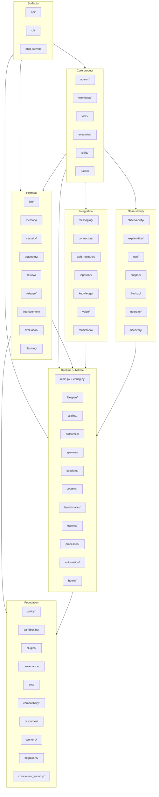

# Component Catalog

This document is the directory-by-directory reference for the engine. Every first-class subsystem under `engine/src/agent33/` is named, its responsibility described, and the load-bearing modules pointed at. It is the place to look when you have a feature in mind and need to find where the relevant code lives.

The top-level [ARCHITECTURE.md](../../ARCHITECTURE.md) is the elevator pitch; [overview.md](overview.md) is the system-level view; this document is the inventory.

## Subsystem relationship diagram

The diagram below groups the ~60 subsystem directories by responsibility and shows the load-bearing dependencies. Arrows point from caller to callee.

## Product surfaces

### `agents/`

The agent registry, the agent definition model, and the agent runtime. Holds the read-and-invoke side of the agent abstraction.

- `definition.py` — the `AgentDefinition` Pydantic model with the 25-entry P/I/V/R/X spec capability taxonomy.
- `registry.py` — `AgentRegistry` with `discover(path)` to scan JSON files, plus search by id, role, spec capability, capability category, and status.
- `runtime.py` — `AgentRuntime` builds the system prompt from the definition, applies skill injection, runs the iterative tool-use loop, and calls the LLM through the model router. Constructor takes 40+ optional dependencies for hooks, governance, memory, autonomy enforcement, and outcomes capture.
- `tool_loop.py` — the iterative tool-use loop with retry and scoring.
- `tool_loop_scoring.py` — scoring of tool-use trajectories.
- `effort.py` — effort routing (selects model and reasoning level per request).
- `capabilities.py` — the 25-entry P/I/V/R/X capability taxonomy and helper functions.
- `delegation.py` — the delegation manager used by sub-agent spawn.
- `archetypes/` — assistant, coder, router, group-chat-host base classes.

### `workflows/`

The DAG-based workflow engine. Workflows are first-class declarative compositions of step actions.

- `definition.py` — `WorkflowDefinition`, `WorkflowStep`, the 12 `StepAction` values (invoke-agent, run-command, validate, transform, conditional, parallel-group, wait, execute-code, http-request, sub-workflow, route, group-chat), the 3 `ExecutionMode` values (sequential, parallel, dependency-aware), and the 6 `TriggerEvent` values.
- `state.py` — persisted run state.
- `dag.py` — `DAGBuilder` with Kahn's algorithm, cycle detection, and parallel group extraction.
- `executor.py` — `WorkflowExecutor` with retry, timeout, checkpoint resume, and step event publication.
- `expressions.py` — `${{ step.output }}` resolver.
- `checkpoint.py` — durable run state.
- `run_archive.py` — archives completed runs to disk.
- `ws_manager.py`, `transport.py`, `sse.py` — WebSocket and SSE delivery.
- `actions/` — one module per `StepAction`.
- `templates/` — pre-built workflow templates.

### `tools/`

The tool framework. Holds the registry, governance, schema validation, MCP discovery, and built-in tools.

- `base.py` — the `Tool` and `SchemaAwareTool` protocols, `ToolContext`, `ToolResult`.
- `registry.py` — `ToolRegistry` with `discover_from_entrypoints(group)`, `register`, `register_with_entry`, MCP STDIO/SSE discovery, `validated_execute` (validates against the tool's JSON Schema before calling).
- `registry_entry.py` — `ToolRegistryEntry`, `ToolProvenance`, `ToolStatus`.
- `schema.py` — `get_tool_schema`, `validate_params`.
- `governance.py` — `ToolGovernance` with rate limiting, autonomy enforcement, approval gates.
- `approvals.py` — the approval state machine.
- `mcp_client.py` — `MCPClientManager` for discovering tools from MCP servers.
- `mutation_audit.py` — records destructive operations.
- `builtin/` — the bundled tools: `shell`, `file_ops`, `web_fetch`, `browser`, `apply_patch`, `search`, `delegate_subtask`, `ptc_execute`.

### `execution/`

The code execution sandbox layer. Pluggable adapters, with progressive disclosure of output.

- `models.py` — `SandboxConfig`, `ExecutionContract`, `ExecutionResult`.
- `validation.py` — IV-01 through IV-05 input validation rules.
- `executor.py` — `CodeExecutor` pipeline that selects an adapter, validates, executes, and packages results.
- `disclosure.py` — L0 summary through L3 full transcript progressive disclosure.
- `adapters/base.py` — `BaseAdapter` protocol.
- `adapters/cli.py` — subprocess adapter.
- `adapters/jupyter.py` — Jupyter kernel adapter (optionally in Docker).
- `adapters/gpu_docker.py` — GPU Docker adapter.
- `gpu.py` — GPU-bound container management.

### `skills/`

Skills and the plugin system. Skills are Markdown documents with YAML frontmatter that AGENT-33 loads and injects into agent prompts.

- `definition.py` — `SkillDefinition` with `name`, `description` (L0), `instructions` (L1), `resources` (L2 on-demand), `allowed_tools`, `disallowed_tools`.
- `loader.py` — `load_from_skillmd`, `load_from_yaml`, `load_from_directory`.
- `registry.py` — `SkillRegistry` (discover, CRUD, search).
- `injection.py` — `SkillInjector` with progressive disclosure.
- `calibration.py` — `HybridSkillMatcher` (fuzzy + semantic + contextual).
- `lineage.py` — `SkillLineageStore` records skill evolution.
- `slash_commands.py` — exposes skills as slash commands.

### `packs/`

Capability packs. A pack is a versioned bundle of skills, prompts, tool entries, outcome packs, and metadata.

- `models.py` — `InstalledPack`, `PackStatus`, `PackSkillEntry`, `OutcomePackEntry`, `PackDependency`, `PackCompatibility`, `PackGovernance`.
- `manifest.py` — `PackManifest` and the YAML parser.
- `loader.py` — `load_pack_manifest`, `load_pack_skills`, `verify_checksums` (with `hmac.compare_digest`), `compute_pack_checksum`.
- `registry.py` — `PackRegistry.discover`, `enable_for_session`, qualified `pack/skill` names + bare aliases.
- `marketplace.py` — local marketplace.
- `remote_marketplace.py` and `marketplace_aggregator.py` — remote sources.
- `trust_manager.py` — `TrustPolicyManager`.
- `signing.py` — Sigstore cosign integration.
- `audit.py`, `rollback.py` — `PackRollbackManager`.
- `hub.py` — `PackHub` registry client with revocation list and SHA-256 verification.
- `sharing.py` — `PackSharingService` for agent-to-agent pack handoff in workflows.
- `provenance.py`, `provenance_models.py` — pack provenance records.

## Platform subsystems

### `llm/`

LLM provider abstraction.

- `base.py` — `LLMProvider` protocol with `complete` and `stream_complete`.
- `router.py` — `ModelRouter` selects provider/model per request.
- `providers/` — adapters for Ollama, OpenAI-compatible APIs, OpenRouter, LM Studio, llama.cpp, Anthropic, Together, Fireworks, Mistral, Cohere, Perplexity, Groq, DeepSeek, Replicate, Hugging Face, Vertex, Azure OpenAI.
- `pricing.py` — per-model pricing for cost tracking.
- `runtime_config.py` — builds the active router at lifespan startup.
- `errors.py` — structured failure taxonomy.

### `memory/`

Memory and retrieval.

- `short_term.py` — in-process conversation buffer.
- `long_term.py` — `LongTermMemory` with pgvector, the `MemoryRecord` ORM, `SearchResult`, `store`, `search`, `scan`, `count`, cosine-distance ranking.
- `embeddings.py` — `EmbeddingProvider`.
- `cache.py` — LRU cache with optional file persistence.
- `quantization.py` — TurboQuant compression.
- `bm25.py` — `BM25Index`.
- `hybrid.py` — `HybridSearcher` with Reciprocal Rank Fusion.
- `rag.py` — `RAGPipeline` (1200-token chunking, retrieval, secret redaction).
- `progressive_recall.py` — long-session memory tiering.
- `compaction.py`, `context_slots.py`, `session_catalog.py` — operator-session context engine.
- `observation_capture.py`, `summarizer.py` — capture-as-you-go and post-session summaries.
- `ingestion.py`, `retention.py` — ingestion and retention policies.

### `security/`

Authentication, authorisation, and prompt hardening.

- `middleware.py` — `AuthMiddleware` resolves tenant from JWT or API key.
- `auth.py` — JWT minting and validation, API key validation.
- `permissions.py` — scope catalogue and `require_scope` helper.
- `encryption.py` — AES-256-GCM (`encrypt`, `decrypt`, `generate_key`).
- `vault.py` — Fernet-backed secret store.
- `approval_tokens.py` — `ApprovalTokenManager` issues HMAC-signed one-time JWTs.
- `prompt_injection.py` — pattern-based prompt-injection screening.
- `allowlists.py` — command and host allowlists.
- `arg_hash.py` — canonical hashing of tool arguments.

### `autonomy/`

Autonomy budget enforcement.

- `models.py` — `AutonomyBudget`, `EnforcementContext`, `EnforcementResult`, `EscalationRecord`, `StopAction`.
- `state.py` — budget lifecycle (`DRAFT → ACTIVE → COMPLETED`).
- `preflight.py` — PF-01 through PF-10 scope and credential checks.
- `enforcement.py` — `RuntimeEnforcer` with EF-01..EF-08 (file read/write, command, network, tool-call limit, file-limit, line-limit) and SC-01..SC-10 stop conditions.
- `escalation.py` — budget exhaustion handling.
- `p69b_service.py`, `p69b_persistence.py` — persistent tool-approval gate.
- `service.py` — `AutonomyService`.

### `review/`

Two-layer review automation.

- `risk.py` — risk assessment.
- `assignment.py` — reviewer assignment.
- `state.py` — sign-off state machine (`pending → approved | rejected | escalated`).
- `service.py` — `ReviewService`.

### `release/`

Release lifecycle.

- `state.py` — `PLANNED → FROZEN → RC → VALIDATING → RELEASED → ROLLED_BACK` state machine.
- `checklist.py` — RL-01 through RL-08 pre-release gate items.
- `sync.py` — `SyncEngine` propagates artifacts to downstream targets (with dry-run mode and `fnmatch` matching).
- `rollback.py` — `RollbackManager` decision matrix.
- `service.py` — `ReleaseService`.

### `improvement/`

Continuous improvement.

- `intake.py` — research intake (`SUBMITTED → TRIAGED → ANALYZING → ACCEPTED | DEFERRED | REJECTED → TRACKED`).
- `lessons.py` — lessons learned with action tracking.
- `checklists.py` — CI-01 through CI-15 checklists.
- `metrics.py` — IM-01 through IM-05 with trend computation.
- `roadmap.py` — roadmap refresh records.
- `service.py` — `ImprovementService`.

### `evaluation/`

Evaluation suite and regression gates.

- `golden_tasks.py` — GT-01 through GT-07.
- `golden_cases.py` — GC-01 through GC-04.
- `metrics.py` — M-01 through M-05 (pass-rate, latency, token budget).
- `gates.py` — threshold enforcement.
- `regression.py` — RI-01 through RI-05 baseline comparison.
- `service.py` — `EvaluationService`.
- `comparative/`, `synthetic_envs/` — environment harnesses.

### `planning/`

The `PlannerService` for plan persistence.

## Integration subsystems

### `messaging/`

External chat integrations.

- `bus.py` — `NATSMessageBus` thin wrapper around the `nats` package.
- Adapters under `messaging/` for Telegram, Discord, Slack, and WhatsApp, each implementing the `MessagingAdapter` protocol with a `health_check()` method.
- `boundary.py` wires connector adapters with metrics.

### `connectors/`

Shared connector boundary for all outbound calls.

- `models.py` — `ConnectorRequest`, `ConnectorResponse`, `Decision`.
- `boundary.py` — `build_connector_boundary_executor`, `enforce_connector_governance`, `map_connector_exception`.
- `executor.py` — `ConnectorExecutor` middleware chain runner.
- `middleware.py` — `GovernanceMiddleware`, `TimeoutMiddleware`, `RetryMiddleware`, `CircuitBreakerMiddleware`, `MetricsMiddleware`.
- `governance.py` — `BlocklistConnectorPolicy` with policy pack support (`default`, `strict-web`, `mcp-readonly`).
- `circuit_breaker.py` — consecutive-failure circuit breaker with progressive backoff, `CircuitState` (closed/open/half_open), `CircuitOpenError`.
- `monitoring.py` — `ConnectorMetricsCollector`.

### `mcp_server/`

Model Context Protocol server endpoints.

- `server.py` — registers handlers for `list_agents`, `invoke_agent`, `search_memory`, `list_tools`, `discover_tools`, `execute_tool`, `list_skills`, plus the standard MCP resource and prompt endpoints.
- `bridge.py` — `MCPServiceBridge` wires the agent, tool, skill, workflow, and proxy registries.
- `auth.py` — scope and tool access enforcement.
- `proxy_manager.py` — proxies tool calls to remote MCP servers.
- `transports/` — SSE transport.

### `web_research/`

`WebResearchService` and the search-provider registry.

### `ingestion/`

Candidate-skill intake pipeline, journal, mailbox, metrics, doctor.

### `knowledge/`

`KnowledgeIngestionService` with RSS, GitHub, web, and folder adapters, scheduled via APScheduler.

### `voice/`

Optional voice sidecar client.

### `multimodal/`

Image, audio, and video handling.

## Observability and ops

### `observability/`

Telemetry, lineage, replay.

- `metrics.py` — `MetricsCollector`, `CostTracker`.
- `alerts.py` — `AlertManager`.
- `lineage.py` — `ExecutionLineage`.
- `replay.py` — `ExecutionReplay`.
- `trace_models.py` — Session → Run → Task → Step → Action.
- `trace_collector.py` — `TraceCollector` with state-store persistence.
- `failure.py` — 10-category failure taxonomy.
- `query_profiling.py`, `effort_telemetry.py`, `http_metrics.py` — request and query timing.
- `trace_retention.py` — retention sweep.

### `explanation/`

Agent explanation store with SQLite persistence.

### `ops/`

Operational helpers (health, status, doctor diagnostics).

### `support/`

Operator-facing support endpoints.

### `backup/`

Backup envelopes, restore plans, integrity verification.

### `operator/`

Operator-facing services (status, config, sessions, backups, onboarding).

### `discovery/`

Tool and skill discovery indexing.

## Control surfaces

### `api/`

FastAPI route modules.

- `routes/` — one module per resource (health, auth, agents, workflows, memory, reviews, traces, evaluations, autonomy, releases, improvements, operator, backups, dashboard, training, webhooks, hooks, plus 60+ others).
- `middleware/` — request-time middleware (rate limit, size limit, hook dispatch).

The full route table is in [api-surface.md](api-surface.md).

### `cli/`

`agent33` command-line interface. Built on Click.

### `hooks/`

Pre/post invocation hook registry with script-based discovery.

### `automation/`

APScheduler integration, webhook delivery, dead-letter queue, event sensors.

### `voice/`

Voice command pipeline.

### `processes/`

`ProcessManagerService` for long-running operator-spawned processes.

## Runtime substrate

### `main.py` and `config.py`

- `main.py` — the FastAPI app and lifespan.
- `config.py` — Pydantic `BaseSettings` with `env_prefix=""`.

### `lifespan/`

In-process fallback implementations.

- `InProcessCache` — drop-in for Redis.
- `InProcessMessageBus` — drop-in for NATS.

### `scaling/`

- `InstanceRegistry` for replica coordination.
- `SchedulerOwnershipGuard` Redis-backed lock for cron jobs.

### `outcomes/`

Outcome event logging with SQLite-backed persistence.

### `spawner/`

`SpawnerService` for the visual sub-agent workflow builder.

### `sessions/`

Operator-session lifecycle, catalog, lineage, spawn, archive.

### `context/`

Context window management.

### `benchmarks/`

Benchmark runner with SkillsBench adapter, config, models, reporting, storage, and task loader. Drives smoke and full benchmark runs.

### `training/`

Optional training, rollout, optimisation, and revert services.

## Foundation

### `policy/`

Runtime policy evaluation.

### `sandboxing/`

Additional sandbox primitives for the execution layer.

### `plugins/`

`PluginRegistry`, `ScopedSkillRegistry`, `ScopedToolRegistry`, capability grants.

### `provenance/`

Provenance collection for packs, skills, and tools.

### `env/`

Environment detection CLI.

### `compatibility/`

Compatibility shims and version detection.

### `resources/`

Operator-visible resource handles (files, processes, sessions).

### `workers/`

Background worker pool.

### `migrations/`

Migration helper utilities (not Alembic itself; that's `engine/alembic/`).

### `component_security/`

Component-level security checks wired into the release service gates.

## How they fit together

The product surfaces (`agents/`, `workflows/`, `tools/`, `execution/`, `skills/`, `packs/`) are the things operators directly use. They depend on the platform layer for memory, model selection, governance, and lifecycle state. The platform layer depends on the runtime substrate for cache, bus, lifespan, and configuration. The runtime substrate depends on the foundation for sandboxing, policy, and provenance.

Integration subsystems (`messaging/`, `connectors/`, `mcp_server/`, `web_research/`, `ingestion/`, `knowledge/`, `voice/`, `multimodal/`) all sit at the edge of the engine. They consume from the platform layer and present external surfaces.

Observability and ops (`observability/`, `explanation/`, `ops/`, `support/`, `backup/`, `operator/`, `discovery/`) are cross-cutting — they observe everything else and expose dashboards, traces, lineage, and recovery paths.

When you need a feature added, the question is which layer it belongs to. New external chat integrations go under `messaging/`; new model providers go under `llm/providers/`; new sandbox back ends go under `execution/adapters/`; new policy packs go in the connector boundary; new agent roles go under `agents/`. The directory structure is the canonical guide.
