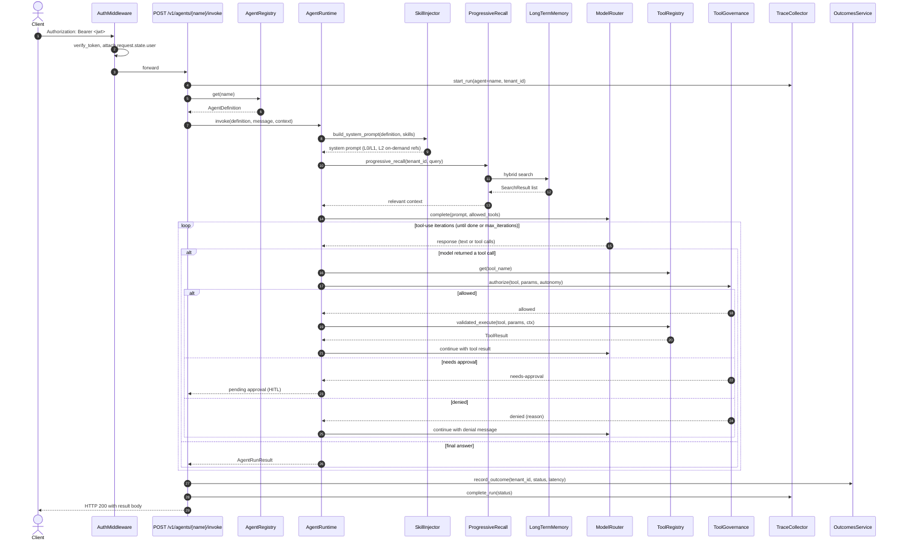
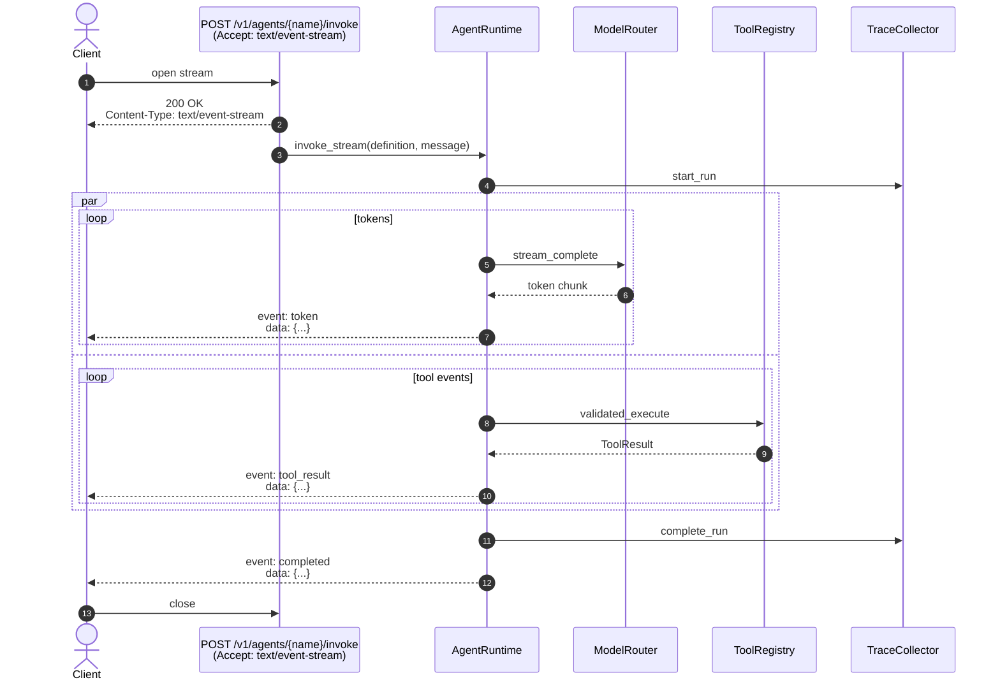
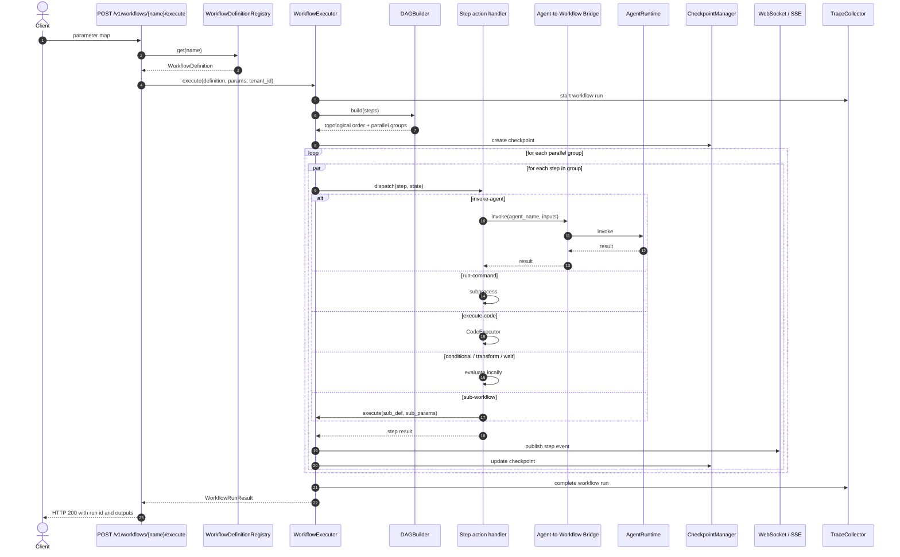
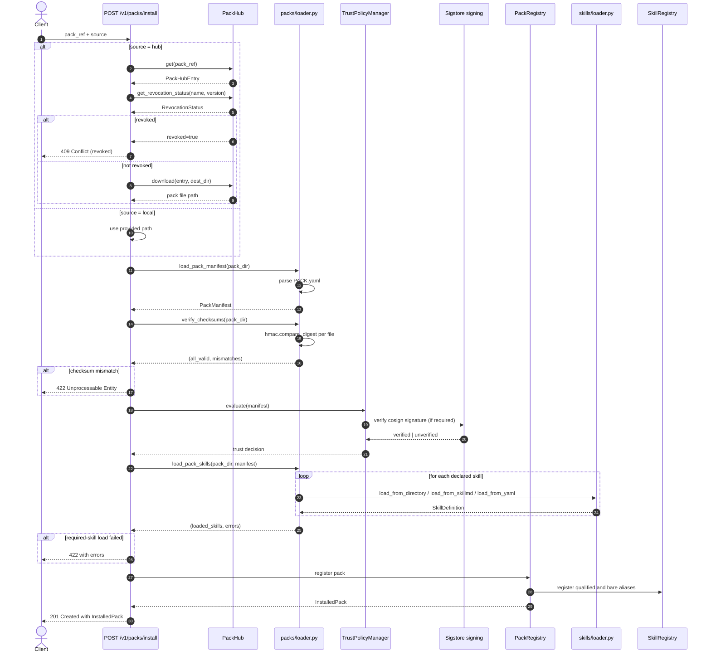
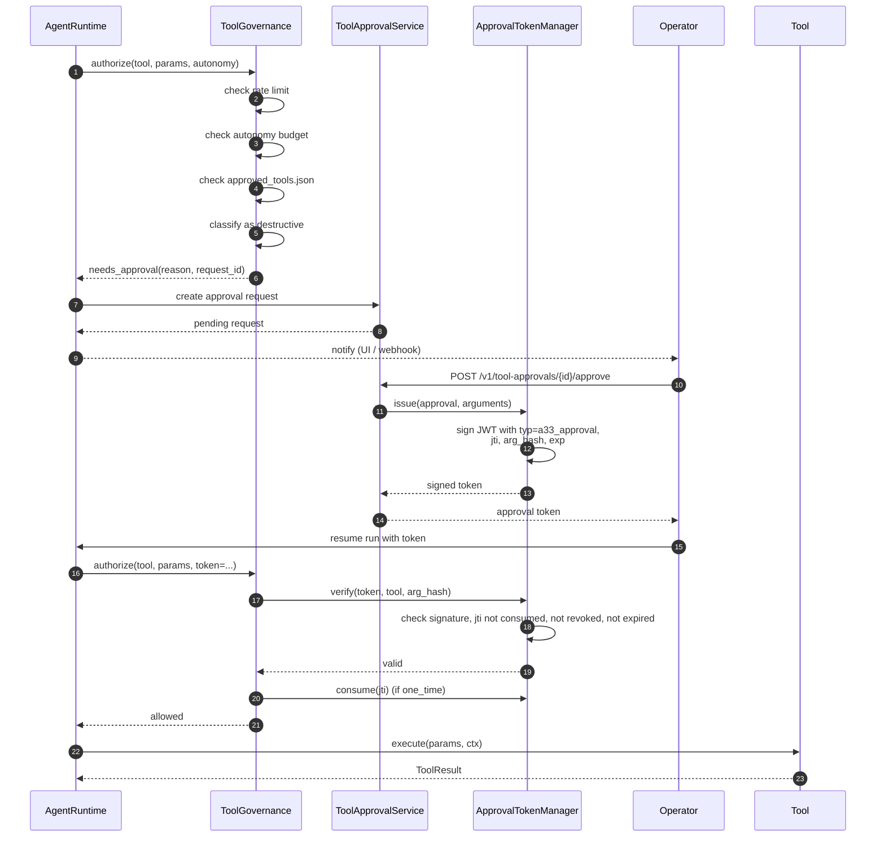
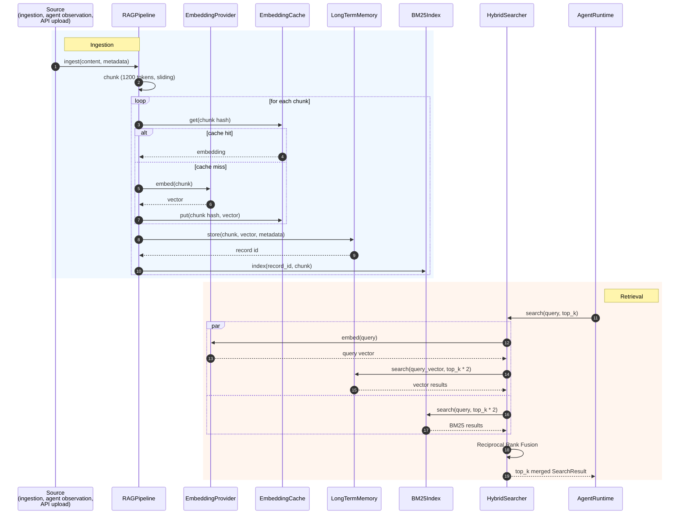
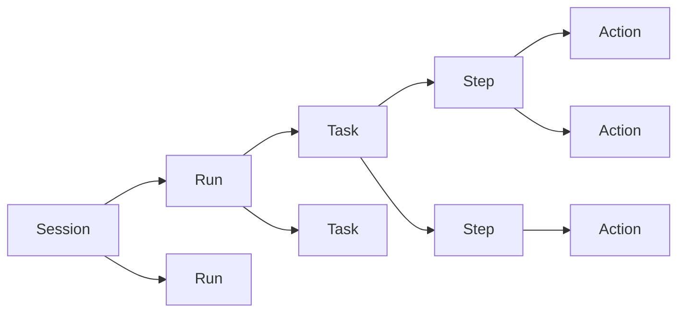

# Canonical Data Flows

This document is the sequence-diagram view of AGENT-33. It traces six canonical flows through the engine, showing which subsystems handle which steps and where state lands. The diagrams are simplified for clarity — error paths and retries are shown where they matter, omitted where they don't.

The flows are:

1. Agent invocation (synchronous HTTP)
2. Streaming agent invocation (SSE)
3. Workflow execution (DAG)
4. Pack installation
5. Tool call with approval gate
6. Memory ingestion and retrieval

For the architectural background read [ARCHITECTURE.md](../../ARCHITECTURE.md). For the per-subsystem reference read [components.md](components.md). For the API surface read [api-surface.md](api-surface.md).

## 1. Agent invocation

The shortest interesting path through the engine. An operator (or the frontend, or an SDK client) posts a message to an agent and gets a response.

Notes:

- The auth middleware runs once. If the token is missing or invalid, the chain short-circuits with `401`.
- The trace is opened *before* registry lookup so that lookup failures are recorded.
- `ProgressiveRecall` and the `LongTermMemory` calls are skipped if RAG is disabled in settings or if the agent definition opts out.
- The tool-use loop has a hard iteration cap; if it hits it, the loop returns the last assistant message and records a `max_iterations` warning to the trace.
- Outcomes capture is best-effort. If the SQLite store is unavailable it swallows the error and logs.

## 2. Streaming agent invocation (SSE)

The streaming variant of the same call. The route returns an SSE stream, and the runtime emits events as the model produces tokens and the tool loop progresses.

The SSE stream emits structured events:

- `event: token` — incremental text from the LLM
- `event: tool_call` — the agent decided to call a tool
- `event: tool_result` — the tool returned
- `event: thinking` — reasoning chunk if the provider exposes them
- `event: completed` — the final answer, with the full content
- `event: error` — the run failed; the data carries the failure category

If the stream hits `max_iterations` it still emits a final `completed` event carrying the last assistant message. The corresponding regression case is `tests/test_streaming_tool_loop.py::test_stream_max_iterations`.

## 3. Workflow execution

The DAG executor. The route accepts a workflow name and parameter map, the executor walks the topological order, and each step either calls an agent, runs a command, transforms data, branches, parallelises, or runs a sub-workflow.

Notes:

- `DAGBuilder` runs Kahn's algorithm at build time. Cycles raise `CycleDetectedError` before any step executes.
- Each parallel group is dispatched concurrently. Steps within a group cannot depend on each other.
- Step retries are configured per step (`max_attempts`, `delay_seconds`).
- Checkpoints land in PostgreSQL (`workflow_checkpoints` table). On restart, `WorkflowExecutor.resume_from_checkpoint(workflow_id)` resumes the run from the last persisted step.
- WebSocket and SSE subscribers receive structured step events: `step_started`, `step_completed`, `step_failed`, `workflow_completed`.

## 4. Pack installation

Installing a pack from disk or from the pack hub. The flow verifies the SHA-256 digest, checks the revocation list, validates path-traversal safety, loads the manifest, loads each declared skill, applies the trust policy, and registers the pack and its skills.

Key safety properties:

- **Path traversal** is blocked in the loader: every skill path is resolved against the pack directory and rejected if it escapes (`skill_path.relative_to(pack_dir.resolve())` raises `ValueError`).
- **Revocation** is checked *before* any extraction or registration. A revoked pack is never installed.
- **SHA-256** verification uses `hmac.compare_digest` to avoid timing side channels.
- **Trust policy** is evaluated against the manifest. Strict mode requires a verified Sigstore signature; permissive mode warns but allows.
- **Optional skills** that fail to load produce a warning; required skills that fail produce an installation failure.

## 5. Tool call with approval gate

Some tool calls require human approval before they execute — destructive file writes, shell commands, browser navigation to high-risk domains. The approval flow is stateless from the engine's perspective: the gate produces a token, the operator approves it, the agent re-runs with the token, the token is consumed.

Approval tokens are signed with `JWT_SECRET` (or a dedicated approval-token secret). The `typ: a33_approval` claim prevents reuse as a regular auth token. The `jti` is recorded in a consumed-set after a one-time call. Tokens have a default 300-second TTL.

The destructive-tool set (`_WRITE_TOOLS = {"shell", "browser"}`) and per-tool destructive parameters (`_DESTRUCTIVE_PARAMS = {"file_ops": {"write"}, "apply_patch": {"apply"}}`) are defined in `tools/governance.py`. Adding a new destructive surface means extending those sets.

## 6. Memory ingestion and retrieval

The memory pipeline. Operator content (or agent observations) is chunked, embedded, indexed in BM25 and pgvector, and later retrieved via hybrid search.

Ingestion notes:

- Chunking is **token-aware**, not character-aware. The chunker uses the model's tokenizer (cached at startup) and produces 1200-token chunks with configurable overlap.
- The **embedding cache** is an LRU keyed by chunk hash. With an Ollama-backed provider on commodity hardware it cuts ingestion cost dramatically for repeated content.
- Secret redaction runs *before* embedding. If a chunk looks like it contains an API key or password, the secret is masked before the vector is computed.

Retrieval notes:

- **Hybrid retrieval** runs the vector and BM25 queries concurrently and fuses them with Reciprocal Rank Fusion. The fusion weight is configurable (`rag_rrf_k`).
- The over-fetch factor (`top_k * 2`) gives the fusion room to drop irrelevant tails.
- `ProgressiveRecall` is layered on top of the hybrid searcher for long-session memory tiering; agents typically call `ProgressiveRecall.recall` rather than `HybridSearcher.search` directly.

## Cross-cutting: traces and lineage

Every flow above writes to the trace collector. The trace hierarchy is Session → Run → Task → Step → Action. A single agent invocation is one Run, with one Task containing N Steps (one per tool-use iteration), each Step containing M Actions (one per tool call within the iteration). A workflow run is a Run with one Task per workflow step, structured the same way.

The `ExecutionLineage` subsystem additionally records parent-child relationships across runs (sub-agent spawn, sub-workflow execution) so that you can trace any artifact back to the originating user request. See [observability.md](observability.md) for the full model.

## Where to go next

- For the per-subsystem code map: [components.md](components.md).
- For the workflow DAG details: [workflows.md](workflows.md).
- For the agent runtime details: [agents.md](agents.md).
- For storage layout: [storage.md](storage.md).
- For pack lifecycle: [packs-and-skills.md](packs-and-skills.md).
- For the security model: [security-model.md](security-model.md).
- For the observability surface: [observability.md](observability.md).
