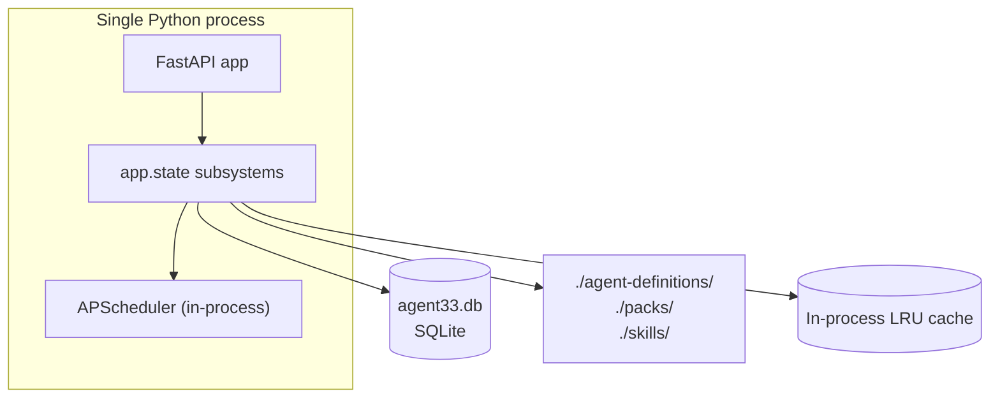
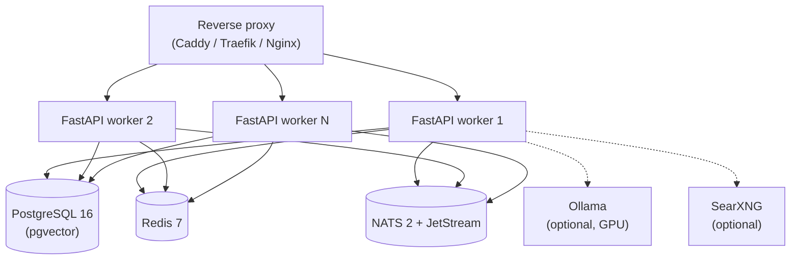
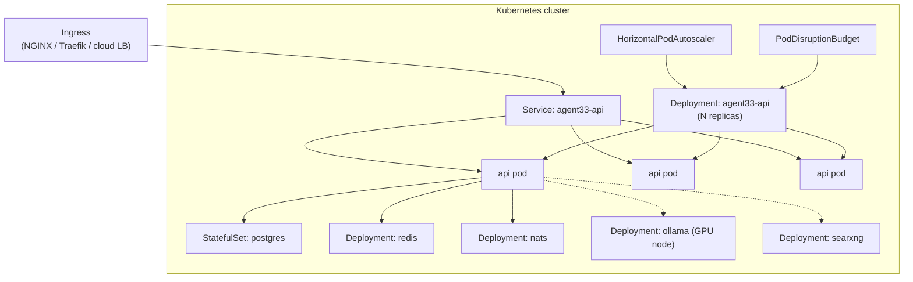

# Deployment Topologies

AGENT-33 runs on a spectrum from a single laptop process to a multi-region Kubernetes deployment. This document describes the supported topologies, the trade-offs of each, and how the same engine code adapts to its environment via configuration alone.

For Docker-specific instructions see the project's installation guide. For the security implications of shared vs. isolated deployments see [security-model.md](security-model.md) and [multi-tenancy.md](multi-tenancy.md#isolation-guarantees).

## The deployment matrix

The engine has three first-class deployment modes:

| Mode | Persistence | Concurrency | Use case |
|------|-------------|-------------|----------|
| **Lite** | SQLite + in-process queues | Single process | Developer laptop, demos, single-tenant home lab |
| **Standard** | PostgreSQL + Redis + NATS | Multi-process, one host or compose stack | Small team, single-VPS production |
| **Enterprise** | PostgreSQL HA + Redis HA + NATS JetStream cluster | Multi-node, K8s | Production multi-tenant SaaS |

A fourth topology — **multi-region** — is operator-assembled from enterprise stacks with a deployment-layer routing decision (no in-engine cross-region coordination).

The engine code is the same in all modes. Mode is selected by config: `DATABASE_URL`, `REDIS_URL`, `NATS_URL`, `CONTROL_PLANE_BACKEND`. Setting these to local file paths or memory backends triggers lite mode; setting them to real services triggers standard or enterprise.

## Lite topology



The lite topology runs one Python process. Persistence is SQLite. Concurrency is single-process; horizontal scale is not available. The engine boots in seconds.

When this mode is appropriate:

- Local development.
- Demos and trials.
- Single-user home lab where the user is also the operator.
- Air-gapped environments where running an external database is operationally heavy.

Trade-offs:

- No high availability (one process, one disk).
- No distributed cache; embedding caches and BM25 indexes are per-process.
- Background jobs run in-process; if the process dies, the jobs die with it.
- Redis-backed features (rate limiting state across replicas, cross-process pub/sub) degrade to in-process equivalents.
- NATS-backed features (messaging connectors, cross-process events) also degrade. The framework provides null adapters so the rest of the engine keeps working; channels that require NATS may be marked degraded in `/health/channels`.

Lite mode is the simplest possible target. It's good for getting started and for environments that genuinely don't need horizontal scale.

## Standard topology



The standard topology runs multiple FastAPI workers behind a reverse proxy, sharing PostgreSQL, Redis, and NATS. This is what `docker compose up` produces and what most small production deployments use.

Compose components from `engine/docker-compose.yml`:

- **frontend** — the React dashboard, built from the repo root context.
- **api** — the FastAPI engine.
- **postgres** — `pgvector/pgvector:pg16` image (pgvector preinstalled).
- **redis** — `redis:7-alpine` for sessions, rate limits, and cache.
- **nats** — `nats:2-alpine` with `--jetstream` for messaging and persistent streams.
- **ollama** — optional GPU profile for local LLMs.
- **searxng** — optional, for web search tools.
- **devbox** / **agent-os** — optional dev profiles for in-container worktrees.
- **n8n** / **airllm** — optional integrations.

The reverse proxy is intentionally not in the compose file. Operators wire their own (Caddy, Traefik, Nginx, Cloudflare Tunnel) and point it at the api service on port 8000.

When this mode is appropriate:

- Production deployments that fit on one VPS.
- Small teams sharing one engine.
- Tenancies in the low tens.

Trade-offs:

- Single-host failure domain. If the VPS dies, the engine dies.
- Vertical scale only — to add more capacity, get a bigger host or split tenants across compose stacks.
- Backups are the operator's responsibility (Postgres pg_dump, volume snapshots).
- Disk failure on the host loses durable state unless the operator has off-host backups.

This is the canonical "one stack per tenant when isolation matters" deployment.

## Enterprise topology (Kubernetes)



The Kubernetes manifests live in `deploy/k8s/base/` and a production overlay in `deploy/k8s/overlays/production/`. Components:

- **agent33-api Deployment** — runs the FastAPI engine. Default `replicas: 1` in the base manifest with an HPA bounded at `maxReplicas: 1` (the single-instance guardrail). The production overlay relaxes this for replicated deployments.
- **agent33-api Service** — `ClusterIP` exposing port 8000.
- **agent33-api Ingress** — exposes the service externally; the production overlay sets the public host.
- **agent33-api HPA** — scales on CPU (75%) and memory (80%).
- **agent33-api PDB** — `minAvailable: 1` to keep one pod up during voluntary disruptions.
- **postgres StatefulSet** — `pgvector/pgvector:pg16` with a 10 Gi PVC.
- **redis Deployment** — `redis:7-alpine`.
- **nats Deployment** — `nats:2-alpine` with JetStream enabled.
- **ollama Deployment** — gated to GPU nodes via nodeSelector/tolerations.
- **searxng Deployment** — optional web search backend.

Health probes are wired:

- `startupProbe` on `/healthz` — long initial budget for the engine to finish lifespan init.
- `readinessProbe` on `/readyz` — only routes traffic to ready pods.
- `livenessProbe` on `/healthz` — restarts pods that wedge.

Resource requests/limits in the base manifest are conservative (250m / 512Mi → 2 / 2Gi). The production overlay tunes these up.

### Why the single-instance guardrail

The base manifest caps replicas at 1. The engine has subsystems (BM25 indexes, embedding caches, agent-workflow bridge state) that are per-process. Running multiple replicas is supported, but the operator must understand:

- The session state is in Redis, so HTTP requests round-robin safely.
- The BM25 index is in-process; each replica has its own. For consistent search, hit the same replica or use Redis-backed search.
- Trace collectors per replica are independent; the trace pipeline aggregates downstream.
- Background scheduler jobs (APScheduler) should be pinned to one replica via the `BACKGROUND_SCHEDULER_ENABLED` flag, not multiplied across all replicas.

The single-instance default is the safe path. The production overlay's responsibility is to flip these flags consistently when raising the replica count.

When this mode is appropriate:

- Multi-tenant SaaS production.
- HA requirements (replica failover, rolling deploys).
- Operators with existing K8s experience and tooling.
- Compliance environments with separation requirements (namespaces, network policy).

Trade-offs:

- Operational complexity. Operators must understand K8s, PVCs, ingress controllers, secret management.
- Cost — running PostgreSQL, Redis, NATS, and Ollama as proper deployments is heavier than compose.
- Cold-start latency on replica scale-up (lifespan init takes several seconds).

## Multi-region topology

```mermaid
flowchart TB
    GLB["Global load balancer<br/>(Cloudflare / Fastly / GeoDNS)"]

    subgraph US["us-east-1"]
        USAPI["agent33 K8s stack"]
        USPG[("Postgres primary")]
    end

    subgraph EU["eu-west-1"]
        EUAPI["agent33 K8s stack"]
        EUPG[("Postgres replica<br/>or independent primary")]
    end

    subgraph AP["ap-southeast-1"]
        APAPI["agent33 K8s stack"]
        APPG[("Postgres replica<br/>or independent primary")]
    end

    GLB --> US
    GLB --> EU
    GLB --> AP

    USPG -.->|streaming replication<br/>(operator-managed)| EUPG
    USPG -.->|streaming replication<br/>(operator-managed)| APPG
```

The framework does not directly orchestrate multi-region deployments. The engine is region-blind: it sees one database, one Redis, one NATS. Multi-region is composed at the deployment layer:

- **GeoDNS or anycast** at the global load balancer routes users to the nearest region.
- **Independent stacks per region** — each region is a complete enterprise topology.
- **Tenant residency** — each tenant lives in one region. Cross-region tenant routing is enforced at the LB or at an upstream API gateway.
- **Data replication** is operator-managed (Postgres logical or physical replication, depending on the topology — primary/replica or active/active).

Trade-offs:

- Maximum complexity. Backups, schema migrations, failover, secret rotation must all be coordinated.
- Strongest isolation. A failure in one region doesn't touch the others.
- Latency benefits — each tenant talks to the nearest region.

The framework's role in multi-region is limited to honoring per-stack configuration; the multi-region story is operator-owned.

## Single-tenant deployment

Multi-tenancy is on by default. A single-tenant deployment is just a multi-tenant deployment with one tenant id (typically `default`). No code changes are needed. The operator:

1. Issues all credentials with `tenant_id: "default"`.
2. Optionally restricts the dashboard's cross-tenant views via ingress rules.
3. Optionally enables backup/export endpoints scoped to the single tenant.

The framework's tenant filtering is invisible when only one tenant exists.

## Containerisation

The engine runs in a multi-stage Docker build:

- **Base image** — `python:3.11.13-slim-trixie`.
- **Builder stage** — installs build deps, installs the package in dev mode.
- **Runtime stage** — copies the installed package, runs as the unprivileged `agent33` user, exposes port 8000.
- **Entrypoint** — `uvicorn agent33.main:app --host 0.0.0.0 --port 8000`.

The frontend has its own multi-stage build that builds the Vite bundle and serves it via NGINX. Important: the frontend Docker build context is the **repository root**, not the `frontend/` directory, because the frontend imports canonical workflow YAML from repo-level `core/workflows/...`.

## Configuration surface by topology

Settings that differ across topologies:

| Setting | Lite | Standard | Enterprise |
|---------|------|----------|------------|
| `DATABASE_URL` | `sqlite+aiosqlite:///agent33.db` | `postgresql+asyncpg://...` | `postgresql+asyncpg://...@pg-primary` |
| `REDIS_URL` | (unset → in-process) | `redis://redis:6379/0` | `redis://redis-cluster:6379/0` |
| `NATS_URL` | (unset → null adapter) | `nats://nats:4222` | `nats://nats-cluster:4222` |
| `OLLAMA_BASE_URL` | `http://localhost:11434` (optional) | `http://ollama:11434` (profile) | `http://ollama.gpu-pool.svc:11434` (optional) |
| `CONTROL_PLANE_BACKEND` | `memory` or `sqlite` | `postgres` | `postgres` |
| `JWT_SECRET` | dev default (warning) | required env or secret | required env or secret |
| `ENCRYPTION_KEY` | generated if absent (warning) | required | required |

Operators are responsible for setting these per environment. The `.env.example` in the repo lists every variable.

## Persistence and backup

All durable state is in PostgreSQL. Redis and NATS hold transient state that the engine can rebuild. The operator's backup plan is:

- **PostgreSQL** — pg_dump or volume snapshot, retained per the operator's compliance window.
- **Volumes (compose / PVCs)** — snapshotted as the host/storage layer supports.
- **Vault keys / JWT secrets / encryption keys** — backed up outside the engine, restored before recovery.
- **`agent-definitions/` and `pack/` directories** — version-controlled in the operator's deployment repo, not in the engine database.

The engine ships a `backup` operator endpoint that writes a JSON envelope of learning state, but it is not a substitute for database backups.

## Observability per topology

- **Lite** — `/metrics` exposes Prometheus metrics for an operator who scrapes locally.
- **Standard** — operators typically wire Prometheus + Grafana via docker-compose (not included in the framework's compose file).
- **Enterprise** — `deploy/monitoring/prometheus/agent33-alerts.rules.yaml` provides a starting alert ruleset. Operators wire their existing Prometheus and alert manager.

See [observability.md](observability.md) for the metrics surface.

## Choosing a topology

The default recommendation:

- **Trying it out** — lite mode on a laptop.
- **Production for a small team** — standard mode on one host with docker-compose, behind Caddy.
- **Multi-tenant SaaS or HA requirements** — enterprise mode on K8s.
- **Global presence** — multi-region with independent enterprise stacks.

There is no architectural ceremony required to move up the ladder: change the config, run the migrations, run the engine. The same code, same behaviors, more durable substrate.
