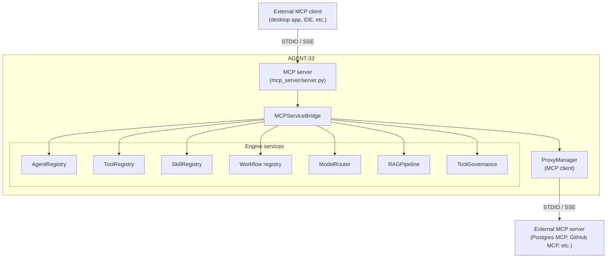
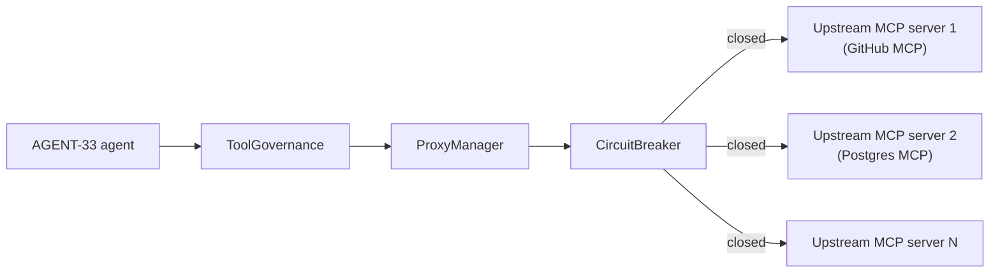
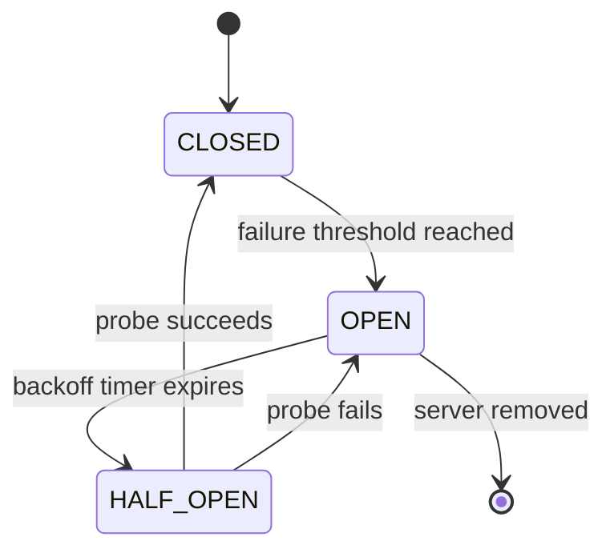
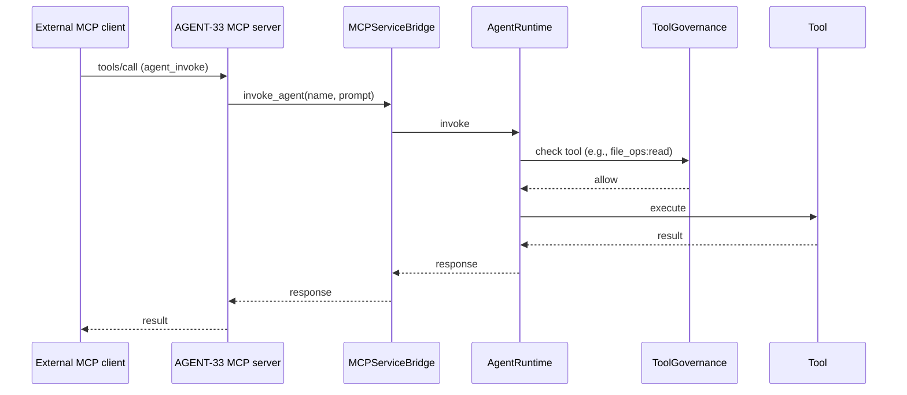
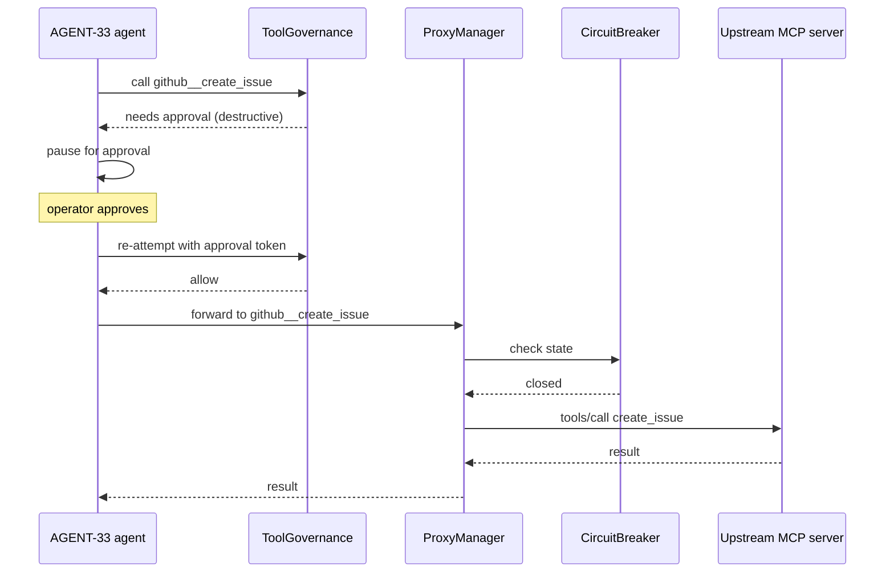

# MCP Integration

AGENT-33 integrates with the Model Context Protocol (MCP) in two directions. As an **MCP server**, the engine exposes its agents, tools, skills, workflows, and resources to external MCP clients. As an **MCP client / proxy**, the engine aggregates third-party MCP servers and exposes their tools to its own agents under one unified namespace. This document describes both sides, the proxy architecture, the circuit breaker that protects the engine from misbehaving upstreams, and how MCP fits into the broader governance model.

For the connector boundary that gates outbound MCP calls see [messaging.md](messaging.md#connector-boundary). For tool governance see [security-model.md](security-model.md#tool-governance).

## Why MCP

MCP is a standardized protocol for connecting LLM-driven agents to external tools, data sources, and services. AGENT-33 supports it because:

- **External tools become available to AGENT-33 agents.** Any MCP-compliant server — a database connector, a SaaS integration, a research tool — can be plugged into an AGENT-33 agent's tool list with a config change rather than custom code.
- **AGENT-33's surfaces become available to external MCP clients.** Operators using a desktop AI client that speaks MCP can drive AGENT-33 agents and workflows from outside the engine.
- **The protocol is composable.** MCP servers can be chained, proxied, and aggregated; AGENT-33 acts as one node in a larger MCP graph.

## Two roles, one bridge



The `MCPServiceBridge` is the central wiring layer. It holds references to the engine's registries and routers, and exposes them in MCP-compatible shapes:

```python
class MCPServiceBridge:
    def __init__(
        self,
        agent_registry: AgentRegistry | None = None,
        tool_registry: ToolRegistry | None = None,
        model_router: ModelRouter | None = None,
        rag_pipeline: RAGPipeline | None = None,
        skill_registry: SkillRegistry | None = None,
        workflow_registry: dict[str, WorkflowDefinition] | None = None,
        proxy_manager: ProxyManager | None = None,
        discovery_service: DiscoveryService | None = None,
        tool_activation_manager: ToolActivationManager | None = None,
        tool_governance: ToolGovernance | None = None,
        tool_discovery_mode: str = "legacy",
    ) -> None: ...
```

The bridge is constructed during lifespan startup with the live registries. The MCP server handlers call bridge methods; the bridge resolves to the real engine services.

## AGENT-33 as MCP server

The engine exposes an MCP server (`mcp_server/server.py`) with the standard MCP surfaces:

### Tools

Every native tool in the `ToolRegistry` is also an MCP tool. Plus, every proxied tool from upstream MCP servers is re-exposed under a prefix (see [Proxy](#proxy-manager)). External clients see one unified list.

A tool call from an MCP client:

1. Authenticated via MCP transport (typically OAuth or shared token).
2. Maps to a tool name (possibly prefixed for a proxied tool).
3. Passes through `ToolGovernance` for allowlist and effect-class checks.
4. Executes either natively or by forwarding to the upstream MCP server.

### Resources

The bridge exposes:

- **Agent definitions** — listable, fetchable by id or name.
- **Workflow definitions** — listable, fetchable.
- **Skill definitions** — listable, fetchable.
- **System status** — counts of agents/tools/skills/workflows/proxies.

Resources are read-only.

### Prompts

Skill prompts and agent system prompts are exposed as MCP prompts. An external client can fetch a prompt template, fill in parameters, and use it as a starting point for a model call (whether back through AGENT-33 or against the client's own model).

### Authentication

MCP server auth is configurable:

- **STDIO transport** — runs as a subprocess; trust boundary is the parent process.
- **SSE transport** — HTTP-based; uses bearer tokens or shared secrets.

The auth check happens before any bridge call. An unauthenticated MCP request never touches the engine's service layer.

## AGENT-33 as MCP client (proxy)

The `ProxyManager` (`mcp_server/proxy_manager.py`) is AGENT-33's MCP client side. It aggregates multiple upstream MCP servers and exposes their tools to native AGENT-33 agents.



### Fleet configuration

```yaml
proxy_servers:
  - id: github
    command: ["npx", "-y", "@modelcontextprotocol/server-github"]
    transport: stdio
    env:
      GITHUB_TOKEN: ${GITHUB_TOKEN}
    enabled: true
  - id: postgres
    command: ["npx", "-y", "@modelcontextprotocol/server-postgres"]
    transport: stdio
    env:
      DATABASE_URL: ${UPSTREAM_DATABASE_URL}
    enabled: true
  - id: gateway
    url: https://mcp.example.com/sse
    transport: sse
    headers:
      Authorization: Bearer ${MCP_GATEWAY_TOKEN}
    enabled: false
```

Each entry creates a `ChildServerHandle` managed by the proxy manager. STDIO transport spawns a subprocess; SSE transport opens a long-lived HTTP connection.

### Tool aggregation

When an MCP client (or an internal agent) asks for the tool list, the proxy manager:

1. Aggregates tools from all enabled child servers.
2. Prefixes each tool with `<server_id>__<tool_name>` (separator defaults to `__`).
3. Filters tools that collide with native tools (native tools are never shadowed).
4. Returns the merged list.

So a GitHub MCP server with a `create_issue` tool appears to AGENT-33 agents as `github__create_issue`. The agent doesn't see the proxy structure; it just sees a longer tool list.

### Per-server lifecycle

Each child server has a state:

```
STOPPED → STARTING → READY → DEGRADED → STOPPED
                          ↘ FAILED
```

Transitions:

- `STOPPED → STARTING` when `start()` is called.
- `STARTING → READY` when the child's initial handshake completes.
- `READY → DEGRADED` when health checks fail but the server still responds intermittently.
- `READY/DEGRADED → FAILED` when health checks fail consistently.
- `FAILED → STARTING` on restart attempt.
- Any state → `STOPPED` on graceful shutdown.

The proxy manager listens for state changes and emits events on the NATS bus so operators can see fleet health.

### Health checks

Every child server is health-checked periodically (default: every 30 seconds). The check is a low-cost call (typically `tools/list`). The result is cached and exposed via `/v1/operator/status` and the dashboard.

Health-check failures move the child to `DEGRADED` (one failure) or `FAILED` (sustained failures), which feeds the circuit breaker.

## Circuit breaker

Each child server has a circuit breaker:



The state semantics:

- **CLOSED** — calls pass through normally. Failures increment a counter.
- **OPEN** — calls are rejected immediately with a `circuit_open` error. No upstream call is attempted.
- **HALF_OPEN** — after the backoff window, one probe call is allowed. Success → CLOSED. Failure → back to OPEN with longer backoff.

Backoff formula: `min(base_seconds * 2^(trips - 1), max_seconds)`. Defaults: `base=30s`, `max=600s`. After enough consecutive failures, a chronically broken server is probed every ten minutes rather than every request.

The breaker protects both sides:

- The engine doesn't waste time on calls that are likely to fail.
- The upstream server isn't hammered with requests when it's struggling.

## Governance and MCP

Every MCP call — inbound *and* outbound — passes through the same governance layer:

- **Allowlist check.** Is this tool permitted for this tenant?
- **Effect class check.** Is this a read, write, or destructive call?
- **Argument validation.** Do the arguments match the schema?
- **Approval check.** Does this destructive call have an approval token?

For inbound (AGENT-33 as MCP server), the MCP client's credential resolves to a `TokenPayload` with a tenant id and scope. The governance check applies that tenant's policy.

For outbound (AGENT-33 as MCP client), the calling agent's run context provides the tenant id. The governance check applies the agent's tenant policy *and* the connector boundary's per-destination policy (see [messaging.md](messaging.md#connector-boundary)).

This means: a tool exposed by a proxied MCP server is not implicitly trusted. It must be in the calling tenant's allowlist, and a destructive call still requires an approval token.

## MCP scanner

The `mcp_scanner.py` module in `component_security/` is a passive scanner that introspects MCP server descriptors:

- Lists every advertised tool and its declared schema.
- Flags tools with overly broad effect classes (e.g., a tool that claims to be read-only but writes to filesystem).
- Flags tools without schema validation.
- Flags tools that bypass the standard MCP transport.

The scanner output feeds the operator's component-security dashboard. It is not a runtime gate — the runtime gate is `ToolGovernance`. The scanner is for pre-deployment review of which servers to allow.

## Sync and discovery

`mcp_sync.py` handles bulk sync of MCP server metadata: pulling a list of advertised servers from a registry, comparing with currently configured proxies, and proposing additions/removals. This is operator-driven, not automatic.

`discovery/service.py` provides MCP server discovery for environments (e.g., LAN, Tailscale tailnets, K8s services) where servers announce themselves.

## API surface

MCP-related routes:

| Path | Purpose |
|------|---------|
| `/v1/mcp/*` | MCP server status, configuration, manual control |
| `/v1/mcp/proxy/*` | Proxy fleet management (list/add/remove servers) |
| `/v1/mcp/sync/*` | Bulk MCP server sync from a registry |
| `/v1/connectors/*` | Connector boundary status (includes MCP destinations) |

All routes require `admin` or operator scope; MCP configuration is a privileged operation.

## Configuration

MCP integration is config-driven. Key settings:

- `MCP_SERVER_ENABLED` (bool) — turn on the MCP server interface.
- `MCP_SERVER_TRANSPORT` (`stdio` | `sse`) — server transport.
- `MCP_SERVER_AUTH_TOKEN` (secret) — bearer token for SSE transport.
- `MCP_PROXY_CONFIG_PATH` (path) — path to the proxy fleet YAML.
- `MCP_PROXY_HEALTH_CHECK_INTERVAL` (seconds) — health probe cadence.
- `MCP_PROXY_TOOL_SEPARATOR` (string) — separator for prefixed tool names (default `__`).

Operators wire these in `.env` or via Kubernetes secrets.

## Sequence: external MCP client invokes an AGENT-33 agent



## Sequence: AGENT-33 agent invokes an upstream MCP tool



## What is in and out of scope

In scope for AGENT-33's MCP integration:

- Exposing engine capabilities as MCP tools, resources, prompts.
- Aggregating multiple upstream MCP servers under one proxy.
- Circuit-breaking and health-checking the fleet.
- Applying the same governance and tenancy model to MCP calls.
- Scanner-based pre-deployment review of MCP server descriptors.

Out of scope:

- Implementing the MCP protocol itself (the framework uses standard MCP libraries).
- Mediating between conflicting MCP protocol versions (the framework targets one version at a time).
- Long-term durable storage of MCP call history (traces capture this; the framework does not maintain a separate MCP log).

## Summary

MCP is a bidirectional integration in AGENT-33. The `MCPServiceBridge` is the wiring layer that maps protocol-level concepts (tools, resources, prompts) to engine services (agents, tool registry, skill registry, workflows, RAG). The `ProxyManager` is the client side that aggregates upstream MCP servers into one unified tool namespace, with circuit breakers preventing cascading failures.

The integration respects the engine's existing governance: allowlists, effect classes, approval tokens, and tenancy apply to MCP calls in both directions. An MCP tool is a tool — it goes through the same gates as a native tool, and a destructive MCP call still requires an approval token.

This means MCP-extended deployments do not need a separate trust model. Adding a third-party MCP server is a config change; the security boundary stays the same.
