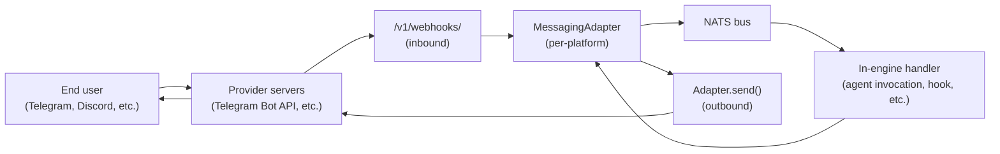
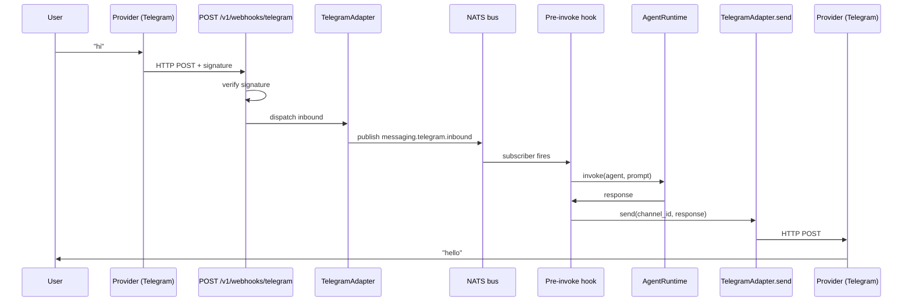
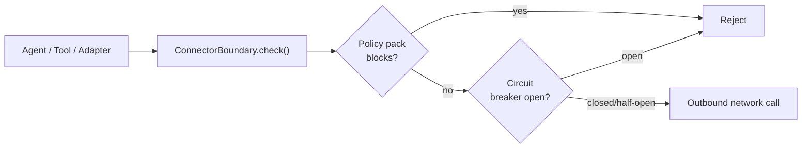
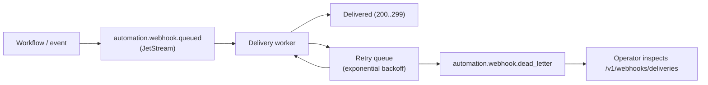
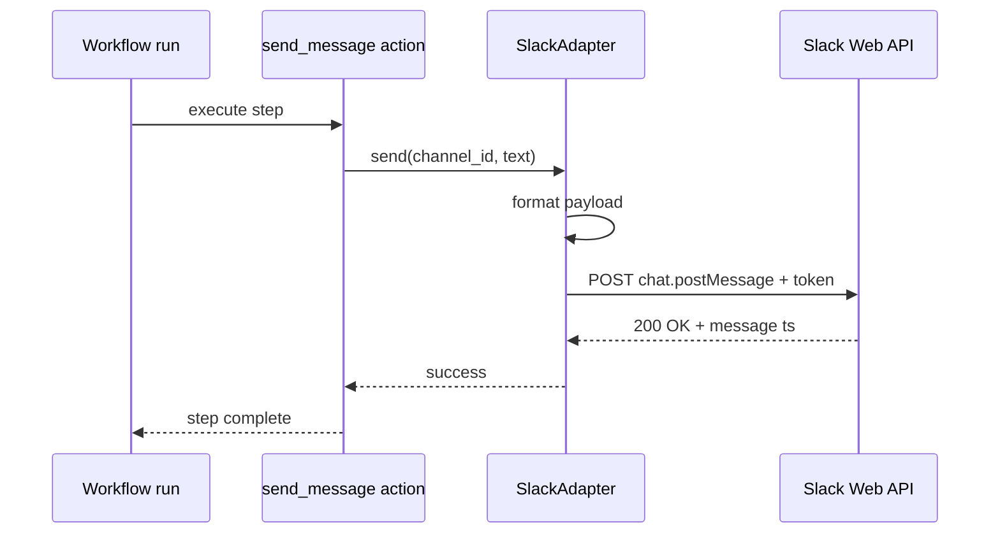

# Messaging

AGENT-33's messaging subsystem has two halves. The internal message bus (NATS) carries events between engine processes. The external messaging adapters (Telegram, Discord, Slack, WhatsApp, Signal, Matrix, iMessage) carry user-facing conversations across third-party platforms. This document covers both, plus the connector boundary that gates outbound traffic.

For inbound webhook routes see [api-surface.md](api-surface.md#webhook-routes). For MCP integration (a different kind of "messaging" — control-plane communication with tool servers) see [mcp-integration.md](mcp-integration.md).

## Two messaging surfaces



The two surfaces:

- **NATS bus** — internal event distribution. Used by hooks, workflow triggers, observability spans, and adapter-to-engine routing.
- **MessagingAdapter** — per-platform connector that translates between platform-native APIs and AGENT-33's internal `Message` model.

The adapter sits between the provider and the bus. It does not call the agent runtime directly; it publishes onto NATS and lets the rest of the engine route the event.

## Internal message bus (NATS)

### Why NATS

NATS gives AGENT-33 three properties the architecture needs:

- **Decoupled subjects.** Producers publish onto a subject (`messaging.telegram.inbound`, `hooks.pre_invoke`, `traces.action.complete`) without knowing who consumes. Consumers subscribe to subjects without knowing producers. Adding a new subscriber is a pure config change.
- **Multiple subscribers per subject.** A trace span event can fan out to the collector, the alert manager, and the lineage tracker simultaneously.
- **JetStream persistence** when needed. Subjects that require durable streams (webhook delivery dead letters, replay queues) are JetStream-backed; everything else is fire-and-forget.

The framework wraps NATS in a thin `NATSMessageBus` class:

```python
class NATSMessageBus:
    async def connect(self) -> None: ...
    async def close(self) -> None: ...
    async def publish(self, subject: str, data: dict[str, Any]) -> None: ...
    async def subscribe(self, subject: str, handler: Handler) -> None: ...
    async def request(self, subject: str, data: dict[str, Any], timeout: float = 5.0) -> dict[str, Any]: ...
```

Payloads are JSON dicts; the wrapper handles encoding and decoding. Subscriptions register a coroutine handler that receives the decoded dict.

### Subject conventions

Subjects follow `<domain>.<entity>.<event>`:

| Domain | Examples |
|--------|----------|
| `messaging` | `messaging.telegram.inbound`, `messaging.slack.outbound`, `messaging.<platform>.health` |
| `hooks` | `hooks.pre_invoke`, `hooks.post_invoke`, `hooks.error` |
| `traces` | `traces.run.start`, `traces.action.complete`, `traces.failure.recorded` |
| `workflows` | `workflows.step.complete`, `workflows.run.failed` |
| `automation` | `automation.cron.fired`, `automation.webhook.delivered` |
| `lineage` | `lineage.spawn`, `lineage.complete` |

Subscribers can use wildcards (`messaging.*.inbound` matches all platforms' inbound events) or explicit subjects.

### Degraded mode

If NATS is unavailable (lite mode, or temporary outage), the bus falls back to a null adapter that accepts publishes and drops them, and a no-op subscriber registry. Features that need persistence on the bus (durable webhook delivery, message replay) are unavailable; everything else degrades gracefully.

## External messaging adapters

The `MessagingAdapter` protocol:

```python
@runtime_checkable
class MessagingAdapter(Protocol):
    @property
    def platform(self) -> str: ...

    async def send(self, channel_id: str, text: str) -> None: ...
    async def receive(self) -> Message: ...
    async def start(self) -> None: ...
    async def stop(self) -> None: ...
    async def health_check(self) -> ChannelHealthResult: ...
```

Every supported platform implements this protocol. The framework ships adapters for:

- **Telegram** — long-polling and webhook modes.
- **Discord** — gateway connection.
- **Slack** — Events API webhook + Web API outbound.
- **WhatsApp** — Cloud API webhook + verification challenge.
- **Signal** — via signal-cli daemon.
- **Matrix** — matrix-nio client.
- **iMessage** — via macOS bridge (operator-provided).

Each adapter is registered at startup and runs its own background task. The lifespan manager calls `start()` after all subsystems are wired and calls `stop()` during shutdown.

### Inbound flow



The webhook route is auth-bypassed (it's verified by signature, not by credential). The adapter converts the platform-specific payload to the framework's `Message` model and publishes onto NATS. From there, subscribers (typically pre-invoke hooks that target the chat domain) pick it up and route to an agent.

### Outbound flow

Outbound is simpler. An agent or workflow produces a response, the system identifies the originating channel from the run context, and the adapter's `send` method is called with `(channel_id, text)`. The adapter formats the message for the platform, signs/authenticates as required, and POSTs to the provider.

### Health checks

Each adapter implements `health_check` returning a `ChannelHealthResult`. The aggregated result is exposed at `GET /health/channels`:

```json
{
  "telegram": {"status": "ok", "latency_ms": 120},
  "discord": {"status": "ok", "latency_ms": 80},
  "slack": {"status": "degraded", "reason": "rate limited", "latency_ms": 450},
  "whatsapp": {"status": "down", "reason": "API key missing"}
}
```

Operators watch this endpoint for per-channel status without needing to inspect each provider separately.

### Pairing

The `pairing.py` module handles per-tenant credential storage for platforms. An operator pairs a tenant with a bot token (for Telegram, Discord) or app credentials (for Slack, WhatsApp). The credentials are encrypted at rest via the credential vault.

When a webhook arrives, the adapter resolves the tenant from the platform-specific identifier (Telegram chat id, Slack team id, etc.) and uses the paired credentials to authenticate the outbound response.

## Connector boundary

The framework gates outbound network access via a `ConnectorBoundary`. The boundary applies a policy pack and a per-connector circuit breaker.



### Policy packs

Three built-in policy packs:

- **`default`** — minimal restrictions. Outbound web fetch, search, MCP calls allowed.
- **`strict-web`** — blocks `tool:web_fetch`, `workflow:http_request`, `search:searxng`, `tool:reader`. Useful for sandboxed environments.
- **`mcp-readonly`** — blocks `tools/call` on MCP servers (read-only mode for safety).

The policy is applied per tenant. Operators can add custom packs by registering a `PolicyPack` with allow/deny lists.

### Circuit breakers

Each connector destination (host, MCP server, provider) has a circuit breaker. States:

- **CLOSED** — calls pass through normally.
- **OPEN** — calls are rejected immediately. Triggers after a failure threshold (default: 5 consecutive failures within 60 seconds).
- **HALF_OPEN** — after a backoff window, one probe call is allowed. If it succeeds, the breaker closes; if it fails, it re-opens with progressive backoff.

The backoff formula: `min(base_seconds * 2^(trips - 1), max_seconds)`. Defaults are `base=30s`, `max=600s`, so a chronically-failing destination ends up probed every 10 minutes rather than every request.

Breakers protect both the engine (from cascading failures) and the destination (from being hammered).

## Webhook delivery

Outbound webhooks (workflow → external system) go through a delivery service with retry semantics:

- Each delivery is queued onto a JetStream subject (`automation.webhook.queued`).
- Workers pick up deliveries and attempt the HTTP POST.
- On failure, the delivery is re-queued with exponential backoff.
- After a configurable retry limit, the delivery moves to a dead-letter queue (`automation.webhook.dead_letter`).
- Operators can list, retry, or purge dead letters via `/v1/webhooks/deliveries/*` (admin scope).

The full lifecycle:



Delivery signing (HMAC) is configurable per webhook target. The receiver validates the signature; the framework retains the secret in the credential vault.

## Outbound MessagingAdapter sequence

For a workflow that ends with sending a Slack message:



The adapter handles platform-specific formatting (Slack blocks, Discord embeds, Telegram parse modes). The workflow author writes a generic `send_message` action; the adapter knows how to talk to the platform.

## Adding a new adapter

To add a new platform:

1. Implement the `MessagingAdapter` protocol in `messaging/<platform>.py`.
2. Register the adapter in the lifespan startup, gated by a config flag.
3. Add a webhook route at `/v1/webhooks/<platform>` if the platform uses webhooks.
4. Add a health check.
5. Add a pairing flow if the platform needs per-tenant credentials.

The protocol is intentionally minimal — five methods — so new platforms are cheap to add.

## Summary

Messaging in AGENT-33 is split between an internal event bus (NATS) for engine-internal pub/sub and external adapters (one per platform) for user-facing conversations. The two halves are bridged by webhook routes (inbound) and adapter `send` methods (outbound), with the NATS bus serving as the indirection layer that lets handlers subscribe to message events without knowing which platform produced them.

The connector boundary applies policy and circuit breakers to outbound calls, so a misbehaving destination cannot take down the engine. The webhook delivery service handles retries and dead letters with JetStream durability so outbound notifications are not lost on transient failures.
