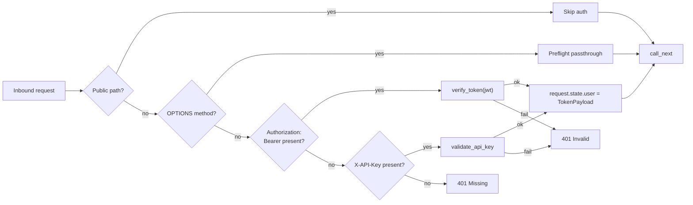
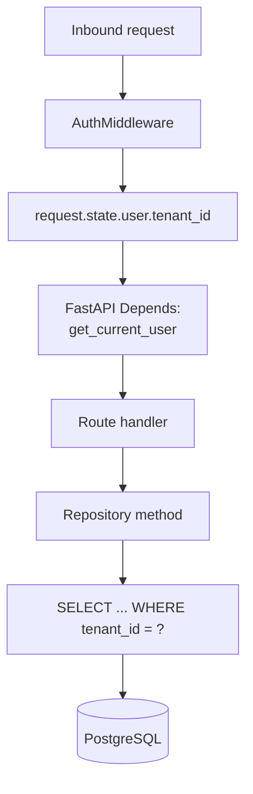

# Multi-Tenancy

This document describes how AGENT-33 implements multi-tenancy: how tenants are identified, how the identifier propagates through requests, how it gates database queries, and what the framework does (and does not) provide as isolation guarantees.

For the higher-level architecture see [ARCHITECTURE.md](../../ARCHITECTURE.md). For the broader security model see [security-model.md](security-model.md). For the request lifecycle see [data-flow.md](data-flow.md).

## The premise

AGENT-33 is multi-tenant by default. That means:

- Every durable model carries a `tenant_id` column.
- Every API request has an associated tenant resolved from the credential.
- Every repository query filters by tenant id.
- Cross-tenant data leakage is a bug, not a misconfiguration.

The framework deliberately does not have a "single-tenant mode" toggle. Single-tenant deployments use the framework normally with one tenant id — `default`, typically — and the multi-tenant infrastructure is invisible.

## How a tenant is resolved

The `AuthMiddleware` in `security/middleware.py` resolves the tenant from one of two credentials.



The two credentials:

- **`Authorization: Bearer <jwt>`** — a JWT signed with `JWT_SECRET`. The token carries `sub` (subject), `tenant_id`, `scopes`, and `exp` claims.
- **`X-API-Key: <key>`** — a long-lived API key. Keys are stored encrypted in the database; the validator looks the key up, decrypts the metadata, and produces an equivalent `TokenPayload`.

Either credential produces a `TokenPayload` attached to `request.state.user`. Routes consume it via FastAPI `Depends`.

## Public paths

A small set of paths bypasses auth entirely:

- `/health`, `/healthz`, `/readyz` — liveness and readiness probes.
- `/health/channels` — per-channel health for messaging adapters.
- `/metrics` — Prometheus scrape endpoint.
- `/docs`, `/redoc`, `/openapi.json` — API documentation.
- `/v1/auth/token` — credential exchange.
- `/v1/dashboard/`, `/v1/dashboard/*` — the operator dashboard read endpoints.
- `/v1/outcomes/health` — outcomes service health.
- `/v1/ingestion/heartbeat` — ingestion service heartbeat.

These paths either:

- Return non-tenant-scoped data (probes, metrics, documentation).
- Are the way to *acquire* a tenant-scoped credential (`/v1/auth/token`).
- Render aggregated dashboards that are intentionally cross-tenant for the local operator.

Production deployments behind an ingress typically restrict the dashboard paths at the ingress layer to operator IP ranges.

## TokenPayload shape

The decoded credential, in either case, looks like:

```python
class TokenPayload(BaseModel):
    sub: str                # subject (user id, agent id, or service id)
    tenant_id: str          # the tenant scope
    scopes: list[str]       # granted scopes
    exp: int | None         # expiration timestamp (JWT only)
    iat: int | None         # issued-at timestamp (JWT only)
    metadata: dict[str, Any]  # provider-specific extras
```

`request.state.user` is set to this. Routes that need the tenant id read `request.state.user.tenant_id`; routes that need scopes read `request.state.user.scopes`.

## Scope enforcement

Tenant id and scope are separate concerns. Scope determines *what* a credential can do; tenant id determines *which slice of data* it can do it on.

The scope catalogue:

| Scope | Grants |
|-------|--------|
| `admin` | Everything: API key CRUD, tenant operations, system admin |
| `agents:read` | List and read agent definitions |
| `agents:write` | Create, update, delete agent definitions |
| `agents:invoke` | Invoke agents |
| `workflows:read` | List and read workflows and runs |
| `workflows:write` | Create, update, delete workflow definitions |
| `workflows:execute` | Trigger workflow runs |
| `tools:execute` | Execute tools (also covers many transactional endpoints) |
| `operator:read` | Operator status, config, sessions, backups, onboarding |
| `operator:write` | Operator mutations (reset, etc.) |

Routes declare their scope via `Depends(require_scope("agents:read"))`. The dependency checks `request.state.user.scopes` and rejects with `403` if the required scope isn't present. Tenant id is *not* part of scope — scopes apply within the credential's tenant.

## Tenant id propagation

Every persisted model has a `tenant_id` column. The flow from request to query:



Repository methods either accept `tenant_id` as a parameter (and the route passes it explicitly) or use a tenant-scoped session helper that pre-filters the query. The former is more common because it's explicit at the call site.

## Tenant-scoped vs tenant-agnostic data

A handful of tables are intentionally **not** tenant-scoped:

- **Capability taxonomy** (in code, not in DB) — global.
- **Agent definitions** — auto-discovered from disk, shared across tenants. (Per-tenant agent overrides are a roadmap item.)
- **Skill definitions** — shared across tenants by default.
- **Pack registry entries** — shared across tenants by default; individual packs can be *enabled* per session, which is tenant-scoped.
- **Pricing catalog** — global.
- **Failure taxonomy** — global.

Everything else (workflow runs, memory records, traces, lineage, autonomy budgets, evaluation runs, releases, improvements, reviews, API keys, sessions, hooks, outcomes) is tenant-scoped.

## API key model

API keys are encrypted at rest. The schema:

```
api_keys (
  id              UUID PRIMARY KEY,
  tenant_id       TEXT NOT NULL,
  owner_user      TEXT NOT NULL,
  key_hash        TEXT NOT NULL,       -- hash of the secret
  key_encrypted   TEXT NOT NULL,       -- encrypted full key for display
  scopes          JSONB NOT NULL,
  created_at      TIMESTAMPTZ NOT NULL,
  expires_at      TIMESTAMPTZ,
  revoked_at      TIMESTAMPTZ
)
```

`validate_api_key` looks up the key by hash, decrypts the metadata, checks expiry and revocation, and produces a `TokenPayload`. The key never leaves the database in its raw form except at creation time, when it's returned once to the caller.

The delete route (`DELETE /v1/auth/api-keys/{key_id}`) enforces ownership: an admin can delete any key, but a non-admin can only delete keys they own. This is handler-level logic, not a scope check.

## Cross-tenant operations

There are intentionally **no** routes that operate across tenants for non-admin credentials. The dashboard's aggregated views are public (read-only, anonymous), and the admin scope grants tenant-spanning operations via specific admin endpoints — never via the same route that normal tenants use.

If an admin needs to operate within a specific tenant, they typically issue a credential with that tenant id and use the normal routes.

## Tenant-scoped middleware

A few middleware components are tenant-aware beyond the auth check:

- **RateLimitMiddleware** — keys the sliding-window limiter on `(tenant_id, route)`.
- **SizeLimitMiddleware** — applies a per-tenant maximum request body size (configurable).
- **HookMiddleware** — passes the tenant id to pre/post hooks for tenant-specific behavior.
- **HTTPMetricsMiddleware** — labels Prometheus metrics with tenant id (with cardinality limits to prevent explosion).

## Tenant lifecycle

Tenants are not first-class entities in the durable schema. They're identifiers carried by credentials. To "create a tenant," an admin:

1. Picks a tenant id (typically a stable string like `acme-corp`).
2. Issues a credential — either by minting a JWT with `tenant_id: "acme-corp"` or by creating an API key with that tenant id.
3. The new tenant id immediately becomes valid; persisted rows under that id will be filtered to that tenant's credentials.

To "delete a tenant," an admin runs a delete sweep against every tenant-scoped table:

```sql
DELETE FROM workflow_runs WHERE tenant_id = 'acme-corp';
DELETE FROM memory_records WHERE tenant_id = 'acme-corp';
...
```

The framework provides admin endpoints for tenant data export (for compliance) and tenant data deletion (for offboarding). See the operator runbooks.

## Isolation guarantees

The framework's isolation guarantees:

| Guarantee | How |
|-----------|-----|
| **Credential cannot read another tenant's data** | Repository queries filter on `request.state.user.tenant_id` |
| **Credential cannot write to another tenant** | Repository writes set `tenant_id` from `request.state.user.tenant_id` |
| **Credential cannot escalate scope** | Scopes are signed into the JWT or stored encrypted with the API key |
| **Public paths cannot leak tenant data** | Public paths return only aggregated metrics, no row-level data |
| **Cross-tenant linkage is not surfaced** | Lineage queries are tenant-scoped, even when tracking sub-agent spawn |
| **Trace artifacts are tenant-scoped** | The trace collector writes the tenant id with every Run/Task/Step/Action |

The framework's isolation **non-guarantees**:

- It does not isolate at the *process* level. All tenants run in the same FastAPI process and share the same connection pool. A misbehaving tenant can consume CPU/RAM/connection budget.
- It does not isolate at the *storage* level by default. All tenants share one PostgreSQL instance. Operators who need per-tenant storage isolation deploy one stack per tenant.
- It does not enforce *network* isolation between tenants. All tenants share the same outbound network.
- It does not isolate *LLM provider keys*. The model router uses keys configured at the engine level. Per-tenant provider configuration is a roadmap item.

These are operational concerns, addressed by the deployment topology (one stack per tenant when isolation matters, shared stack when it doesn't) and by orthogonal controls (rate limits, autonomy budgets, governance).

## Inspecting tenant scope at runtime

The `/v1/operator/status` endpoint returns the current tenant id and scopes for the active credential. This is the simplest way to verify what your credential is authorized to do. The dashboard surfaces the same data.

The trace collector records the tenant id on every Run, so any trace inspection includes tenant context.

## Adding a tenant-scoped table

When adding a new persisted entity to the engine:

1. Add a `tenant_id` column (NOT NULL TEXT or UUID).
2. Add an index on `(tenant_id, created_at)` for time-range queries.
3. Pass the tenant id to every repository method.
4. Filter every read query on `tenant_id`.
5. Set `tenant_id` on every write query.
6. Add a test that verifies cross-tenant reads return empty.

These are mechanical changes. The framework's existing tables are good examples — every Alembic migration after `001_initial.py` that adds a state table includes a `tenant_id` column.
