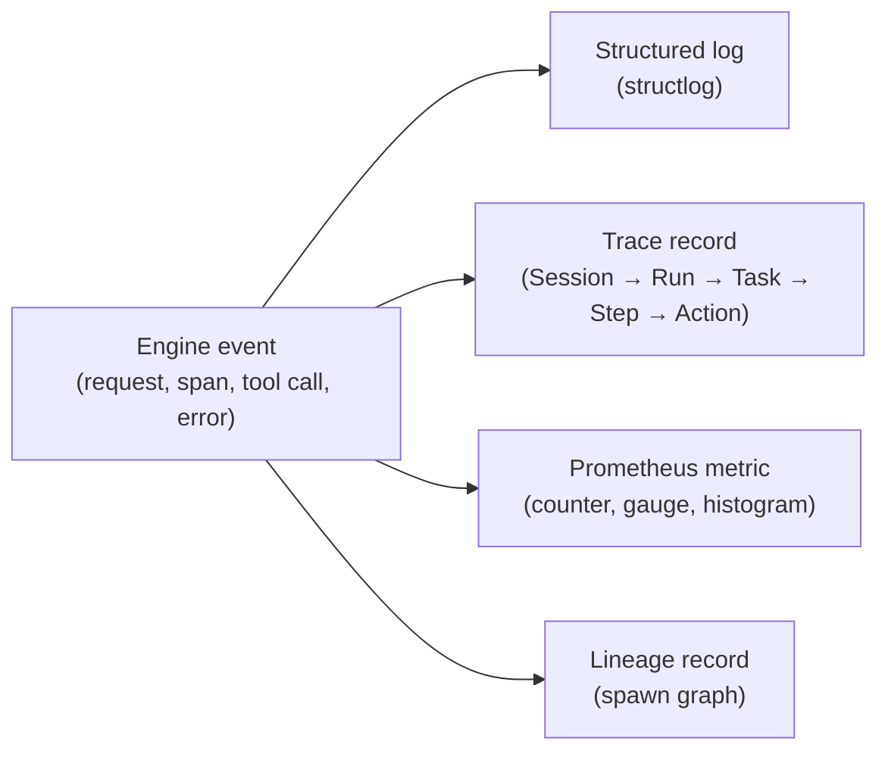
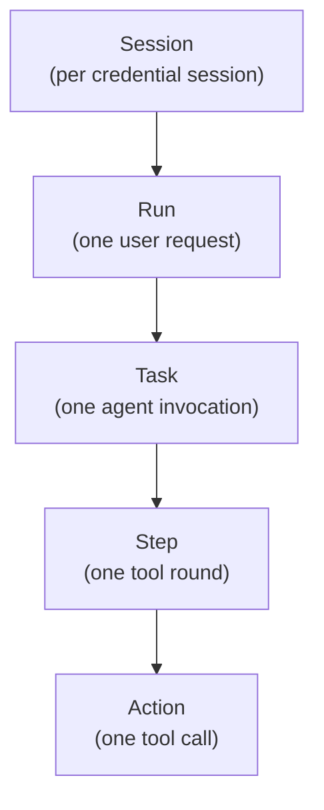
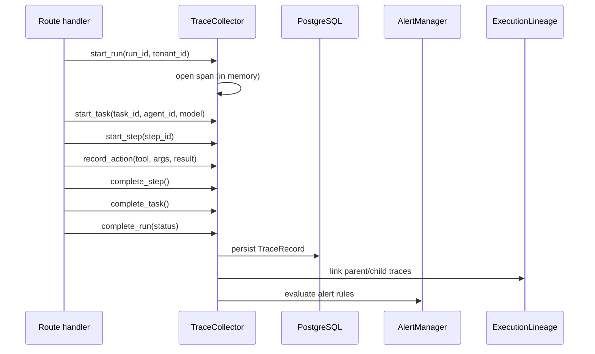
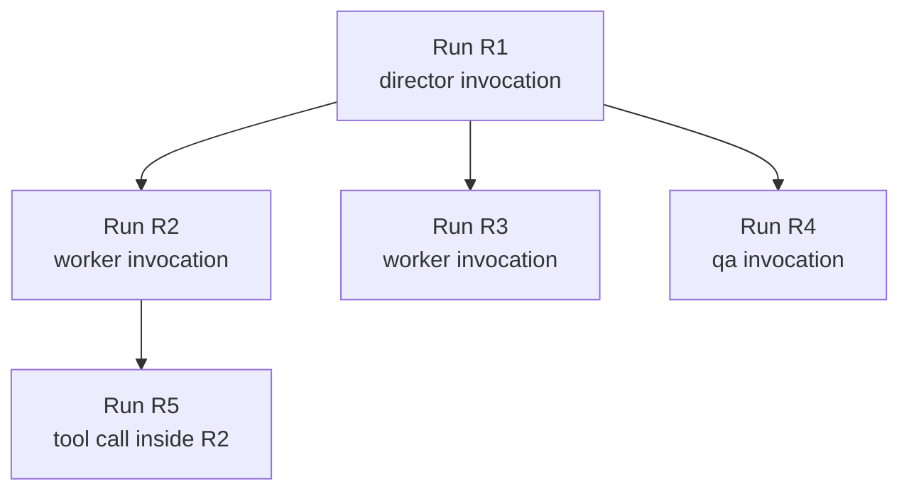
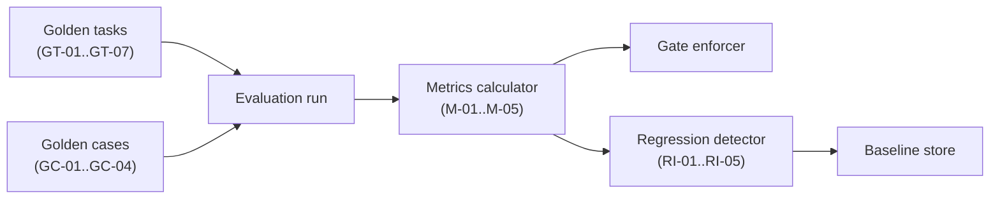

# Observability

This document describes how AGENT-33 makes itself inspectable: structured logs, the trace pipeline, Prometheus metrics, lineage tracking, replay, alerts, performance guardrails, and effort telemetry. Together these form the engine's introspection surface — the answer to "what just happened, and why".

For the trace API surface see [api-surface.md](api-surface.md). For trace-driven evaluation see the evaluation section below. For where traces are persisted see [storage.md](storage.md).

## Why observability is a first-class subsystem

AGENT-33 runs long, multi-step, LLM-driven workflows that span tools, agents, and external integrations. Without strong introspection, an operator looking at a failed run has no way to answer:

- Which agent? Which model? Which prompt?
- What tools were called? With which arguments?
- Where did it fail — input validation, tool execution, model timeout, policy violation?
- How long did each step take? How much did it cost?
- Has this happened before? In a related workflow? In a parent run?

The observability subsystem exists to answer those questions deterministically, with structured evidence that survives a fresh checkout.

## The four pillars



Each engine event can fan out to all four pillars. Logs are for ad-hoc inspection; traces are for structured retrieval; metrics are for aggregation and alerting; lineage is for cross-run causality.

## Structured logging

AGENT-33 uses `structlog` for every log line. The configuration:

- JSON output to stdout (default; rendered by the operator's log aggregator).
- Optional console-renderer for local development.
- Request-id, tenant-id, agent-id, run-id propagated via `contextvars` so every log line within a request carries the context.
- No naive interpolation — events are key/value pairs, not formatted strings.

Example log line:

```json
{
  "event": "agent_invoked",
  "level": "info",
  "timestamp": "2025-04-12T08:23:14.123Z",
  "request_id": "req-abc-123",
  "tenant_id": "acme",
  "agent_id": "AGT-002",
  "model": "ollama/llama3:70b",
  "duration_ms": 1840
}
```

Every public route handler logs at least one event. Errors include `exc_info=True` with a redacted traceback. Sensitive fields (api keys, raw prompts containing PII) are redacted before logging via the `redaction` module.

## Trace pipeline

The trace hierarchy matches the orchestrator schema:



A workflow run produces one Run. Each agent the workflow invokes produces a Task. Each iteration of the tool loop is a Step. Each individual tool call is an Action.

### TraceRecord model

```python
class TraceRecord(BaseModel):
    trace_id: str          # TRC-YYYYMMDD-HHMMSS-XXXX
    session_id: str
    run_id: str
    task_id: str
    tenant_id: str
    started_at: datetime
    completed_at: datetime | None
    duration_ms: int

    context: TraceContext       # agent_id, agent_role, model, branch, commit, cwd
    input: TraceInput            # prompt, parameters, files_read, context_loaded
    execution: list[TraceStep]   # ordered steps, each with actions
    output: TraceOutput          # result, files_written, artifacts_created
    outcome: TraceOutcome        # status + failure code/message/category
    evidence: TraceEvidence      # log refs, capture refs
    metadata: TraceMetadata      # tags, annotations, parent_trace, child_traces
```

Traces are written by the `TraceCollector` (see below). They are persisted to PostgreSQL and queryable via `/v1/traces/*`.

### TraceStatus

```
RUNNING → COMPLETED
        → FAILED
        → TIMEOUT
        → CANCELLED
        → ESCALATED
```

The terminal status determines downstream behavior: `FAILED` triggers failure classification, `TIMEOUT` triggers retry-with-backoff if the call site allows, `ESCALATED` posts to the operator queue.

### ActionStatus

```
SUCCESS / FAILURE / TIMEOUT / SKIPPED
```

Action-level status is more granular than trace-level. A step can have a mix — three tool calls succeed, one is skipped (because a previous one returned the answer), one times out.

### Artifact types

```
LOG / OUT / DIF / TST / REV / EVD / SES / CFG / TMP
```

Artifacts produced during execution are linked from the trace by reference. The trace doesn't embed artifacts; it stores a `ref` (a content-addressed identifier) that the operator can resolve via the artifact store.

## TraceCollector

`TraceCollector` is the singleton that accumulates trace records during a run. The flow:



The collector is in-process. Multiple replicas each have their own collector and persist independently; the database is the convergence point.

The collector emits NATS events (`traces.run.start`, `traces.action.complete`, `traces.run.complete`) so downstream subscribers (lineage, alerts, real-time dashboards) can react without polling the database.

## Failure taxonomy

Failures are classified into ten categories:

| Code | Category | Retryable | Escalate after | Description |
|------|----------|-----------|----------------|-------------|
| `F-ENV` | Environment | yes | 2 retries | Setup, dependencies, permissions |
| `F-INP` | Input | no | immediate | Invalid input, missing files |
| `F-EXE` | Execution | yes | 1 retry | Runtime errors, crashes |
| `F-TMO` | Timeout | yes | 1 retry | Exceeded time limit |
| `F-RES` | Resource | yes | 1 retry | Memory, disk, network |
| `F-SEC` | Security | no | immediate | Blocked by policy |
| `F-DEP` | Dependency | yes | 1 retry | Upstream service failure |
| `F-VAL` | Validation | no | immediate | Output validation failed |
| `F-REV` | Review | no | immediate | Review/approval failure |
| `F-UNK` | Unknown | no | immediate | Unclassified |

Each failure carries a code, a category, a message, and a severity (`low` / `medium` / `high` / `critical`). The classification drives retry policy, escalation, and metric labels.

The retryability and escalation rules are conventions, not hard limits. The runtime checks the failure's category metadata and applies the recommended action; route handlers can override.

## Metrics

The Prometheus surface is exposed at `/metrics`. Metric categories:

### HTTP metrics

`HTTPMetricsMiddleware` records:

- `http_requests_total{method, route, status, tenant_id}` — counter.
- `http_request_duration_seconds{method, route, tenant_id}` — histogram.
- `http_in_flight_requests{tenant_id}` — gauge.

The tenant_id label is cardinality-capped to prevent runaway label growth (top N tenants tracked; others bucketed as `other`).

### Workflow and agent metrics

- `agent_invocations_total{agent_id, model, status}` — counter.
- `agent_invocation_duration_seconds{agent_id, model}` — histogram.
- `workflow_runs_total{workflow_name, status}` — counter.
- `workflow_run_duration_seconds{workflow_name}` — histogram.
- `workflow_steps_total{workflow_name, action, status}` — counter.

### Tool metrics

- `tool_calls_total{tool, status}` — counter.
- `tool_call_duration_seconds{tool}` — histogram.
- `tool_governance_decisions_total{tool, decision}` — counter (allow/deny/ask).

### Subsystem health

- `embedding_cache_hits_total` / `embedding_cache_misses_total`.
- `bm25_index_size`, `bm25_index_documents`.
- `nats_connected` (0/1).
- `redis_connected` (0/1).
- `lifespan_subsystem_ready{name}` (0/1).

### Custom metrics

Subsystems register their own metrics via `MetricsCollector.register_*`. The collector ensures registration is idempotent on lifespan reload.

## Alerts

`AlertManager` evaluates alert rules against the metric/trace stream:

- **Rules** are declarative: condition expression, severity, cooldown.
- **Triggers** fire when conditions are sustained for a window.
- **Channels** route alerts to operator destinations (webhook, Slack, dashboard banner).

The Prometheus rule file at `deploy/monitoring/prometheus/agent33-alerts.rules.yaml` is the canonical starter set. Operators add their own rules without restarting the engine (rules are hot-reloaded).

## Lineage

`ExecutionLineage` tracks cross-trace causality. When a parent agent spawns a child agent (a director triggers a worker, or a workflow invokes a sub-workflow), the spawn is recorded:



Lineage queries return the full spawn graph for a given root. Operators inspecting a failed parent can see every descendant, including which ones succeeded and which ones contributed to the parent's failure.

Lineage is tenant-scoped — cross-tenant linkage is not surfaced even when an admin operates across tenants.

## Replay

`ExecutionReplay` re-executes a recorded trace deterministically. Use cases:

- **Regression testing** — replay a trace from a previous release against a candidate release and compare results.
- **Debugging** — replay a failed run with verbose logging to capture more detail than the original.
- **Evaluation** — replay golden tasks as part of the evaluation pipeline.

Replay reads the trace, reconstructs the input (prompt, parameters, files), invokes the same agent/workflow, and produces a fresh trace. The original trace and the replay are linked via `metadata.parent_trace` / `metadata.child_traces`.

Replay does not re-execute side-effectful tools unless explicitly allowed. By default, write tools are mocked with the recorded output; the replay is a "what would the LLM say" exercise, not a "redo the whole thing" exercise.

## Evaluation pipeline

The evaluation subsystem (`evaluation/`) builds on traces and replay to provide continuous regression detection:



- **Golden tasks** are well-known inputs with expected outputs. Each evaluation run executes the golden tasks against the current engine.
- **Golden cases** are end-to-end scenarios (multi-turn conversations, multi-step workflows).
- **Metrics calculator** computes per-task scores (accuracy, latency, cost).
- **Gate enforcer** rejects runs that fall below thresholds.
- **Regression detector** compares against the baseline and flags regressions.
- **Scheduled gates** run the eval suite on a schedule (per commit, nightly, weekly) and write history.

The eval surface is `/v1/evaluations/*`. The evaluator's output is itself a set of traces, so the same observability tooling that inspects production runs inspects eval runs.

## Performance guardrails

`PerfGuardrails` and `QueryProfiling` capture per-request performance characteristics:

- **Slow query log** — Postgres queries exceeding a threshold are logged with the SQL, the params, and the call stack.
- **Slow tool log** — tool calls exceeding their declared budget are logged with the same detail.
- **Memory ceiling** — observed RSS is sampled periodically; spikes above threshold trigger an alert.
- **Embedding cache hit rate** — falls below threshold → alert (likely indicates wrong-tenant or bypassed cache).

The guardrails are inactive in production until they trip. The thresholds are tunable per tenant.

## Effort telemetry

`EffortTelemetry` records per-request "effort": the model used, the number of tokens consumed, the wall-clock duration, the number of tool calls, the number of retries. This is the input to:

- **Cost dashboards** — token cost per agent / per tenant / per workflow.
- **Tier suggestions** — operators see which tenants are exceeding their tier's effort budget.
- **Adaptive routing** — the model router can use historical effort to choose a smaller model for low-effort tasks.

Effort telemetry is per-trace; aggregated views are in `/v1/operator/status` and the dashboard.

## Retention

`RetentionService` enforces per-tenant retention windows:

- **Traces** — kept for N days (configurable, default 30).
- **Logs** — operator-managed (the framework emits to stdout; the log aggregator's retention applies).
- **Metrics** — Prometheus-managed.
- **Lineage** — kept as long as the parent trace; cascaded on delete.
- **Artifacts** — content-addressed; kept until orphaned, then GC'd.

Retention runs on a scheduler. Operators can trigger early cleanup via the operator API.

## Insights

`InsightsService` derives higher-level signals from the trace stream:

- **Top failing agents / tools / workflows** in the last window.
- **New failure patterns** — clusters of similar errors that didn't appear in the prior window.
- **Cost outliers** — runs whose token cost is significantly above the median.
- **Workflow drift** — workflows whose success rate is declining.

Insights are surfaced in the dashboard and via `/v1/operator/doctor`. They are derived; the source of truth remains the trace records.

## Putting it together

A typical operator workflow:

1. Alert fires: `agent_invocations_total{status="failed"}` rate exceeded threshold.
2. Operator opens dashboard, sees failure cluster around one agent.
3. Drills into the agent's recent traces.
4. Sees the failure category is `F-DEP` — upstream LLM provider returning 502.
5. Checks `/health/channels` and connector boundary breaker states — provider's circuit is open.
6. Inspects lineage to see which workflows depend on that agent.
7. Decides: wait for provider recovery, switch model router fallback, or escalate to the provider.

Every step in this flow is backed by data the engine emitted automatically. The operator does not need to instrument anything ad-hoc.

## Summary

Observability in AGENT-33 is not bolt-on — it is a first-class subsystem that the runtime emits to automatically. Structured logs give text introspection; the trace pipeline gives structured runtime evidence (with the hierarchy Session → Run → Task → Step → Action); Prometheus metrics give aggregation and alerting; lineage gives cross-run causality; replay gives deterministic regression testing; the evaluation pipeline gives continuous gate enforcement; performance guardrails and effort telemetry surface long-tail issues; retention keeps the data manageable.

Each layer is independently useful and composes with the others. The trace API, the metrics endpoint, and the dashboard are the three surfaces operators use day-to-day; the rest is plumbing that ensures those surfaces have the data they need.
