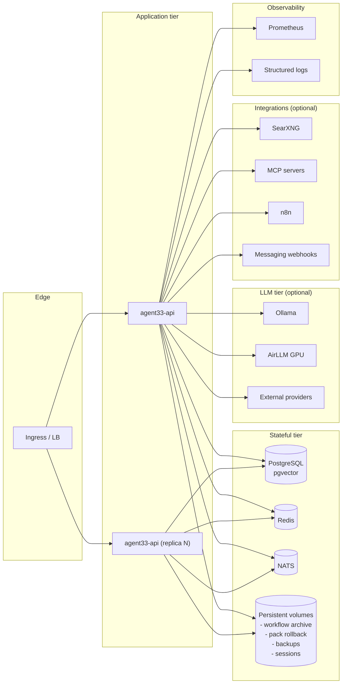

# System Overview

This document is the system-level view of AGENT-33. It describes the runtime modes the engine supports, the block-level layout of a running deployment, the full lifespan startup order (every step the FastAPI app actually performs), and the shutdown semantics. It is the place to read when you need to understand *what is running* and *in what order*.

The top-level [ARCHITECTURE.md](../../ARCHITECTURE.md) gives you the elevator pitch and links to every other architecture document. Read it first; then come back here.

## What "AGENT-33" means at runtime

A running AGENT-33 instance is a single FastAPI process — `engine/src/agent33/main.py` — that exposes an HTTP, WebSocket, and SSE API surface; persists state to PostgreSQL, Redis, NATS, and the local filesystem; and dispatches LLM calls through a model router that talks to Ollama by default and to any of 20+ providers when configured. The process is stateless; the durability is in the stores.

Around the process are a small number of optional integrations: messaging adapters (Telegram, Discord, Slack, WhatsApp) that consume from inbound webhooks and publish to NATS; MCP servers that the engine connects to as a client and that connect to the engine as a server; pack hubs that the engine fetches from; search providers; and external LLM providers. None of these are required. The engine starts and serves its API with only PostgreSQL, Redis, and NATS available, and starts in *lite mode* if those are also absent.

## Runtime modes

AGENT-33 has three runtime modes, each of which trades capability for operational simplicity.

| Mode | Persistence | Bus | Cache | Use case |
|------|-------------|-----|-------|----------|
| **lite** | SQLite | `InProcessMessageBus` | `InProcessCache` | Single-user laptop; quick start; CI smoke tests |
| **standard** | PostgreSQL | NATS | Redis | Single-node or small Kubernetes deployment |
| **enterprise** | PostgreSQL + HA storage | NATS + JetStream | Redis | Multi-node Kubernetes, HPA, dedicated observability |

The mode is not a configuration flag in the strict sense. The engine adapts to whatever stores it can connect to. If `DATABASE_URL` is set and reachable, PostgreSQL is used; if not, SQLite is the fallback. If `REDIS_URL` is set and reachable, Redis is used; otherwise the in-process cache. If `NATS_URL` is set and reachable, NATS is used; otherwise the in-process bus. This means a single deployment can be downgraded by removing a store, or upgraded by adding one, without restructuring the application.

## Block-level deployment view

In the lite mode this collapses to a single Python process and a handful of SQLite files. In the enterprise mode each box is its own deployment with persistent volumes, network policies, and monitoring. The *application is the same* in both modes — only the surrounding stores change.

## Lifespan startup order (full)

The FastAPI lifespan in `engine/src/agent33/main.py` is the canonical ordering of subsystem construction. Every subsystem stored on `app.state` is initialised here, in this order. The blocks below correspond to the actual sequence in the code.

### 1. Pre-flight

1. **Runtime state paths.** `settings.runtime_state` is resolved into a `RuntimeStatePaths` object that exposes paths for SQLite files, archives, sessions, backups, and exports. All of them are anchored at the application's working directory unless overridden.
2. **Secret warnings.** `settings.check_production_secrets()` runs. In development it prints warnings if the JWT secret or other secrets look like defaults. In production (when `ENV=production` or equivalent), it raises a `SystemExit` if `JWT_SECRET` is the default development value.
3. **Identity defaults.** The capability catalog and 25-entry P/I/V/R/X capability taxonomy are loaded into memory from `agents/capabilities.py`.

### 2. Persistence and core state

4. **PostgreSQL.** `LongTermMemory(database_url, embedding_dim=...)` opens an async SQLAlchemy engine. The lifespan calls `await long_term_memory.initialize()`, which runs `CREATE EXTENSION IF NOT EXISTS vector` and `MetaData.create_all`. If the connection fails the engine logs and continues in lite mode (`LongTermMemory` references become no-ops or fall back to SQLite for some subsystems).
5. **Shared orchestration state store.** A SQLite-backed key-value store with namespaced sections for autonomy, evaluation, release, review, improvement, and skill-registry state.
6. **Explanation store.** SQLite store for agent explanation records.
7. **Service skeletons.** `AutonomyService`, `EvaluationService`, `ReleaseService`, `ReviewService`, `TraceCollector`, `WorkflowRunArchiveService`, `WorkflowStateService` are constructed empty; they're populated as their dependencies come online.

### 3. Cache, bus, and coordination

8. **Redis.** `redis.asyncio.Redis.from_url(...)` is created and pinged. On failure, `app.state.cache = InProcessCache()`.
9. **NATS.** `NATSMessageBus(url)` connects. On failure, `app.state.message_bus = InProcessMessageBus()`.
10. **Scaling guards.** `InstanceRegistry` and `SchedulerOwnershipGuard` are constructed. The ownership guard holds a Redis-backed lease so that only one replica runs cron-triggered jobs.

### 4. Agent and capability registries

11. **AgentRegistry.** Scans `agent_definitions_dir` for `.json` files, validates against the `AgentDefinition` Pydantic model, and registers each one.
12. **Capability pack registry.** Discovers built-in capability packs (the curated bundle that ships with the engine).
13. **Agent profiler** and **tool-loop scorer.** Construction only — they're activated by `AgentRuntime` invocations.

### 5. Observability

14. **MetricsCollector** with a rolling window for HTTP, agent, and tool counters.
15. **AlertManager** with rule-based evaluation against the metrics collector.
16. **ExecutionLineage** records the parent-child graph of agent and workflow runs.
17. **ExecutionReplay** allows deterministic replay of recorded runs.
18. **CheckpointManager** maintains durable workflow run state.
19. **CostTracker** applies pricing catalog overrides for known providers.
20. **Connector metrics collector** and **circuit breaker registry** support outbound integrations.

### 6. Execution layer

21. **CodeExecutor.** Constructs the executor and registers adapters: `CLIAdapter` always; `JupyterAdapter` if Jupyter is available and enabled; the GPU Docker adapter if a Docker daemon is reachable and GPU support is configured.

### 7. LLM and memory

22. **ModelRouter.** Auto-registers providers from environment variables. Out of the box that's Ollama; with API keys it can also be OpenAI, Anthropic, OpenRouter, LM Studio, llama.cpp, Together, Fireworks, Mistral, Cohere, Perplexity, Groq, DeepSeek, Replicate, Hugging Face, Vertex, Azure OpenAI, and several more.
23. **DelegationManager** and **SubAgentSpawner.**
24. **EmbeddingProvider** with optional `EmbeddingCache` and TurboQuant quantization. The provider talks to Ollama by default; with API keys it can use OpenAI, Cohere, or Voyage.
25. **EmbeddingHotSwapManager** (optional) supports zero-downtime migration between embedding models.

### 8. Tool layer

26. **ToolRegistry.** Calls `discover_from_entrypoints("agent33.tools")` to pick up tools advertised via setuptools entry points. Registers the built-in tools (`shell`, `file_ops`, `web_fetch`, `browser`, `apply_patch`, `search`, `delegate_subtask`, `ptc_execute`).
27. **ToolApprovalService.** Holds approval state for HITL gates.
28. **ApprovalTokenManager.** Issues HMAC-signed JWTs for one-time approval.
29. **ToolGovernance.** Loads `~/.agent33/approved-tools.json` if present, and gates execution behind allowlist, autonomy budget, and approval token policies.

### 9. Planning and knowledge

30. **PlannerService.**
31. **SkillRegistry.** Discovers SKILL.md and SKILL.yaml files from `skill_definitions_dir`.
32. **Ingestion pipeline.** Candidate-skill intake, journal, mailbox, metrics, doctor.
33. **BackupService** and **ComponentSecurityService.** The release service is wired to gate releases on backup currency and component security checks.

### 10. Hybrid search and recall

34. **BM25Index.** Optionally warms up from existing memory records by scanning the long-term memory in pages.
35. **HybridSearcher.** Fuses BM25 and vector results via Reciprocal Rank Fusion.
36. **RAGPipeline.** Token-aware chunking (1200 tokens), retrieval, secret redaction.
37. **ProgressiveRecall.** Long-session memory tiering with budget enforcement.
38. **KnowledgeIngestionService.** Starts the APScheduler-driven cron for RSS, GitHub, web, and folder adapters.

### 11. Skill injection and pack registry

39. **SkillInjector.** Three-tier progressive disclosure (L0 metadata, L1 summary, L2 full body); wired into `AgentRuntime`.
40. **CommandRegistry.** Surfaces skills as slash commands.
41. **HybridSkillMatcher.** Fuzzy + semantic + contextual ranking.
42. **PackRegistry.** Discovers local packs, registers local marketplace, attaches remote marketplaces if configured, attaches `TrustPolicyManager`, `PackRollbackManager`, `PackHub`, `PackSharingService`.
43. **Marketplace curation** and **trust analytics.**

### 12. Operator and session services

44. **HookRegistry.** Discovers script hooks from project and user directories.
45. **OperatorSessionService.** File-backed session storage with crash recovery.
46. **Session catalog, lineage, spawn, archive.**
47. **Memory session services.** Context slots, compaction diagnostics, context-slot reconciler.

### 13. External research and voice

48. **WebResearchService.** Search-provider registry with multi-provider fallback.
49. **VoiceSidecarClient probe** (optional, configurable host/port).
50. **StatusLineService.** Renders the operator status line.

### 14. Transports and bridges

51. **WebSocket manager** for workflow streams.
52. **SSE manager** for streaming agent responses.
53. **Agent-to-workflow bridge.** Calls `set_definition_registry(agent_registry)` so workflow steps can resolve agents by name, and `set_pack_sharing_service(pack_sharing_service)` so workflows can recommend packs to peer agents.
54. **MCPServiceBridge.** Wires the agent, tool, skill, workflow, and proxy registries into the MCP server endpoints.

### 15. Optional and last-mile

55. **AirLLM.** If `AIRLLM_ENABLED=true`, attaches the AirLLM 70B local-inference client.
56. **Memory observation capture** and **session summarizer.**
57. **Training subsystems.** If enabled, attaches rollout, optimisation, and revert services.

When all of the above completes, the FastAPI app yields control to Uvicorn and starts serving requests.

## Middleware order

The HTTP request path is shaped by a fixed middleware chain. The order matters because each layer can short-circuit the next. Listed outer-most to inner-most:

1. **SessionPodMiddleware.** Attaches a per-request session pod id for trace correlation.
2. **HTTPMetricsMiddleware.** Counts requests, durations, and status codes.
3. **CORSMiddleware.** Standard CORS with allowlist from settings.
4. **AuthMiddleware.** Reads `Authorization: Bearer <jwt>` or `X-API-Key: <key>`. Public paths bypass.
5. **RateLimitMiddleware.** Per-tenant sliding-window limiter backed by Redis or the in-process cache.
6. **SizeLimitMiddleware.** Enforces a maximum request body size.
7. **HookMiddleware.** Invokes pre-request and post-request hooks registered with the hook registry.
8. **Router.** FastAPI dispatch to the matched route handler.

WebSocket upgrades go through auth at handshake time. SSE streams go through auth on the initiating HTTP request and then stream until the route completes or the client disconnects.

## Shutdown order

The FastAPI lifespan exits in *reverse* order from startup. Specifically:

1. WebSocket connections are sent a close frame.
2. SSE generators receive a cancellation signal.
3. The agent-to-workflow bridge is detached.
4. Voice sidecar, web research, and operator session services are closed.
5. The pack hub, knowledge ingestion cron, and hybrid skill matcher are stopped.
6. RAG, hybrid searcher, BM25, embedding provider, model router are released.
7. The code executor cancels in-flight subprocess sessions.
8. Tool governance and approval state are flushed.
9. Agent registry releases its cache.
10. NATS is drained and disconnected.
11. Redis is closed.
12. The trace collector flushes the in-memory ring to its store.
13. PostgreSQL engine pool is disposed last.

Shutdown is best-effort. If a step raises, the lifespan logs and continues to the next. The intention is that a SIGTERM completes within the kubelet's grace period (default 30 seconds).

## Configuration

Everything described above is governed by `engine/src/agent33/config.py`, a Pydantic `BaseSettings` class with `env_prefix=""`. Settings load from a `.env` file in the working directory and from process environment variables. The fields are extensively documented inline; the headline groups are:

| Group | Examples |
|-------|---------|
| **Identity & version** | `app_name`, `version` |
| **Auth & secrets** | `jwt_secret`, `jwt_algorithm`, `api_key_lifetime`, `fernet_key` |
| **Persistence** | `database_url`, `redis_url`, `nats_url`, `runtime_state` |
| **Definitions paths** | `agent_definitions_dir`, `workflow_definitions_dir`, `skill_definitions_dir`, `pack_definitions_dir`, `tool_definitions_dir` |
| **LLM defaults** | `default_provider`, `default_model`, `ollama_base_url`, plus per-provider keys |
| **Memory** | `embedding_dim`, `bm25_warmup_enabled`, `rag_chunk_tokens` |
| **Governance** | `connector_boundary_enabled`, `connector_policy_pack`, `tool_approval_required_*` |
| **Scaling** | `instance_registry_enabled`, `scheduler_ownership_enabled` |
| **Observability** | `metrics_window`, `trace_retention_days`, `log_level` |

The development-mode auto-defaults (in-memory JWT secret with rotation warning, in-process Fernet key, `host.docker.internal:11434` for Ollama, etc.) are all overridable. Production deployments must set their own `JWT_SECRET` or the process exits.

## What this means for operators

You can stand the engine up against a stack you already have. If you have PostgreSQL, point `DATABASE_URL` at it and let Alembic migrate. If you have Redis and NATS, set their URLs. If you don't, the engine will run anyway in lite mode and tell you (via `/v1/operator/doctor` and the dashboard) what it's missing. You can add stores later by editing `.env` and restarting; the engine will pick them up.

The reference for the *runtime* model is this document. The reference for the *operational* model is the runbooks under `docs/operators/`. The reference for the *what does each directory do* model is [components](components.md).
