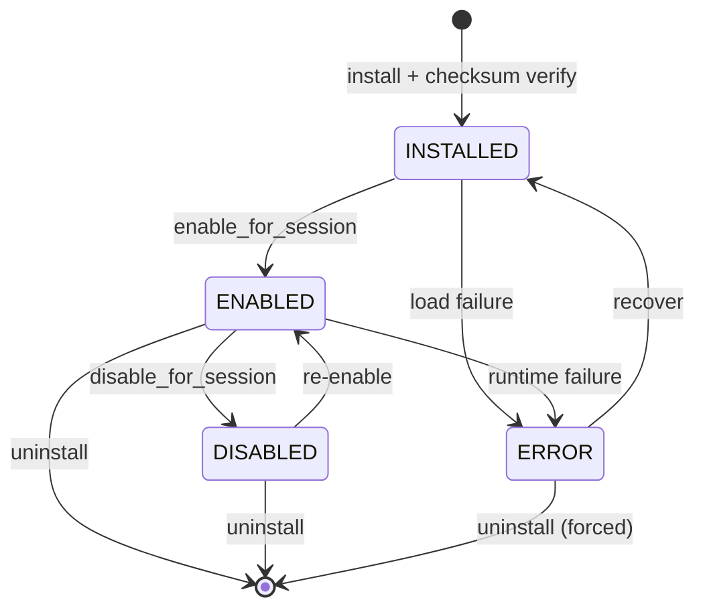
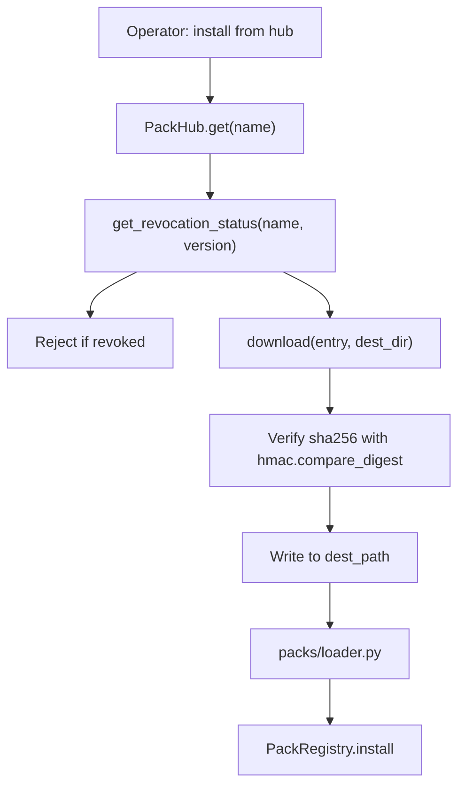

# Packs and Skills

This document describes the skill and pack subsystems in AGENT-33: what a skill is, what a pack is, how skills are loaded, how packs are installed, how trust and revocation work, and how skills are injected into agent prompts at runtime. It is the place to read when you want to bundle a capability for distribution, write a new skill, or understand why an agent did or didn't pick up a skill you defined.

For the higher-level architecture see [ARCHITECTURE.md](../../ARCHITECTURE.md). For the surrounding agent runtime see [agents.md](agents.md). For the data flow of pack installation see [data-flow.md](data-flow.md).

## Skills

A skill is a Markdown file (`SKILL.md`) or YAML file (`SKILL.yaml`) that defines a reusable piece of agent capability. The contents are split across three progressive-disclosure tiers so that the runtime can show the agent only as much as it needs.

| Tier | Contents | When loaded |
|------|----------|-------------|
| **L0** | Name, version, description | Always — embedded in the prompt as metadata |
| **L1** | Detailed instructions | Inlined into the prompt when the skill is selected |
| **L2** | Reference resources (large examples, datasets, schemas) | Loaded on demand when the agent calls a tool that needs them |

The `SkillDefinition` Pydantic model in `skills/definition.py` captures all three tiers. A typical SKILL.md looks like:

```markdown
---
name: review-pr
version: 1.0.0
description: Review a pull request against project conventions.
allowed_tools:
  - file_ops
  - search
disallowed_tools:
  - shell
tags:
  - review
  - quality
---

# review-pr

## Instructions
1. Read the PR diff.
2. Compare against CONVENTIONS.md and CONTRIBUTING.md.
3. Check for missing tests.
4. Produce a markdown report with severity tags.

## Resources
- docs/conventions/code-style.md
- docs/conventions/test-policy.md
```

The frontmatter is YAML; the body is L1 (instructions); resource links are L2 references that the injector resolves when the agent decides to read them.

## Skill loaders

Three loader functions live in `skills/loader.py`:

- `load_from_skillmd(path)` — parses a SKILL.md file with YAML frontmatter and Markdown body.
- `load_from_yaml(path)` — parses a SKILL.yaml file (everything in YAML).
- `load_from_directory(path)` — looks for `SKILL.md` or `SKILL.yaml` in the directory.

All three produce a `SkillDefinition` instance. Loaders are forgiving about extension case (`.md` vs `.MD`) and about filename (the registry will also accept `*.skill.md` patterns in some configurations).

## Skill registry

`SkillRegistry` in `skills/registry.py` holds skills in memory and provides search and CRUD:

- `discover(path)` — scans for SKILL files and registers them.
- `register(skill)` — adds or replaces a skill by name.
- `get(name)` — looks up a skill.
- `list_all()` — returns every registered skill.
- `search(query, *, role=None, tags=None)` — text and tag search.

The registry is constructed in the FastAPI lifespan and stored on `app.state.skill_registry`. It's populated by `discover(skill_definitions_dir)` and by every pack's `_register_pack_skills` call.

## Skill injector

`SkillInjector` in `skills/injection.py` is the runtime component that picks skills for an agent invocation and weaves them into the system prompt. The injection process:

1. Look at the agent definition's `allowed_skills` and `disallowed_skills` filters.
2. Look at any active capability pack's skill set.
3. Run the `HybridSkillMatcher` (fuzzy + semantic + contextual) against the user's message to find relevant skills.
4. Filter by `allowed_tools` and `disallowed_tools` on each skill.
5. Render L0 metadata for every selected skill as a compact list.
6. Render L1 instructions for the top-K selected skills inline.
7. Render L2 references as a "resources available on demand" list.

The injector also rewrites the tool list passed to the LLM so that only tools allowed by the active skills are visible — a skill can narrow the tool surface but cannot expand it beyond the agent's own `allowed_tools`.

## Slash commands

Skills can be exposed as **slash commands** through `skills/slash_commands.py`. A skill named `review-pr` becomes invocable as `/review-pr` in the operator UI or via the chat completions API. The command registry is constructed at lifespan time and stored on `app.state.command_registry`.

Slash commands are skill-driven, not separate artifacts. There is no "slash command definition" type — every command resolves to a skill.

## Packs

A pack is a versioned bundle of skills, prompts, tool entries, outcome packs, governance overrides, and metadata. Packs are the unit of distribution.

### Anatomy

A pack on disk is a directory with a `PACK.yaml` manifest:

```
my-pack/
├── PACK.yaml
├── CHECKSUMS.sha256        # optional
├── skills/
│   ├── analyze/
│   │   └── SKILL.md
│   └── synthesize/
│       └── SKILL.yaml
├── prompts/                # optional prompt addenda
│   ├── system.md
│   └── ...
├── tools/                  # optional tool entries
│   └── tool.yaml
└── outcomes/               # optional outcome packs
    └── starter.yaml
```

The `PACK.yaml` declares each entry. The full schema is in `packs/manifest.py` and includes:

- `name`, `version`, `description`, `author`, `tags`.
- `skills:` — list of `PackSkillEntry` (`name`, `path`, `description`, `required`).
- `prompt_addenda:` — list of paths that contribute to agent system prompts.
- `tool_config:` — list of tool definitions.
- `outcome_packs:` — list of `OutcomePackEntry` (starter pack outcomes).
- `dependencies:` — packs this one depends on (with semver constraints).
- `compatibility:` — required agent roles, capabilities, Python packages.
- `governance:` — `min_autonomy_level`, scope overrides.
- `provenance:` — `repo_url`, `commit_or_tag`, `checksum`, `license`.

### Pack registry

`PackRegistry` in `packs/registry.py` holds installed packs and supports:

- `discover(directory)` — scans for `PACK.yaml` and loads each pack.
- `install(pack_dir, *, source)` — installs a pack from a local path (already covered: revocation, checksum, trust, skill loading).
- `enable_for_session(name, session_id, source)` — marks a pack as active for a specific operator session.
- `get(name)` — looks up an installed pack.
- `list_installed()` — returns every installed pack with status.

The registry is constructed at lifespan time. It auto-attaches the local marketplace, the trust policy manager, the pack rollback manager, the pack hub, and the pack sharing service.

### Pack lifecycle



The four statuses (`PackStatus` enum):

- `INSTALLED` — present and verified, not active for any session.
- `ENABLED` — active for at least one session.
- `DISABLED` — explicitly disabled for sessions; doesn't show up in skill injection.
- `ERROR` — installed but failed to load skills or apply trust policy.

### Pack loading

`packs/loader.py` does the actual on-disk work:

1. **Locate manifest.** Looks for `PACK.yaml` or `pack.yaml` (case-insensitive).
2. **Parse manifest.** Validates against the `PackManifest` Pydantic model.
3. **Verify checksums.** Reads `CHECKSUMS.sha256` if present, computes SHA-256 of each listed file, and compares with `hmac.compare_digest`. Mismatches are returned as errors; the pack is not installed.
4. **Path traversal protection.** Every skill path is resolved against the pack directory and rejected if it escapes.
5. **Load skills.** For each skill entry, dispatches to `load_from_directory`, `load_from_skillmd`, or `load_from_yaml`. Required skills that fail to load produce an installation error; optional skills produce a warning.
6. **Compute overall checksum.** `compute_pack_checksum` hashes the sorted file tree for a stable pack-level digest.

### Path traversal

The loader explicitly blocks path traversal:

```python
skill_path = (pack_dir / skill_entry.path).resolve()
try:
    skill_path.relative_to(pack_dir.resolve())
except ValueError:
    # Path escapes pack directory — reject
    ...
```

This guards against malicious or accidentally relative paths in pack manifests. Any path that resolves outside the pack directory is rejected.

## Pack hub

`PackHub` in `packs/hub.py` is the network client for the community registry. It supports search, lookup, download, and revocation checks.

### Hub flow



The hub has three layers:

1. **In-memory cache** (`self._cache`, `self._revocation_list`) — populated by `refresh_cache()`.
2. **Disk cache** (`~/.agent33/pack_cache.json`) — populated by every successful refresh.
3. **Remote registry** (`AGENT33_PACK_REGISTRY_URL`) — fetched on cache miss or expiry.

The hub never raises on network errors. If the remote registry is unreachable, it falls back to the disk cache. If the disk cache is missing, it returns empty results. This is intentional: the operator's day-to-day work shouldn't depend on the hub being online.

### Revocation

The `revoked` list in the registry payload contains `RevocationRecord` entries with `name`, optional `version`, and `reason`. `get_revocation_status(name, version)` returns the current status; `download` rejects revoked packs before any extraction.

A pack can be revoked at:

- **Entry level** — the `PackHubEntry.revoked` flag is set.
- **Registry level** — a `RevocationRecord` is added to the top-level `revoked` array.

Either is sufficient to block installation. Revocation is registry-side; the engine has no way to revoke a pack that's already installed except through `PackRegistry.uninstall`.

## Trust policy

`TrustPolicyManager` in `packs/trust_manager.py` enforces trust policies on installation. The headline checks:

- **Signature.** If signing is required, the pack must carry a valid Sigstore cosign signature. SHA-256 verifies integrity; the signature verifies authorship.
- **Author allowlist.** Operators can configure an allowlist of authors; packs from non-allowlisted authors are rejected (or warned).
- **License allowlist.** Operators can configure a set of acceptable licenses; non-compliant packs are flagged.
- **Provenance.** The `repo_url`, `commit_or_tag`, and `checksum` in the provenance block are verified against expectations.

Trust policy is enforced *after* the loader's structural checks (manifest parse, path traversal, SHA-256). A pack that fails the structural check is rejected with a `422`; a pack that passes structural checks but fails trust policy is rejected with a `409` (or, in permissive mode, warned and installed).

## Pack sharing

`PackSharingService` in `packs/sharing.py` enables agent-to-agent pack handoff inside workflows. When a workflow step produces an output with a `pack_ref` key, the sharing service detects it, validates that the referenced pack is installed, and enables it for the downstream agent's session.

Two patterns are supported:

```yaml
# Top-level pack_ref string
outputs:
  pack_ref: "review-tools"

# Top-level pack_ref dict with reason
outputs:
  pack_ref:
    pack_ref: "review-tools"
    reason: "Need linting tools for the downstream review step"

# List of pack refs
outputs:
  pack_refs:
    - "review-tools"
    - { pack_ref: "test-tools", reason: "..." }
```

The service scans recursively (nested dicts and lists are walked) and produces a list of `PackShareRequest` objects. Each request is applied via `enable_for_session(pack_ref, session_id, source="shared")`. Failures (pack not installed, enable failed) are logged and skipped without aborting the workflow.

## Capability packs vs skill packs

A note on terminology. The framework has two related-but-distinct pack concepts:

- **Capability packs** (`PackRegistry`, `packs/`) — versioned skill bundles distributed via the pack hub or local marketplaces. Operators install, enable, disable, and revoke them.
- **Capability pack registry** — a startup-time component (`app.state.capability_pack_registry`) that holds the curated bundle of capability packs that ship with the engine itself.

The latter is a subset of the former: shipped packs auto-register at lifespan time; community packs are added via install. Most operators only interact with the community pack registry through the hub.

## Outcome packs

`OutcomePackEntry` represents a "starter pack" of outcomes — pre-baked golden runs that demonstrate the pack's intended use. Outcome packs feed:

- The evaluation suite (golden cases).
- The operator onboarding flow (sample workflows).
- The dashboard's "what this pack does" preview.

A pack can ship zero or more outcome packs. Outcome packs are referenced by relative path and validated against the same path-traversal rules as skills.

## Operational concerns

- **Versioning.** Packs use semver. Dependency constraints in the manifest use the standard `^`, `~`, `>=`, `<` operators.
- **Updates.** `PackRegistry.update(name, version)` performs a transactional update: install new version, run trust + checksum on the new version, atomically replace the registry entry, and archive the old version in the pack rollback store.
- **Rollback.** `PackRollbackManager` retains the previous N versions of every pack. `rollback(name, target_version)` restores the named version.
- **Audit.** `packs/audit.py` runs a periodic audit that re-verifies installed pack checksums, re-fetches the revocation list, and reports drift to the dashboard.
- **Sharing safety.** The sharing service only enables packs that are already *installed*. A workflow can't surreptitiously install a pack on a peer agent's session.
- **Disabled packs and skill injection.** A pack in `DISABLED` status doesn't contribute to skill injection for any session. The skills are still in the registry under their qualified names (`pack/skill`), but the bare aliases are removed for sessions that don't have the pack enabled.

## Adding a pack

The procedure for shipping a new pack:

1. Create the directory structure under your repo.
2. Write `PACK.yaml` with name, version, and skill entries.
3. Write each skill as `SKILL.md` or `SKILL.yaml` under the declared paths.
4. (Optional) Compute and ship `CHECKSUMS.sha256` for integrity.
5. (Optional) Sign with Sigstore cosign for trust.
6. Install locally: copy the directory into your pack directory; the registry picks it up on restart.
7. Publish to your registry by adding an entry to its JSON file with `download_url`, `sha256`, and metadata.

That's it. There is no compilation step, no schema generation, no plugin registration. The runtime treats packs as data.
