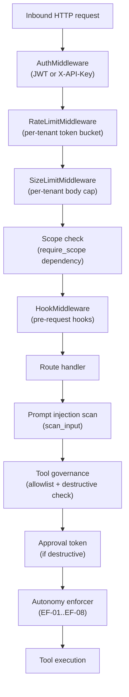

# Security Model

This document describes the security boundaries AGENT-33 enforces: how credentials are minted and verified, how secrets are encrypted, how tools are governed, how the human-in-the-loop approval flow signs grants, and how prompt-injection screening protects the agent runtime from being weaponised by untrusted inputs.

For tenant isolation see [multi-tenancy.md](multi-tenancy.md). For the request lifecycle see [data-flow.md](data-flow.md). For the wider architecture see [overview.md](overview.md).

## The threat model

AGENT-33 assumes:

- **The operator is trusted.** The person who deploys the engine has access to the database, the JWT secret, and the encryption keys. The security model protects against everything *but* the operator.
- **Tenants are not trusted with each other's data.** A credential for tenant `A` must not be able to read or write tenant `B`'s data.
- **Inbound prompts are not trusted.** Anything that crosses the API boundary — user prompts, tool outputs, retrieved memory — may contain prompt-injection payloads.
- **Outbound tool calls are not trusted to be safe.** Even an approved tool can be invoked with destructive arguments. Governance and approval gates exist for arguments, not just for tool identity.
- **Provider credentials are sensitive.** API keys for LLM providers, integration secrets, and webhook keys are encrypted at rest.

The non-goals:

- AGENT-33 does **not** isolate at the process or host level (one process per tenant). Operators who need that deploy one stack per tenant.
- AGENT-33 does **not** defend against a malicious local administrator with root on the host.
- AGENT-33 does **not** vouch for the safety of third-party LLM providers or MCP servers; it does authenticate and rate-limit calls to them, but the content of completions is trusted at the level of the provider configuration.

## The security stack

A request flows through the security stack in order. Each stage can short-circuit with an error.



Each box is a hard gate. If `AuthMiddleware` rejects, the request never reaches the rate limiter. If the autonomy enforcer rejects, the tool never runs.

## Authentication

Two credential types are supported.

### JWT bearer

JWTs are issued by `POST /v1/auth/token` after exchanging a username/password or a long-lived refresh credential. The signing algorithm is configurable but defaults to `HS256` with the secret in `JWT_SECRET`.

The claim set is small and explicit:

```python
{
  "sub": "user-id-or-agent-id",
  "scopes": ["agents:read", "tools:execute"],
  "tenant_id": "acme-corp",
  "iat": 1700000000,
  "exp": 1700003600
}
```

The decoded payload is exposed as `request.state.user` and consumed by route handlers via FastAPI dependencies.

Tokens are validated on every request. There is no refresh-on-use — a token is either valid or it isn't, and the client is responsible for re-issuing.

### X-API-Key

API keys are long-lived credentials issued by `POST /v1/auth/api-keys` (admin scope required). Their schema:

- A 32-byte `secrets.token_urlsafe(32)` payload prefixed with `a33_`.
- SHA-256 hashed for lookup (`_hash_key`).
- The full key is encrypted at rest using AES-256-GCM (see [Encryption](#encryption)).
- Stored with `subject`, `scopes`, `tenant_id`, `expires_at`, and a unique `key_id`.

When a request arrives with `X-API-Key`, the validator:

1. Hashes the presented key.
2. Looks up the hash in the auth repository.
3. Checks expiration (if `expires_at` is set and now exceeds it, the key is deleted and rejected).
4. Returns a `TokenPayload` equivalent to a JWT.

Plaintext keys are only returned at creation — the engine cannot recover a key after its creation response is closed.

### Public paths

A short list of paths bypasses auth (health probes, metrics, OpenAPI, the auth endpoint itself, dashboard reads). See [multi-tenancy.md](multi-tenancy.md#public-paths) for the full list.

## Authorization (scopes)

Scope is a string label attached to a credential that says what it can do. AGENT-33 uses a flat scope namespace with `noun:verb` strings.

| Scope | Grants |
|-------|--------|
| `admin` | Everything (implicitly grants all other scopes unless explicitly denied) |
| `agents:read` | List/get agent definitions |
| `agents:write` | Create/update/delete agent definitions |
| `agents:invoke` | Invoke an agent |
| `workflows:read` | Read workflows and runs |
| `workflows:write` | Create/update/delete workflows |
| `workflows:execute` | Trigger workflow runs |
| `tools:execute` | Execute tools |
| `operator:read` | Operator status, config, sessions |
| `operator:write` | Operator mutations |
| `hooks:read` / `hooks:manage` / `hooks:admin` | Hook lifecycle |
| `plugins:read` / `plugins:write` | Plugin management |
| `processes:read` / `processes:manage` | Process inspector |
| `provenance:read` / `provenance:export` | Provenance/lineage queries |
| `cron:read` / `cron:write` | Cron job lifecycle |
| `outcomes:read` / `outcomes:write` | Outcome/feedback ledger |
| `multimodal:read` / `multimodal:write` / `multimodal:execute` | Multimodal artifacts |
| `component-security:read` / `component-security:write` | Component security catalog |

The scope check is **deny-first**:

1. If the required scope is in a `deny_scopes` list, **deny** immediately.
2. If the required scope is in an `ask_scopes` list, return **ASK** (used by the HITL flow).
3. If `admin` is in the token scopes and `admin` isn't denied, **allow**.
4. If the required scope is in the token scopes (with `fnmatch` wildcards), **allow**.
5. Default **deny**.

The dependency wrapper:

```python
@router.get("/agents", dependencies=[Depends(require_scope("agents:read"))])
async def list_agents(): ...
```

If the credential lacks the scope, the dependency raises `HTTPException(403)` before the handler runs.

## Encryption

### Symmetric primitives

The engine uses two encryption primitives:

- **AES-256-GCM** (`security/encryption.py`) — 12-byte nonce, 256-bit key, output is `base64-urlsafe(nonce || ciphertext+tag)`. Used for credential vault and any encryption-at-rest.
- **Fernet** (via `cryptography.fernet`, used inside the vault for older entries) — symmetric authenticated encryption with a managed key.

The active encryption key is derived from `ENCRYPTION_KEY` in the environment, or generated at startup if absent (with a warning that data won't survive a restart).

### Credential vault

`CredentialVault` is an in-memory store with encryption-at-rest. Callers:

```python
vault.store("openai_api_key", "sk-...", metadata={"provider": "openai"})
key = vault.retrieve("openai_api_key")  # decrypts on read
```

Stored values:

- Are AES-256-GCM encrypted before being kept in memory.
- Are never written to logs.
- Are returned only via `retrieve()`.

Operators who want persistent vault state can subclass the vault or back it with the database.

## Tool governance

Tool calls are gated by the `ToolGovernance` service. The gate runs before every tool execution.

### Allowlist

Each tenant has an *approved tools list* loaded from `~/.agent33/approved-tools.json` or from a per-tenant config in the database. The list is read at startup and on hot reload. Tools not on the list are rejected with a clear error.

The governance check:

1. **Tool exists** in the registry.
2. **Tool is in the allowlist** for this tenant.
3. **Tool's effect class** is permitted (read tools may be permitted broadly; write tools require approval).
4. **Arguments** match the schema.

### Effect classes

Tools self-declare their effect class. The framework recognises:

- **Read** — fetches data, does not mutate (e.g., `file_ops:read`, `search:web`).
- **Write** — mutates filesystem or external state (e.g., `file_ops:write`, `shell`, `browser` for navigation that triggers form submissions).
- **Destructive** — irreversible mutation (e.g., `file_ops:write` for overwrites, `apply_patch:apply`).

The destructive list is a small explicit set:

```python
_WRITE_TOOLS = {"shell", "browser"}
_DESTRUCTIVE_PARAMS = {
    "file_ops": {"write"},
    "apply_patch": {"apply"},
}
```

A write or destructive call requires an approval token (next section).

### Rate limiting at the tool layer

Tool calls also pass through a per-tool rate limit. This is separate from the HTTP rate limit and exists to prevent a single agent from issuing thousands of tool calls in a short window.

## Approval tokens (HITL)

When a destructive tool is called, the runtime checks for an approval token in the call's metadata. If absent, the runtime returns an `ASK` decision and the workflow pauses with a `PausedInvocation` state record.

### Token shape

Approval tokens are short-lived signed JWTs with a distinctive `typ` claim:

```python
class ApprovalTokenPayload(BaseModel):
    typ: str = "a33_approval"
    sub: str = ""             # approver identity
    jti: str = ""             # unique approval id
    tool: str = ""            # which tool this approves
    op: str = ""              # which operation within the tool
    arg_hash: str = ""        # canonical hash of the arguments
    tenant_id: str = ""
    scope: str = "tools:execute"
    one_time: bool = True
    exp: int = 0
    iat: int = 0
```

The `arg_hash` is the load-bearing claim. It's a canonical hash of the tool name and arguments, computed deterministically by `canonical_arg_hash`. If the runtime executes the tool with even one different argument from what was approved, the hash won't match and the token is rejected.

### Issuance

A reviewer with the right scope sees the pending approval, inspects the request, and approves it. The approval service:

1. Marks the request as approved.
2. Calls `ApprovalTokenManager.issue(approval, arguments)`.
3. Returns the signed token to the runtime.

The token has a default TTL of 300 seconds. Operators can configure longer or shorter.

### Validation

Before executing the destructive call, the runtime calls `validate(token, tool_name, arguments, tenant_id, consume=True)`:

1. Decodes the JWT with the shared secret.
2. Verifies the `typ` is `a33_approval`.
3. Verifies the `tool` matches.
4. Computes the expected `arg_hash` and compares with `hmac.compare_digest`.
5. Verifies the `tenant_id` matches.
6. Checks the JTI isn't revoked.
7. Checks the JTI isn't already consumed (for one-time tokens).
8. Consumes the JTI (records it in `_consumed`).

A token that fails any check raises `ApprovalTokenError` and the tool does not run.

### Revocation

Tokens can be revoked by JTI before they expire. The revocation set is in-memory by default; operators who need persistence wire an `OrchestrationStateStore` into the manager, which persists `consumed` and `revoked` sets to disk.

### Why HMAC over the argument hash

A common mistake in approval flows is signing only the tool identity, not the arguments. AGENT-33 signs both — and validates with `hmac.compare_digest` to avoid timing-oracle leaks of the expected hash. If a tampered request changes one byte of an argument, the hash diverges and the token is rejected.

## Autonomy enforcement

Approval is a per-call gate. The autonomy enforcer is the per-budget gate — it sits *above* the tool layer and applies session-wide constraints.

An autonomy budget has:

- A **scope** — what file paths, commands, and network destinations are allowed.
- A **stop set** — conditions that immediately terminate the budget (file count threshold, command count, time, error rate).
- A **lifecycle state** — `DRAFT` → `ACTIVE` → `COMPLETED` (or `STOPPED`).

The runtime enforcer (`autonomy/enforcement.py`) intercepts:

- **File reads** (`EF-01`) — checked against allowed read paths.
- **File writes** (`EF-02`) — checked against allowed write paths.
- **Commands** (`EF-03`) — checked against an allowed command pattern set.
- **Network destinations** (`EF-04`) — checked against allowed domains.
- **Process spawns** (`EF-05..08`) — restricted by mode (subshell, container, sandbox).

Each check returns either an allow or a stop condition (`SC-01..SC-10`). A stop condition halts the budget and writes a stop record to the trace.

## Prompt-injection screening

The framework scans inbound text for injection patterns before passing it into the LLM. `scan_input(text)` returns a `ScanResult` with `is_safe: bool` and a `threats: list[str]` of pattern names.

The pattern set:

- **System override** — phrases like "ignore previous instructions", "you are now a", "new system prompt".
- **Delimiter injection** — fake system delimiters like `[SYSTEM]`, `<|im_start|>`, ` ```system ` blocks.
- **Instruction override** — phrases like "do not follow your original", "act as if you have no restrictions".
- **Encoded payloads** — base64, hex, or `\u` escapes that decode to a known injection.

For nested structures, `scan_inputs_recursive(data)` walks dicts/lists/strings and returns at the first threat.

The scanner is conservative. It is not a perfect defence — adversarial inputs can still slip through. The expectation is that the screening combined with allowlists and approval gates limits blast radius, not that screening alone prevents injection.

## Rate limiting

Per-tenant rate limits are enforced by `RateLimiter` (token-bucket algorithm) and `RateLimitMiddleware`. Tiers:

| Tier | Per minute | Per hour | Daily quota | Burst |
|------|-----------:|---------:|------------:|------:|
| `free` | 10 | 200 | 1,000 | 5 |
| `standard` | 60 | 2,000 | 10,000 | 15 |
| `premium` | 200 | 10,000 | 50,000 | 50 |
| `unlimited` | — | — | — | — |

Limits are returned to the client via `X-RateLimit-Limit`, `X-RateLimit-Remaining`, and `X-RateLimit-Reset` headers. A `429` response includes `Retry-After`.

Health, docs, dashboard, and OPTIONS bypass rate limiting.

## Size limits

`SizeLimitMiddleware` enforces a per-tenant maximum request body size (default 16 MiB). Oversized bodies return `413`. This protects against unbounded ingestion paths from being weaponised as DoS.

## Path and domain allowlists

`PathAllowlist` and `DomainAllowlist` are dataclasses that gate filesystem and network access. They use glob (path) and wildcard prefix (domain) matching:

- `PathAllowlist(patterns=["/data/**", "/tmp/*"])` allows `/data/sub/file.txt` and `/tmp/x.log`, denies `/etc/passwd`.
- `DomainAllowlist(domains=["api.example.com", "*.trusted.io"])` allows `api.example.com` and `sub.trusted.io`, denies `evil.com`.

These are used by file-ops tools, web fetch, and the connector boundary to apply per-tenant network policy.

## What is not in this document

These are intentionally out of scope here and live elsewhere:

- **Multi-tenancy isolation guarantees** — see [multi-tenancy.md](multi-tenancy.md#isolation-guarantees).
- **Operational secret management** (env files, vaults at the deployment layer) — see [deployment-topologies.md](deployment-topologies.md).
- **Public security policy and vulnerability disclosure** — see `SECURITY.md` in the repo root.

## Summary

The security model rests on a small number of explicit gates rather than a large surface of implicit policy:

- **Auth gate** — every request is authenticated.
- **Scope gate** — every privileged operation requires a named scope.
- **Tenant gate** — every persisted row carries `tenant_id`.
- **Tool gate** — every tool call is allowlisted and effect-classified.
- **Approval gate** — every destructive operation requires a signed, argument-bound approval token.
- **Autonomy gate** — every long-running budget applies scope and stop conditions session-wide.
- **Encryption gate** — every persisted secret is encrypted with AES-256-GCM.
- **Injection gate** — every inbound prompt is scanned before reaching the LLM.

These gates compose. A request that passes all of them is — by construction — within the operator's explicitly granted permissions for that credential, that tenant, that tool, that argument set, that budget, and that scan policy.
