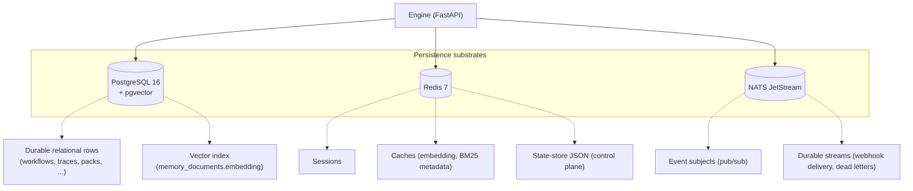
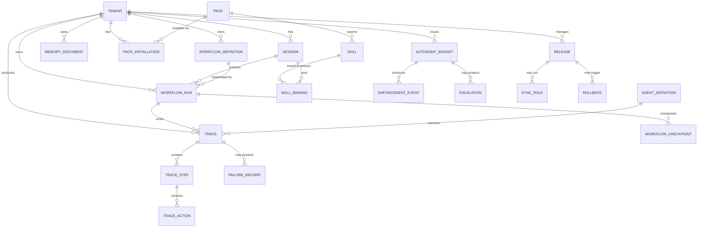

# Storage

AGENT-33 persists state in three substrates: PostgreSQL with pgvector for durable relational and vector data, Redis for transient state and caches, and NATS JetStream for durable event streams. This document describes the schema, how migrations are managed, how the three substrates divide responsibilities, and what falls outside the durable store.

For tenant scoping of every persisted row see [multi-tenancy.md](multi-tenancy.md). For how the engine reads and writes traces see [observability.md](observability.md). For deployment-level persistence concerns see [deployment-topologies.md](deployment-topologies.md).

## The three substrates



Division of responsibility:

- **PostgreSQL** — durable rows you cannot afford to lose. Workflows, traces, agents, packs, sessions, memory records, evaluations, releases.
- **Redis** — transient state the engine can rebuild from PostgreSQL or recompute. Caches, rate-limit counters, ephemeral session state.
- **NATS JetStream** — durable event streams that need persistence with redelivery semantics (webhook deliveries, dead letters).

The engine can degrade if Redis or NATS are unavailable; it cannot run without PostgreSQL.

## PostgreSQL schema

The schema is managed by Alembic. Migrations live in `engine/alembic/versions/`. Each migration is numbered and named for its purpose:

| Migration | Purpose |
|-----------|---------|
| `001_initial.py` | Foundation: pgvector extension, workflow_checkpoints, sessions, memory_documents |
| `002_embedding_dim_hnsw.py` | Switch vector index from IVFFlat to HNSW, configurable dimension |
| `003_adr_review_state.py` | Review state machine tables |
| `004_adr_evaluation_state.py` | Evaluation runs, golden tasks, regressions |
| `005_adr_autonomy_state.py` | Autonomy budgets, enforcer events, escalations |
| `006_adr_release_state.py` | Release lifecycle, sync rules, rollbacks |
| `007_adr_improvement_state.py` | Improvement intakes, lessons, checklists, metrics |
| `008_adr_skill_registry_state.py` | ADR recording that skills use JSON state store, not Postgres |

The "ADR" migrations are notable: some are functional (they create tables), others are *architectural decision records* — rows in a `schema_decisions` table that document a deliberate choice not to create tables. Migration 008 records that the skill registry persists to the JSON state store, not Postgres, with rationale baked into the migration itself.

### Core entities and relationships



(Tenant is implicit on every box via `tenant_id`. It's drawn here once for clarity.)

### Table inventory

The schema groups by domain:

**Auth and tenancy**
- `api_keys` — encrypted API keys with scopes, expiration, revocation.

**Sessions and workflows**
- `sessions` — credentials + tenant context, runtime session metadata.
- `workflow_definitions` — workflow YAML/JSON definitions per tenant.
- `workflow_runs` — instances of workflow execution.
- `workflow_checkpoints` — per-step checkpoints for resume.

**Agents**
- `agent_overrides` (optional) — per-tenant overrides of file-backed agent definitions.

**Memory and vectors**
- `memory_documents` — RAG documents with `embedding vector(N)` column and HNSW index.
- `memory_records` — short-term observations with same vector shape.
- `bm25_index` — BM25 term frequencies (when on the DB; can be in-process for lite).

**Traces and observability**
- `traces` — top-level TraceRecord (one per run/task).
- `trace_steps` — denormalised step rows (joined view also available).
- `trace_actions` — individual tool calls.
- `failure_records` — classified failures with category, severity, retry policy.
- `lineage_edges` — parent → child trace relationships.

**Evaluation**
- `evaluation_golden_tasks`, `evaluation_golden_cases` — eval inputs.
- `evaluation_runs` — eval invocations.
- `evaluation_results` — per-task results within a run.
- `evaluation_baselines` — baseline snapshots for regression comparison.
- `evaluation_regressions` — detected regressions with triage state.
- `evaluation_schedules` — scheduled gate runs.

**Autonomy**
- `autonomy_budgets` — budget definitions with scope and stop conditions.
- `autonomy_enforcer_events` — per-call enforcement decisions.
- `autonomy_escalations` — pending operator approvals.

**Release**
- `releases` — release lifecycle state.
- `release_checklist_items` — per-item state for pre-release checklist.
- `sync_rules` — release sync rules with fnmatch patterns.
- `rollbacks` — rollback records linked to releases.

**Improvement**
- `improvement_intakes` — research intake records.
- `improvement_lessons` — lessons learned with action tracking.
- `improvement_checklists` — periodic improvement checklists.
- `improvement_metrics` — metric snapshots and trends.
- `improvement_refreshes` — roadmap refresh records.

**Reviews**
- `reviews` — review records with risk assessment, L1/L2 sign-off state, merge state.

**Packs and skills**
- `pack_installations` — installed packs per tenant.
- `pack_revocations` — locally cached revocation status from the hub.
- `skill_bindings` (optional) — per-session active skills.

**Hooks and plugins**
- `hooks` — registered pre/post hooks per tenant.
- `plugin_records` — plugin metadata.

**Outcomes and feedback**
- `outcomes` — outcome events (can be in SQLite per-tenant path for lite mode).
- `outcome_packs` — outcome-driven improvement bundles.

**Schema decisions**
- `schema_decisions` — ADR records (migrated rows, not tables; see migration 008).

### Indexes and constraints

- Every tenant-scoped table has an index on `(tenant_id, created_at)` for time-range queries.
- Vector columns have HNSW indexes with cosine distance ops.
- Foreign keys cascade on tenant delete (via the operator's tenant-delete sweep, not SQL `ON DELETE`).
- Composite primary keys are avoided; rows use UUID or domain-specific string ids (`AGT-001`, `WF-...`, `TRC-...`).

## pgvector and embeddings

The `pgvector` extension is enabled in migration 001 and used for:

- `memory_documents.embedding` — long-term RAG store.
- `memory_records.embedding` — short-term observation embeddings.

The dimension is configurable via `EMBEDDING_DIM` (default 768 for `nomic-embed-text`). Migration 002 dropped the original 1536-dim IVFFlat index and replaced it with HNSW (`m=16`, `ef_construction=200`) at the configured dimension. HNSW gives better recall than IVFFlat without a manual training step.

Switching embedding models requires:

1. Update `EMBEDDING_DIM` to the new model's output dimension.
2. Re-run migration 002 (or write a new migration with the new dimension).
3. Re-ingest all documents so embeddings are regenerated at the new dimension.

The framework does not maintain cross-dimension vectors. A model change is a re-index operation.

## Alembic workflow

Migrations are forward-only in practice. The `downgrade` functions exist for completeness but are rarely run in production.

Operator workflow:

```bash
# From engine/
alembic upgrade head      # apply all pending migrations
alembic current           # show current revision
alembic history           # show migration history
alembic revision -m "..."  # create a new migration (operator only)
```

A startup check (`migrations/checker.py`) compares the database's current revision against the application's expected revision and refuses to start if they diverge. Operators must run `alembic upgrade head` before deploying a new engine version that bumps the migration.

## Redis usage

Redis holds:

- **Sessions** — short-lived per-credential session data.
- **Rate limit counters** — per-tenant token-bucket state (cross-replica).
- **Embedding cache** — LRU cache of recent embeddings (key = `tenant:hash(text)`).
- **BM25 metadata** — optional; per-tenant index summaries.
- **OrchestrationStateStore** — JSON state for subsystems that don't need their own table (approval tokens consumed/revoked sets, skill registry dynamic state, control-plane scratch).
- **Pub/sub channels** — internal short-lived event distribution (separate from NATS).

Redis is treated as recoverable. If the Redis instance is reset, the engine continues to run; caches rebuild, rate-limit counters reset, sessions invalidate.

Operators who need Redis persistence enable Redis's own AOF or RDB persistence. The framework does not assume one.

## NATS JetStream

NATS subjects are mostly fire-and-forget pub/sub. A few subjects use JetStream for durability:

- `automation.webhook.queued` — pending outbound webhook deliveries.
- `automation.webhook.dead_letter` — failed deliveries past retry limit.
- `messaging.<platform>.inbound` (optional) — durable inbound message buffer for replay.

JetStream streams have configured retention windows and max sizes. Operators tune per their needs.

The non-durable subjects (trace events, hook fires, lineage events) drop messages if no subscriber is up. This is intentional — these are best-effort signals, not state.

## Object and artifact storage

Artifacts produced during execution (logs, diffs, test outputs, evidence captures) are content-addressed and stored outside Postgres:

- **Default** — local filesystem at `var/artifacts/<tenant>/<hash>`.
- **Optional** — S3-compatible blob store (operator-configured).

The artifact ref stored in the trace is the hash. Resolving a ref returns the artifact's bytes from whichever backend is configured.

Artifact retention follows trace retention — when the parent trace is purged, the artifact's ref is dropped and the GC eventually deletes the orphaned bytes.

## Configuration storage

Configuration is not in Postgres. It comes from:

- **Environment variables** — primary source, loaded via Pydantic `Settings`.
- **`.env` file** — local development convenience.
- **Files on disk** — agent definitions in `agent-definitions/`, packs in `packs/`, workflows in `workflow-definitions/`, tools in `tool-definitions/`.

The deliberate choice: configuration lives in the operator's deployment repo, not in the database. This keeps deployments reproducible (a fresh checkout + a fresh database + the same env yields the same engine state) and avoids the "ship a config change via PostgreSQL" anti-pattern.

The exception is per-tenant runtime state: paired credentials, installed packs, active skills, autonomy budgets — all are in PostgreSQL because they are tenant-issued and tenant-owned, not operator-deployed.

## Backups

What needs to be backed up:

- **PostgreSQL** — full database dump or volume snapshot.
- **Artifacts** — file system or S3 bucket.
- **Vault keys / JWT secrets / encryption keys** — operator's secret store.
- **Agent definitions / packs / workflows / tools on disk** — version-controlled in the operator's deployment repo.

What does not need to be backed up:

- Redis — recoverable from PostgreSQL.
- NATS subjects — transient; JetStream streams can be re-seeded.
- In-process caches.

The backup endpoints at `/v1/backups/*` produce JSON envelopes of learning state (memory + observations + lessons). They are *not* a substitute for database backups — they're a higher-level export for migration and offboarding.

## Lite mode persistence

When the engine runs in lite mode:

- PostgreSQL is replaced by SQLite.
- pgvector is replaced by an in-process vector index (or a SQLite extension if installed).
- Redis is replaced by in-process dicts.
- NATS JetStream is replaced by in-process queues.

The schema in SQLite is a subset of the Postgres schema — vector columns become BLOBs and HNSW indexes are not available. The trade-off: lite mode is fast to set up but cannot scale or replicate.

The control plane has its own setting (`CONTROL_PLANE_BACKEND`). Values:

- `memory` — pure in-process (default for tests).
- `sqlite` — SQLite-backed control-plane repos at `CONTROL_PLANE_DB_PATH`.
- `postgres` — Postgres-backed (production).

These three values are the durable-state knob for non-test environments.

## Summary

AGENT-33's storage architecture splits durable rows (Postgres + pgvector) from recoverable transient state (Redis) and from durable event streams (NATS JetStream). The schema is managed by Alembic with forward-only migrations and an explicit ADR convention for "we deliberately did not create a table here."

Every tenant-scoped table carries `tenant_id` and time-range indexes. Vector storage is HNSW at a configurable dimension. Artifacts are content-addressed and stored outside the database, with refs in traces.

Configuration is on disk and in env vars — not in the database — so deployments stay reproducible. Tenant runtime state is in Postgres because it is tenant-owned and dynamic.

In lite mode the same logical schema runs on SQLite + in-process substitutes with reduced vector performance and no replication.
