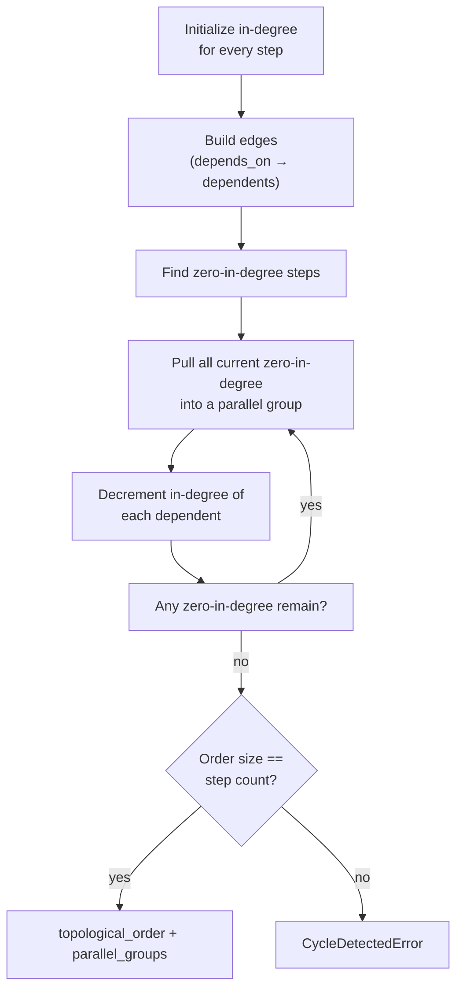
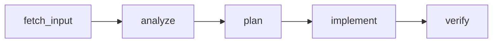
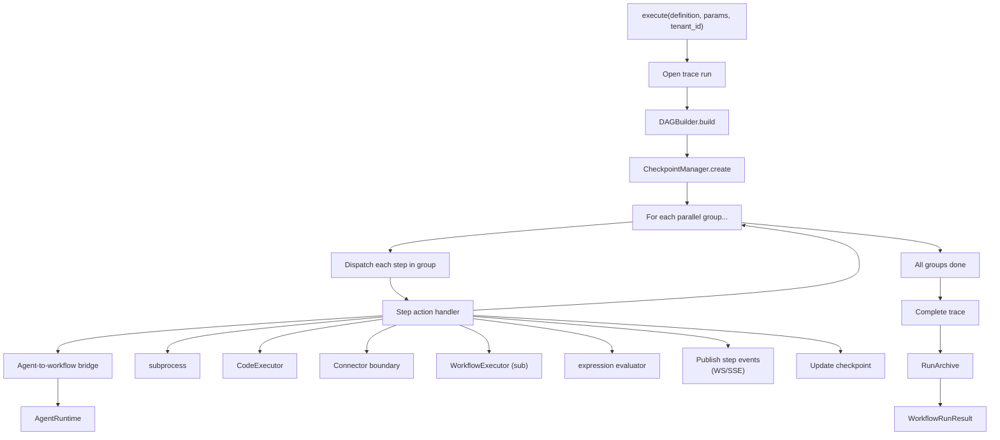

# Workflow Engine

This document describes the AGENT-33 workflow engine: how DAG-based workflows are defined, validated, executed, checkpointed, and observed. It is the place to read when you want to compose multiple agent calls, command runs, code executions, or transformations into a reproducible pipeline.

For the higher-level architecture see [ARCHITECTURE.md](../../ARCHITECTURE.md). For the agent runtime read [agents.md](agents.md). For the full sequence diagrams read [data-flow.md](data-flow.md).

## What a workflow is

A workflow is a declarative DAG of steps. Each step has an action, optional inputs, optional outputs, and an optional dependency list. The engine takes the step graph, runs Kahn's topological sort to validate it (rejecting cycles), partitions the steps into parallel groups, and dispatches each group concurrently.

Workflows are first-class artifacts:

- They live as YAML or JSON files on disk (under `workflow-definitions/` and `core/workflows/`).
- They can be POSTed at runtime via `POST /v1/workflows/`.
- They have a lifecycle: defined → submitted → running → completed | failed | cancelled.
- They produce traces, checkpoints, run archives, and step events visible on the dashboard.

## Step actions

The `StepAction` enum in `workflows/definition.py` lists every action the engine supports:

| Action | Purpose |
|--------|---------|
| `invoke-agent` | Call a registered agent by name with inputs |
| `run-command` | Run a subprocess; capture stdout, stderr, exit code |
| `validate` | Run a validator expression against earlier outputs |
| `transform` | Apply a transformation (Jinja or expression) to data |
| `conditional` | Branch on an expression; execute `then` or `else` sub-steps |
| `parallel-group` | Group sub-steps that should run concurrently |
| `wait` | Sleep for `duration_seconds` or until `wait_condition` is true |
| `execute-code` | Run code via the `CodeExecutor` (CLI, Jupyter, or GPU Docker adapter) |
| `http-request` | Make an HTTP request through the connector boundary |
| `sub-workflow` | Execute another workflow with inputs and capture outputs |
| `route` | LLM-driven routing to one of N candidate sub-steps |
| `group-chat` | Multi-agent group chat with a host |

## Execution modes

A workflow declares an `ExecutionMode`:

- `sequential` — steps run in the order declared.
- `parallel` — all steps without dependencies run in parallel, then their dependents, etc.
- `dependency-aware` — explicit DAG resolution; this is the most flexible mode and the most common in practice.

Most production workflows are `dependency-aware`. The mode interacts with each step's `depends_on` list and `parallel_allowed` constraint on the agent it invokes.

## Trigger events

The `TriggerEvent` enum lists the events that can trigger a workflow automatically:

- `session-start` — operator session begins.
- `session-end` — operator session ends.
- `artifact-created` — a registered artifact appears.
- `review-complete` — a review subsystem transition.
- `webhook` — an external webhook fires.
- `schedule` — APScheduler cron expression matches.

Triggers are declared in the `triggers` block of the workflow definition (`manual: true` for human-only, `schedule: "0 */4 * * *"` for cron, etc.).

## DAG construction

The `DAGBuilder` in `workflows/dag.py` runs Kahn's algorithm:



The result is:

- `topological_order` — every step id in a valid linear order.
- `parallel_groups` — a list of lists; each inner list contains step ids that have no mutual dependencies and can run concurrently.

For workflows that declare a cycle (intentionally or by mistake), the builder raises `CycleDetectedError` with the cycle path. The error happens at build time, before any step executes.

### Example DAG

A workflow with five steps:

```yaml
steps:
  - id: fetch_input
    action: run-command
    command: "echo input"

  - id: analyze
    action: invoke-agent
    agent: researcher
    depends_on: [fetch_input]

  - id: plan
    action: invoke-agent
    agent: director
    depends_on: [analyze]

  - id: implement
    action: invoke-agent
    agent: implementer
    depends_on: [plan]

  - id: verify
    action: invoke-agent
    agent: qa
    depends_on: [implement]
```

renders to:



with a single linear topological order and five parallel groups of one step each (no parallelism here). A workflow with two independent root steps would have one parallel group of two steps at the start.

## Executor pipeline

The `WorkflowExecutor` in `workflows/executor.py` is the top-level orchestrator:



## Step action handlers

Each `StepAction` value has a corresponding handler under `workflows/actions/`:

| Action | Handler module | Notes |
|--------|----------------|-------|
| `invoke-agent` | `invoke_agent.py` | Resolves agent via the bridge; passes inputs |
| `run-command` | `run_command.py` | subprocess with timeout and retry |
| `validate` | `validate.py` | Evaluates a validation expression |
| `transform` | `transform.py` | Jinja2 or expression-based transformation |
| `conditional` | `conditional.py` | Branches on an expression |
| `parallel-group` | `parallel_group.py` | Concurrent sub-step execution |
| `wait` | `wait.py` | Sleep with optional condition |
| `execute-code` | `execute_code.py` | Delegates to `CodeExecutor` |
| `http-request` | (handler) | Goes through the connector boundary |
| `sub-workflow` | (handler) | Recursive invocation of the executor |
| `route` | (handler) | LLM-driven routing |
| `group-chat` | (handler) | Multi-agent host pattern |

Each handler receives the step definition, the current execution state, and the step context (tenant id, run id, parent step id). It returns a step result that's appended to the state and published as a step event.

## Step expressions

Steps can reference earlier outputs via `${{ step.<id>.output.<path> }}` expressions. The resolver in `workflows/expressions.py` handles:

- `step.<id>.output` — the entire output dict.
- `step.<id>.output.<key>` — a nested value.
- `step.<id>.status` — `success` / `failure`.
- `${{ params.<key> }}` — workflow-level input parameters.
- `${{ env.<NAME> }}` — environment variables (subject to a safe-name allowlist).
- `${{ tenant_id }}` — the active tenant.

A common pattern:

```yaml
steps:
  - id: research
    action: invoke-agent
    agent: researcher
    inputs:
      query: "${{ params.topic }}"

  - id: plan
    action: invoke-agent
    agent: director
    depends_on: [research]
    inputs:
      summary: "${{ step.research.output.summary }}"
```

The resolver runs **after** the upstream step completes, so it has the actual output to substitute. If an upstream step fails or its output is missing, the resolver raises and the step fails with a `F-INP` failure category.

> **Note on step ids and Jinja:** Jinja2 treats hyphens as subtraction. If you use hyphens in step ids that are referenced from Jinja-rendered prompts, the aggregator prompt resolution may silently break. Use underscores in programmatic step ids (`research_step`, not `research-step`) when in doubt.

## Checkpoint and resume

`CheckpointManager` persists the workflow run state in PostgreSQL (`workflow_checkpoints` table). Each step completion updates the checkpoint with:

- The step id and status.
- The step's output (truncated if very large).
- The cumulative parallel group index.
- A timestamp.

If the process restarts mid-run, `WorkflowExecutor.resume_from_checkpoint(workflow_id)` resumes from the last persisted step. Steps that were running but didn't checkpoint are re-run; steps that were checkpointed as completed are skipped.

The checkpoint table is keyed by run id (a UUID) and supports a tenant scope.

## Transports

Step events are published to two transports:

- **WebSocket** — operators connected via `/v1/workflows/{run_id}/ws` receive a structured event stream:
  - `workflow_started`
  - `step_started`
  - `step_log` (streaming subprocess output)
  - `step_completed` or `step_failed`
  - `workflow_completed` or `workflow_failed`
- **SSE** — `/v1/workflows/{run_id}/events` is the SSE alternative for clients that prefer one-way streaming.

The WS and SSE managers are constructed at lifespan time and stored on `app.state`. Authentication runs at the handshake; once a client is connected it receives events until the run completes or the client disconnects.

## Retries and timeouts

Each step declares retry and timeout:

```yaml
- id: build
  action: run-command
  command: "npm run build"
  retry:
    max_attempts: 3
    delay_seconds: 5
  timeout_seconds: 300
```

The executor runs the step inside a `wait_for` with the timeout. If the step raises a retryable failure (e.g., a `F-ENV` setup error or a `F-EXE` runtime error), it's retried up to `max_attempts` times with `delay_seconds` between attempts. Non-retryable failures (`F-INP`, `F-SEC`, `F-VAL`) bypass the retry loop.

The retry semantics are aligned with the failure taxonomy in `observability/failure.py`; see [observability.md](observability.md) for the categories and their retry policies.

## Templates

Pre-built workflow templates live under `engine/src/agent33/workflows/templates/` and the canonical set lives at the repo root in `core/workflows/`. The frontend imports the canonical YAML directly via Vite raw imports, which is why the Docker build context for the frontend must include the repo root.

Templates cover common patterns:

- Research → plan → implement → verify (the four-agent loop).
- Document → review → publish.
- Issue triage → analyze → fix → test.
- Continuous integration runner.
- Knowledge ingestion sweep.

You can copy a template into your tenant, modify it, and submit it as a new workflow.

## Adding a step action

Adding a new `StepAction` is a small ceremony:

1. Add a value to the `StepAction` enum in `workflows/definition.py`.
2. Add a handler module under `workflows/actions/` with the shape `async def execute(step, state, context) -> StepResult`.
3. Register it in the action dispatch in `executor.py`.
4. Add validation rules — does it require an agent name? a command? a URL? — to the step model validator.
5. Write a unit test that exercises the handler.

Most new patterns can be expressed as a `sub-workflow` or as a custom tool called from an `invoke-agent` step. Add a new action only when the existing 12 are genuinely insufficient.

## Operational concerns

- **Large outputs.** Step outputs are JSON-serialized into the checkpoint. Very large outputs (over a few MB) should be persisted to the run archive and the step output should reference them by path.
- **Workflow cancellation.** `POST /v1/workflows/{run_id}/cancel` cancels a running workflow. The executor sends a cancellation to each in-flight step; subprocess and HTTP steps are interrupted; agent and code steps complete the current tool call before exiting.
- **Concurrency limits.** The executor honors `parallel_allowed` on each agent definition; an agent that is not `parallel_allowed` will queue rather than run concurrently in the same run.
- **Sub-workflow recursion.** Sub-workflow calls share the parent's tenant id and run id space. The lineage subsystem records the parent-child link.
- **WebSocket reconnect.** Clients can reconnect to a running workflow's WS stream and replay missed events from a checkpoint cursor.

## When to use a workflow

Workflows are heavy. They make sense when:

- You have multiple agent calls that depend on each other and you want explicit DAG semantics.
- You need durable resume across process restarts.
- You need observability and trace correlation across all the steps.
- You need to share intermediate state between steps explicitly.

For one-shot agent calls, `POST /v1/agents/{name}/invoke` is simpler. For interactive multi-turn conversation, the agent runtime's iterative tool-use loop is the right surface. Workflows are for *composition*.
